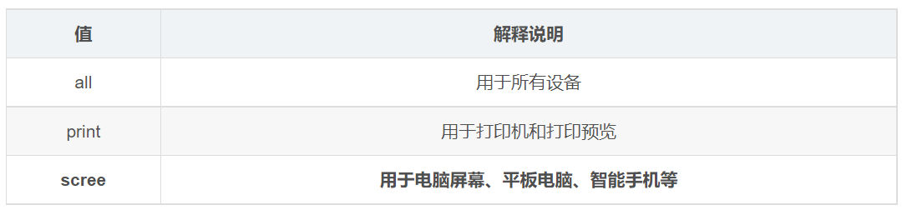
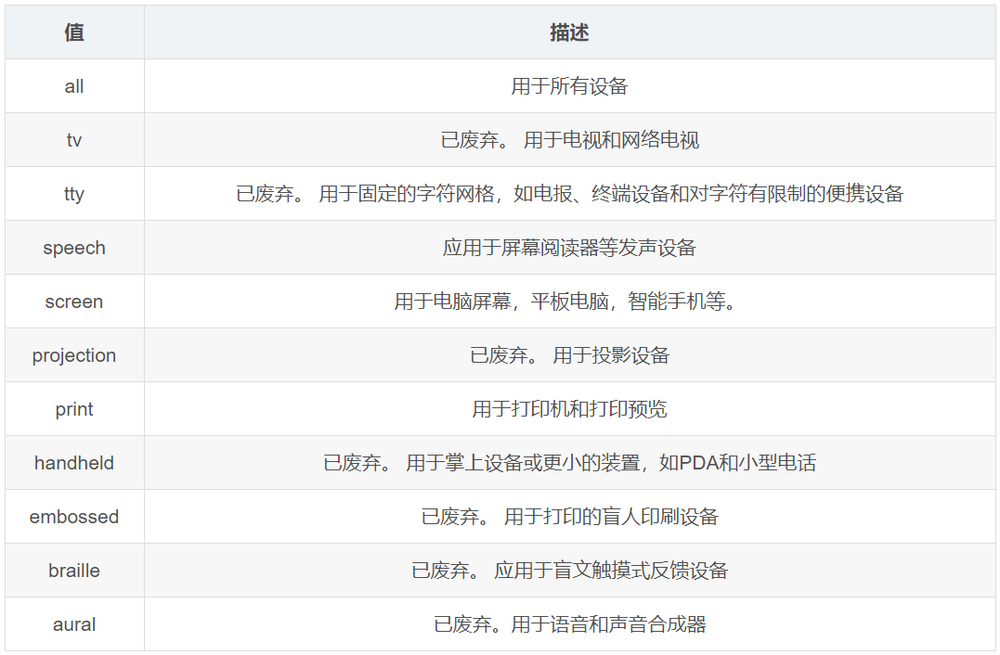

---
source_atomic:
  - atomic/290-媒體查詢/01-媒體查詢概念與基本語法.md
  - atomic/290-媒體查詢/02-media-type媒體類型.md
  - atomic/290-媒體查詢/03-媒體特性與min-max前綴.md
topics:
  - 媒體查詢
  - @media
  - 媒體類型
  - 媒體特性
  - min/max 前綴
summary: "說明媒體查詢的基本語法、媒體類型與媒體特性，以及 min/max 條件的判讀方式。"
---

# 媒體查詢基礎與媒體類型

## 學習目標

讀完這篇筆記，你應該能夠：

- 說明媒體查詢為什麼是響應式網頁設計的重要工具。
- 看懂 `@media` 的基本語法組成。
- 分辨媒體類型與媒體特性的責任。
- 使用 `screen`、`print`、`all` 這類媒體類型。
- 理解 `min-` 與 `max-` 前綴在媒體特性中的意思。

## 問題情境

同一個網頁可能會被桌機、筆電、平板、手機，甚至列印預覽打開。這些環境的螢幕大小、輸入方式、顯示能力和使用情境都不同。

如果所有設備都使用完全相同的 CSS，常見問題會是：

- 手機上文字太小、欄位太擠。
- 桌面版空間很寬，卻仍顯示成狹窄單欄。
- 列印時背景色、導覽列或互動元件不適合出現在紙上。

媒體查詢就是用來讓 CSS 根據不同媒體條件套用不同樣式。

## 一句話理解

媒體查詢是 CSS 中用來判斷「目前環境是否符合某些條件」，符合時才套用指定樣式的機制。

## 基本語法

```css
@media 媒體類型 and (媒體特性) {
  /* CSS 樣式 */
}
```

一個媒體查詢通常由三個部分組成：

- **媒體類型**：判斷使用的是哪一類媒體，例如螢幕或列印。
- **媒體特性**：判斷具體條件，例如視口寬度是否大於某個值。
- **CSS 規則**：當條件成立時才會套用的樣式。

例如：

```css
@media screen and (min-width: 970px) {
  body {
    background-color: red;
  }
}
```

這段表示：當媒體類型是螢幕，且視口寬度大於等於 `970px` 時，將頁面背景色改成紅色。

## 媒體類型

媒體類型用來描述樣式要套用在哪一類輸出環境。



常見媒體類型如下：

| 媒體類型 | 說明 |
| --- | --- |
| `screen` | 螢幕設備，例如桌機、筆電、手機、平板 |
| `print` | 列印或列印預覽 |
| `all` | 所有媒體類型 |



範例：

```css
div {
  width: 450px;
  height: 300px;
}

@media print {
  div {
    background-color: orange;
  }
}

@media screen {
  div {
    background-color: green;
  }
}
```

這段 CSS 會在列印時使用橘色背景，在螢幕上使用綠色背景。

## 媒體特性

媒體特性是更具體的條件，例如視口寬度、高度、方向、解析度、使用者偏好等。

最常見的是寬度相關條件：


```css
@media (max-width: 539px) {
  body {
    background-color: blue;
  }
}

@media (min-width: 540px) {
  body {
    background-color: green;
  }
}

@media (min-width: 970px) {
  body {
    background-color: red;
  }
}
```

這裡可以不寫 `screen`，只判斷媒體特性也可以成立。`screen and` 很常見，但不是每次都必填。

## min 與 max 前綴

許多媒體特性都有 `min-` 和 `max-` 前綴。

| 前綴 | 意思 | 範例 |
| --- | --- | --- |
| `min-` | 大於等於 | `min-width: 768px` 表示寬度至少 768px |
| `max-` | 小於等於 | `max-width: 767px` 表示寬度最多 767px |

這兩個前綴是寫響應式斷點時最核心的工具。

```css
@media (min-width: 768px) {
  .container {
    max-width: 720px;
  }
}
```

上面這段表示：當視口寬度大於等於 `768px` 時，才套用 `.container` 的寬度限制。

## 完整範例拆解

```css
@media (max-width: 539px) {
  body {
    background-color: blue;
  }
}

@media (min-width: 540px) {
  body {
    background-color: green;
  }
}

@media (min-width: 970px) {
  body {
    background-color: red;
  }
}
```

這組規則可以理解成：

- 小於等於 `539px`：背景為藍色。
- 大於等於 `540px`：背景為綠色。
- 大於等於 `970px`：也符合第二條，但第三條較晚出現，若選擇器與屬性相同，最後背景會變紅色。

這也提醒我們：媒體查詢不是只會匹配一條規則。所有符合條件的規則都會參與 CSS 層疊。

## 常見錯誤

### 錯誤一：斷點數值漏寫單位

媒體查詢中的長度值要寫單位。

```css
/* 錯誤 */
@media (min-width: 970) {
  body {
    background-color: red;
  }
}
```

應改為：

```css
@media (min-width: 970px) {
  body {
    background-color: red;
  }
}
```

### 錯誤二：以為一定要寫 screen and

只判斷媒體特性時，可以直接寫：

```css
@media (max-width: 539px) {
  body {
    background-color: blue;
  }
}
```

`screen and` 可以讓條件更明確，但不是每個寬度查詢都必須加上。

### 錯誤三：混淆 min-width 和 max-width

`min-width` 是「至少這麼寬」，常用於從小螢幕往大螢幕加樣式。

`max-width` 是「最多這麼寬」，常用於從大螢幕往小螢幕覆蓋樣式。

## 重點整理

- 媒體查詢讓 CSS 根據設備或環境條件套用不同樣式。
- 基本語法是 `@media 條件 { CSS 規則 }`。
- 媒體類型描述輸出環境，例如 `screen`、`print`、`all`。
- 媒體特性描述具體條件，例如 `min-width`、`max-width`。
- `min-` 表示大於等於，`max-` 表示小於等於。
- 所有符合條件的 media query 都會生效，最後結果仍依 CSS 層疊規則決定。

## 自我檢查

1. `@media (min-width: 768px)` 在寬度 800px 時會不會生效？
2. `@media (max-width: 768px)` 在寬度 800px 時會不會生效？
3. `screen` 和 `(min-width: 768px)` 分別屬於媒體類型還是媒體特性？
4. 為什麼同一個頁面在 970px 以上可能同時符合多條 media query？
