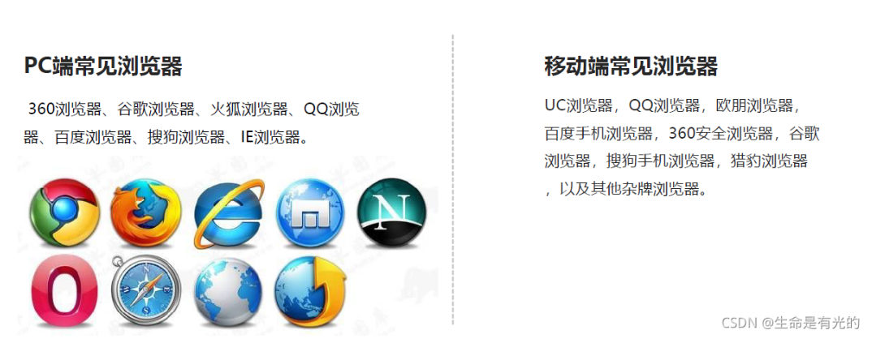
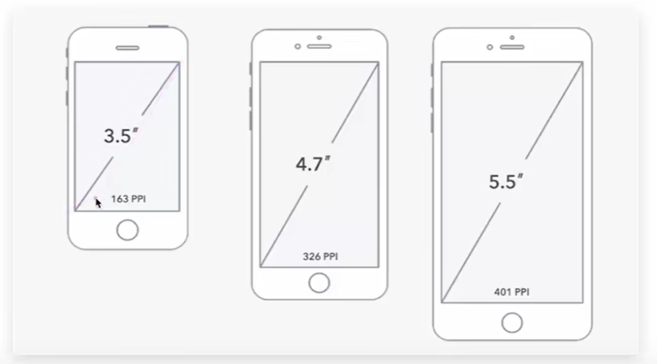
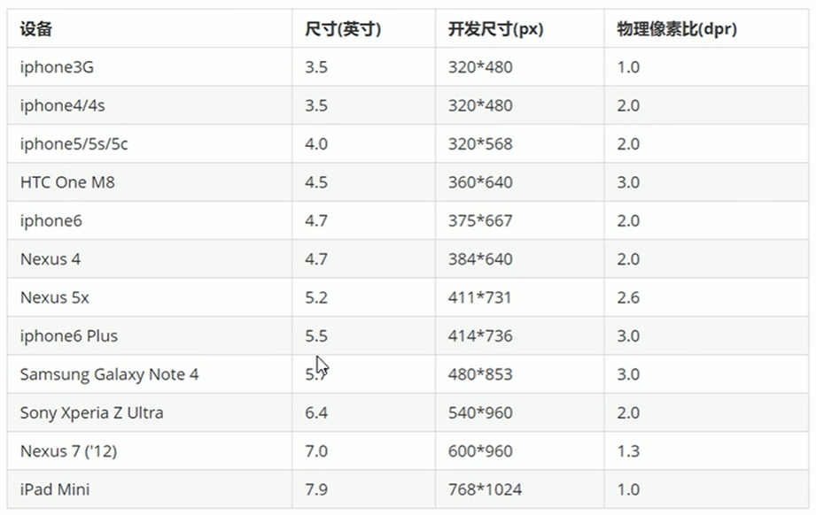
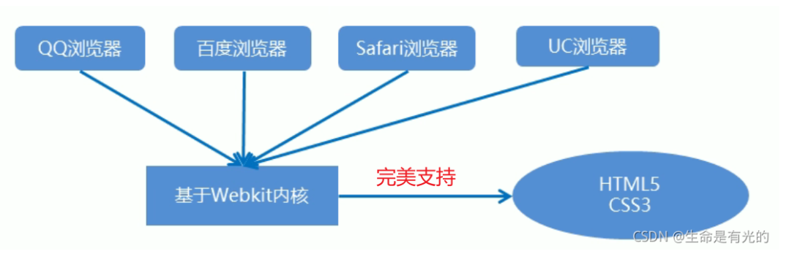

---
source_atomic:
  - atomic/310-移動端網頁適配/01-移動端瀏覽器與設備環境.md
  - atomic/310-移動端網頁適配/02-移動端視口與-meta-viewport.md
topics: [移動端適配, viewport, meta viewport, 理想視口, 瀏覽器相容性]
summary: "說明移動端瀏覽器與三種視口，並建立 meta viewport 的常用設定與可用性注意。"
---

# 移動端環境與視口設定

## 學習目標

讀完這篇筆記後，你應該能夠：

- 說明移動端設備與瀏覽器環境為什麼會影響版面適配。
- 分辨佈局視口、視覺視口與理想視口。
- 正確加入常用的 `meta viewport` 設定。
- 避免只依賴單一瀏覽器核心或禁止使用者縮放的做法。

## 問題情境

同一個網頁放到手機上，常見問題包括：文字看起來很小、頁面可以左右滑動、使用者需要手動放大才能閱讀，或某些 CSS 效果在不同手機瀏覽器中表現不同。

這些問題通常不是單一屬性造成的，而是和移動端的設備碎片化、瀏覽器環境，以及視口設定有關。開始寫移動端頁面前，要先知道瀏覽器到底用多大的區域在排版。

## 一句話理解

移動端適配的第一步，是讓佈局視口接近設備寬度，也就是建立適合手機閱讀與排版的理想視口。

## 移動端瀏覽器與設備環境

移動端瀏覽器環境會隨平台而不同。iOS 主要基於 WebKit，Android 常見瀏覽器與 WebView 多基於 Chromium / Blink；實務上仍應依目標瀏覽器查詢相容性。



移動端設備的屏幕尺寸、解析度與像素密度非常多，碎片化明顯。



常見設備可能有不同解析度，例如 `480x800`、`720x1280`、`1080x1920`，iPhone 也有不同世代與尺寸。前端開發時不需要死背所有 dp、dpi、pt、ppi，但要知道：移動端不是只有一種固定尺寸。



因此，不要只假設「移動端就是 WebKit」，也不要只為某一台手機寫死尺寸。應同時關注 iOS Safari、Android Chrome / WebView，以及具體 CSS 特性的支援狀況。



## 什麼是視口

視口（viewport）就是瀏覽器顯示頁面內容的屏幕區域。移動端常提到三種視口：

- 佈局視口（layout viewport）。
- 視覺視口（visual viewport）。
- 理想視口（ideal viewport）。

初學時最重要的是理解：我們希望移動端頁面的佈局寬度能接近設備本身的寬度，而不是用一個很寬的 PC 版寬度硬塞到手機裡。

## 佈局視口

一般移動設備的瀏覽器曾經會預設一個較寬的佈局視口，用來解決早期 PC 頁面在手機上顯示的問題。


例如部分環境會把佈局視口設成接近 `980px`。這樣 PC 頁面大多能完整縮進手機畫面，但結果是元素看起來很小，使用者常需要手動縮放。

## 視覺視口

視覺視口是使用者當下真正看到的網站區域。


使用者縮放頁面時，改變的是正在看到的區域；但佈局視口可能仍保持原來的寬度。這也是為什麼頁面能被放大縮小，但 CSS 佈局不一定跟著重新以新寬度排版。

## 理想視口

理想視口表示：佈局視口的大小和設備屏幕寬度一致。


在理想視口下，手機有多寬，頁面佈局就以多寬作為基準。這樣可以避免預設 PC 視口造成的縮小顯示與橫向滾動。

## meta viewport 設定

為了讓頁面使用理想視口，需要在 HTML 中加入 `meta viewport`。


常用寫法如下：

```html
<meta name="viewport" content="width=device-width, initial-scale=1.0">
```

這段設定的重點是：

- `width=device-width`：讓佈局視口寬度等於設備寬度。
- `initial-scale=1.0`：初始縮放比例為 `1`。

完整 HTML 範例：

```html
<!DOCTYPE html>
<html lang="en">

<head>
  <meta charset="UTF-8">
  <meta name="viewport" content="width=device-width, initial-scale=1.0">
  <title>Document</title>
</head>

<body>
  移動端頁面
</body>

</html>
```

## 常見錯誤

### 忘記設定 meta viewport

如果沒有設定 `meta viewport`，手機瀏覽器可能使用較寬的預設佈局視口，導致頁面被縮小顯示。

### 禁止使用者縮放

不建議使用 `user-scalable=no`，或把 `maximum-scale`、`minimum-scale` 都固定為 `1.0` 來禁止使用者縮放。

這會影響需要放大頁面的使用者，部分瀏覽器也可能忽略這類限制。一般教學範例若出現這種寫法，應理解為舊式示例，不建議直接照搬到正式頁面。

### 只假設單一瀏覽器核心

移動端瀏覽器曾長期以 WebKit / Blink 系列為主，但實務上仍要依目標環境確認支援狀況。私有前綴也不應只固定考慮 `-webkit-`，而要看具體 CSS 特性與目標瀏覽器需求。

## 重點整理

- 移動端設備尺寸與瀏覽器環境碎片化明顯。
- 視口是瀏覽器顯示頁面內容的屏幕區域。
- 佈局視口決定頁面排版基準，視覺視口是使用者正在看到的區域。
- 理想視口讓佈局視口寬度與設備寬度一致。
- 常用設定是 `<meta name="viewport" content="width=device-width, initial-scale=1.0">`。

## 自我檢查

1. 為什麼手機上沒有設定 `meta viewport` 時，頁面可能看起來很小？
2. 佈局視口和視覺視口有什麼差異？
3. `width=device-width` 的主要目的 是什麼？
4. 為什麼不建議在正式頁面中禁止使用者縮放？
