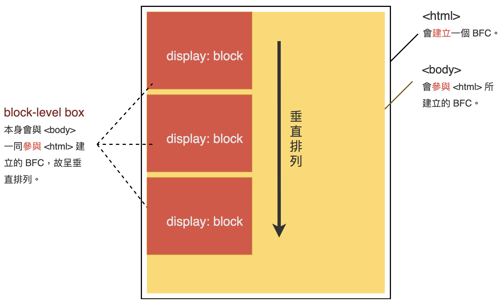

---
source_atomic:
  - atomic/320-BFC/01-BFC概念與佈局規則.md
  - atomic/320-BFC/02-建立BFC的條件.md
---

# BFC 概念與建立條件

## 學習目標

讀完這篇筆記，你應該能夠：

- 說明 BFC 是什麼，以及它為什麼會影響 CSS 佈局。
- 理解同一個 BFC 中 block-level box 的基本排列規則。
- 知道哪些常見 CSS 條件會建立新的 BFC。
- 判斷什麼時候應該主動建立 BFC。
- 避免把 BFC 當成單一 CSS 屬性或萬用解法。

## 問題情境

寫 CSS 佈局時，你可能遇過這些情況：

- 父容器裡明明有浮動元素，高度卻像消失一樣。
- 兩個區塊都設定了上下 margin，實際間距卻不是兩者相加。
- float 元素旁邊的普通區塊被擠壓或遮住。
- 明明只是相鄰元素，卻互相影響到版面結果。

這些問題的背後常常不是單一屬性寫錯，而是元素處在同一個佈局環境中彼此影響。BFC 就是理解這類問題的重要概念。

## 一句話理解

BFC（Block Formatting Context）是一個獨立的區塊格式化環境；在同一個 BFC 裡，區塊盒子依特定規則排列，而建立新的 BFC 可以隔離某些佈局影響。

## Formatting Context 是什麼

Formatting Context 可以理解為「佈局環境」。不同佈局環境有不同的排列規則。

BFC 是其中一種，完整名稱是 Block Formatting Context，也就是區塊格式化環境。當元素參與某個 BFC 時，它會依照 BFC 的規則安排位置、margin 與和其他盒子的關係。

## 同一個 BFC 中的排列規則

在同一個 BFC 中，block-level box 通常會有這些現象：

- 從 containing block 的頂部開始，一個接一個垂直排列。
- 在預設由左至右書寫方向中，盒子的左外邊緣會貼齊 containing block 的左側。
- 相鄰盒子之間的垂直距離由 `margin` 決定。
- 相鄰 block-level box 的垂直 margin 可能發生 margin collapsing。

例如：

```html
<html>
  <body>
    <div></div>
    <div></div>
    <div></div>
  </body>
</html>
```

`html` 會建立一個 BFC，`body` 與三個 `div` 參與這個 BFC，因此它們會依區塊格式化規則垂直排列。



重點是：這些規則描述的是「同一個 BFC 裡」的元素。如果某個元素建立了新的 BFC，它就會形成另一個佈局環境，和外部元素的影響方式會改變。

## 常見會建立 BFC 的條件

常見會建立 BFC 的情況包括：

- 根元素 `<html>`。
- float 元素。
- `position: absolute` 或 `position: fixed` 的元素。
- 區塊元素的 `overflow` 不是 `visible` 或 `clip`，例如 `hidden`、`scroll`、`auto`。
- `display: inline-block` 的元素。
- `display: flow-root` 的元素。
- table 相關顯示值，例如 `table-cell`、`table-caption` 等。
- flex item 或 grid item 在特定條件下也可能建立 BFC。
- `contain: layout`、`contain: content`、`contain: paint` 的元素。
- `container-type` 不為 `normal` 的元素。
- 多欄布局相關條件，例如 `column-count` 或 `column-width` 不為 `auto`。

對初學者來說，最常遇到、也最容易拿來解決問題的是：

```css
.box {
  display: flow-root;
}
```

或：

```css
.box {
  overflow: hidden;
}
```

`display: flow-root` 的語意很直接：讓元素建立新的 block formatting context。若只是為了建立 BFC，通常比用 `overflow: hidden` 更清楚。

## 為什麼建立新 BFC 有用

建立新 BFC 的核心價值是隔離佈局影響。

常見用途包括：

- 讓父容器包住內部 float 元素，避免高度塌陷。
- 讓兩個區塊不在同一個 BFC 中，避免垂直 margin 重疊。
- 讓普通區塊避開 float 元素，不被 float 遮住。

這些不是 BFC 的「魔法效果」，而是因為新 BFC 改變了元素參與佈局的環境。

## 常見錯誤

### 錯誤一：把 BFC 當成某個 CSS 屬性

BFC 不是某個屬性，也不是 `display: flow-root` 的別名。

`display: flow-root` 只是建立 BFC 的其中一種方式。其他條件，例如 float、absolute、某些 overflow 值，也可能建立 BFC。

### 錯誤二：為了建立 BFC 機械式使用 overflow: hidden

`overflow: hidden` 可以建立 BFC，但它也會裁切超出元素範圍的內容。

如果你的目的只是建立 BFC，應優先考慮：

```css
.container {
  display: flow-root;
}
```

這樣語意更清楚，也比較不容易帶來裁切副作用。

### 錯誤三：以為建立 BFC 可以解決所有佈局問題

BFC 常用來處理 float、margin collapsing 與部分區塊互相影響問題，但它不是所有 CSS 佈局問題的通用解法。

遇到問題時，應先判斷原因是否真的和同一個 BFC 中的盒子互相影響有關。

## 實務判斷

- 要讓元素明確建立新的 BFC：優先考慮 `display: flow-root`。
- 看到 float 容器高度塌陷：可以考慮讓父容器建立 BFC。
- 看到垂直 margin 重疊：確認兩個元素是否處在同一個 BFC。
- 使用 `overflow: hidden` 時：確認裁切內容不會造成副作用。

## 重點整理

- BFC 是 Block Formatting Context，表示區塊格式化環境。
- 同一個 BFC 中的 block-level box 會垂直排列，垂直 margin 可能重疊。
- 建立新的 BFC 可以隔離某些佈局影響。
- `display: flow-root` 是現代、語意清楚的建立 BFC 方法。
- `overflow: hidden` 也能建立 BFC，但可能裁切內容。

## 自我檢查

1. BFC 是某個 CSS 屬性，還是一種佈局環境？
2. 同一個 BFC 中，相鄰 block-level box 的垂直 margin 可能發生什麼現象？
3. 如果只是想建立 BFC，為什麼 `display: flow-root` 通常比 `overflow: hidden` 更清楚？
4. 建立新 BFC 的核心價值是什麼？
