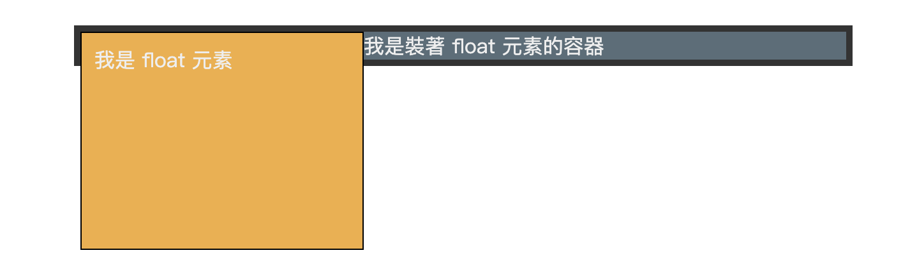
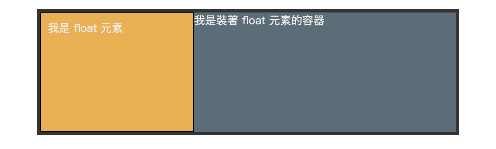

---
source_atomic:
  - atomic/320-BFC/03-用BFC解決float容器高度塌陷.md
  - atomic/320-BFC/04-用BFC防止margin重疊.md
  - atomic/320-BFC/05-用BFC避免float遮住普通元素.md
topics: [BFC, float, 高度塌陷, 外邊距合併, flow-root]
summary: "說明如何用 BFC 隔離 float、margin 與遮擋影響，並判斷應讓哪個元素建立新環境。"
---

# BFC 常見用途與案例

## 學習目標

讀完這篇筆記，你應該能夠：

- 用 BFC 解釋 float 子元素造成父容器高度塌陷的原因。
- 使用 `display: flow-root` 讓父容器包住內部 float 元素。
- 用 BFC 避免相鄰區塊的垂直 margin 重疊。
- 用 BFC 讓普通區塊避開 float 元素。
- 判斷什麼時候應該使用 BFC，什麼時候不該硬套。

## 使用情境

BFC 最常被提到的原因，是它能解決幾個很典型的 CSS 佈局問題：

- float 子元素造成父容器高度塌陷。
- 垂直方向的 margin collapsing。
- float 元素與普通區塊互相覆蓋或干擾。

這些問題看起來不同，但核心都和「盒子是否處在同一個格式化環境、是否互相影響」有關。

## 一句話理解

BFC 常見用途不是直接改變畫面，而是建立新的佈局環境，讓元素之間的 float、margin 或環繞影響被隔離。

## 案例一：解決 float 容器高度塌陷

### 問題

當父容器只有 float 子元素時，父容器可能無法被子元素撐開。

```html
<div class="container">
  <span>我是裝著 float 元素的容器</span>
  <div class="float">我是 float 元素</div>
</div>
```

```css
.container {
  width: 600px;
  background-color: grey;
  border: 5px solid #333;
}

.float {
  float: left;
  width: 200px;
  height: 150px;
  background-color: yellow;
  border: 1px solid black;
  padding: 10px;
}
```



float 元素脫離普通文檔流後，如果父容器沒有其他足夠撐高的內容，就可能出現高度塌陷。

### 解法

讓父容器建立新的 BFC。

```css
.container {
  display: flow-root;
}
```



建立 BFC 後，父容器會把內部 float 元素納入計算，容器高度就能被撐開。

### 實務提醒

過去常見寫法是：

```css
.container {
  overflow: hidden;
}
```

它也能建立 BFC，但可能裁切溢出內容。若目的只是解決 float 高度塌陷，`display: flow-root` 更直接。

## 案例二：防止垂直 margin 重疊

### 問題

相鄰 block 元素在同一個 BFC 中時，垂直 margin 可能發生重疊。

```html
<style>
  p {
    color: #f55;
    background: #fcc;
    width: 200px;
    line-height: 100px;
    text-align: center;
    margin: 100px;
  }
</style>

<body>
  <p>Haha</p>
  <p>Hehe</p>
</body>
```


兩個 `p` 在同一個 BFC 中，相鄰垂直 margin 會重疊，而不是單純相加。

### 解法

讓其中一個元素外面包一層新的 BFC。

```html
<style>
  .wrap {
    overflow: hidden;
  }

  p {
    color: #f55;
    background: #fcc;
    width: 200px;
    line-height: 100px;
    text-align: center;
    margin: 100px;
  }
</style>

<body>
  <p>Haha</p>
  <div class="wrap">
    <p>Hehe</p>
  </div>
</body>
```


因為第二個 `p` 被放進 `.wrap` 建立的新 BFC 中，兩個 `p` 不再屬於同一個 BFC，垂直 margin 的互相影響就被隔開。

### 實務提醒

不要只記「BFC 可以解決 margin 重疊」。更重要的是理解：margin 重疊發生在同一個格式化環境中的相鄰 block；建立新 BFC 是把它們分到不同環境。

## 案例三：避免 float 遮住普通元素

### 問題

float 元素可能遮住後面的普通 block 元素。

```html
<div class="float"></div>
<div class="box"></div>
```

```css
.float {
  float: left;
  width: 200px;
  height: 200px;
  background-color: orange;
}

.box {
  display: block;
  width: 300px;
  height: 300px;
  background-color: yellow;
}
```


普通 block 元素可能和 float 元素發生重疊或受到 float 影響。

### 解法

讓普通區塊建立新的 BFC。

```css
.box {
  display: flow-root;
}
```


建立 BFC 後，`.box` 會避開 float 元素，不再被 float 遮住。

## 三個案例的共同模式

這三個問題表面不同，但解法的核心很像：

| 問題 | 建立 BFC 的對象 | 效果 |
| --- | --- | --- |
| float 子元素造成父容器高度塌陷 | 父容器 | 讓父容器包住 float 子元素 |
| 相鄰 margin 重疊 | 其中一個元素的外層容器 | 隔離兩個 block 的 margin 影響 |
| float 遮住普通元素 | 普通元素本身 | 讓普通元素避開 float |

也就是說，BFC 的重點不是「把某段 CSS 加上去就好」，而是要判斷哪個元素需要建立新的佈局環境。

## 常見錯誤

### 錯誤一：看到 float 問題就只會 overflow: hidden

`overflow: hidden` 可以建立 BFC，但它也會裁切溢出內容。若只需要建立 BFC，優先考慮：

```css
.target {
  display: flow-root;
}
```

### 錯誤二：不知道應該讓誰建立 BFC

不同問題要建立 BFC 的對象不同：

- 容器高度塌陷：讓父容器建立 BFC。
- margin 重疊：讓其中一方進入新的 BFC。
- float 遮住普通元素：讓普通元素建立 BFC。

先判斷問題來源，再決定 BFC 放在哪個元素上。

### 錯誤三：把 BFC 當成所有間距問題的解法

有些間距問題只是 `margin`、`padding`、`line-height` 或布局方式設計不當，不一定和 BFC 有關。不要看到間距不對就直接套 BFC。

## 實務判斷

- 要清除 float 對父容器高度的影響：優先試 `display: flow-root`。
- 要處理垂直 margin 重疊：先確認元素是否在同一個 BFC 中。
- 要讓 block 避開 float：讓該 block 建立 BFC。
- 如果使用 `overflow: hidden`：確認不會裁切內容。

## 重點整理

- BFC 可以處理 float 高度塌陷、margin 重疊與 float 遮擋等典型問題。
- 解題關鍵是判斷「哪個元素需要建立新的 BFC」。
- `display: flow-root` 是清楚建立 BFC 的常用方式。
- `overflow: hidden` 雖然也能建立 BFC，但有裁切風險。
- BFC 不是萬用補丁，應用前要先確認問題是否和格式化環境有關。

## 小練習

1. 父容器只有 float 子元素，高度塌陷時，應該讓哪個元素建立 BFC？
2. 兩個相鄰段落的垂直 margin 重疊時，為什麼包一層 `.wrap` 並建立 BFC 可以解決？
3. 如果使用 `overflow: hidden` 建立 BFC，可能帶來什麼副作用？
4. float 元素遮住普通區塊時，應該讓 float 元素還是普通區塊建立 BFC？
