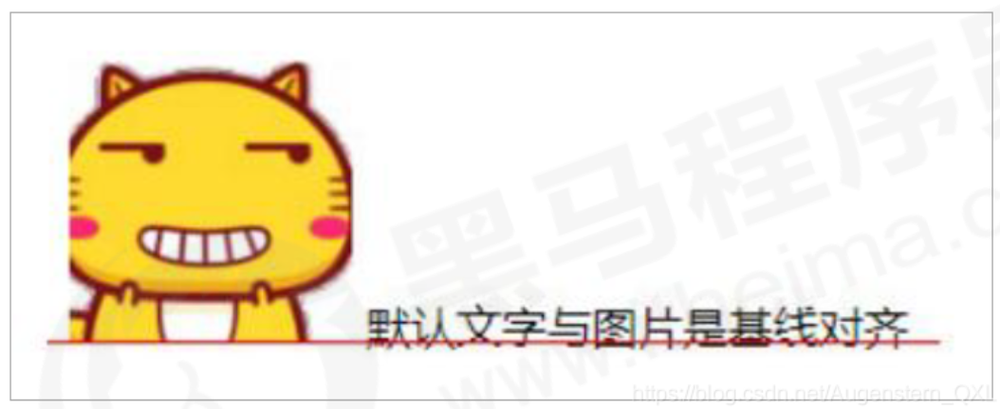

# **介紹**

> 官方解釋：用於設置一個元素的垂直對齊方式，但是它只針對於行內元素或者行內塊元素有效。( 不能控制塊元素 )
> 
> 
> 
> - 使用場景：經常用於設置圖片或者表單（行內塊元素）和文字垂直對齊。
> - 作用: 用於指定同一行元素之間，或表格單元格內文字的垂直對齊方式。

```css
vertical-align: baseline | top | middle | bottom
```

## **認識基線**

> 基線: 瀏覽器文字類型元素排版中存在用於對齊的基線 ( baseline )
> 
> 

# **圖片、表單和文字對齊**

> 圖片、表單都屬於行內塊元素，默認的 vertical-align 是基線對齊。
> 
> 

- 此時可以給圖片、表單這些行內塊元素的 `vertical-align` 屬性設置為 `middle` 就可以讓文字和圖片垂直居中對齊了。

```css
img {
	/* 让图片和文字垂直居中 */
	vertical-align: middle;
}

textarea {
  vertical-align: middle;
}
```

```html
  pink老师是刘德华

<br>
<textarea name="" id="" cols="30" rows="10"></textarea> 请您留言
```

# **圖片底側空白縫隙解決**

> bug：圖片底側會有一個空白縫隙，原因是行內塊元素會和文字的基線對齊（給圖片加邊框就可以看見）。
> 
> 

<aside>
💡

**主要解決辦法有兩種 :**

- 給圖片添加 `vertical-align : middle | top | bottom` 等。
- 把圖片轉換為塊級元素 `display:block;`，因為塊級元素不會有`vertical-align`屬性。
</aside>

```css
div {
  border: 2px solid red;
}

img {
	/* vertical-align: middle; */
	display: block;
}

```

```html
<div>
    
</div>
```
