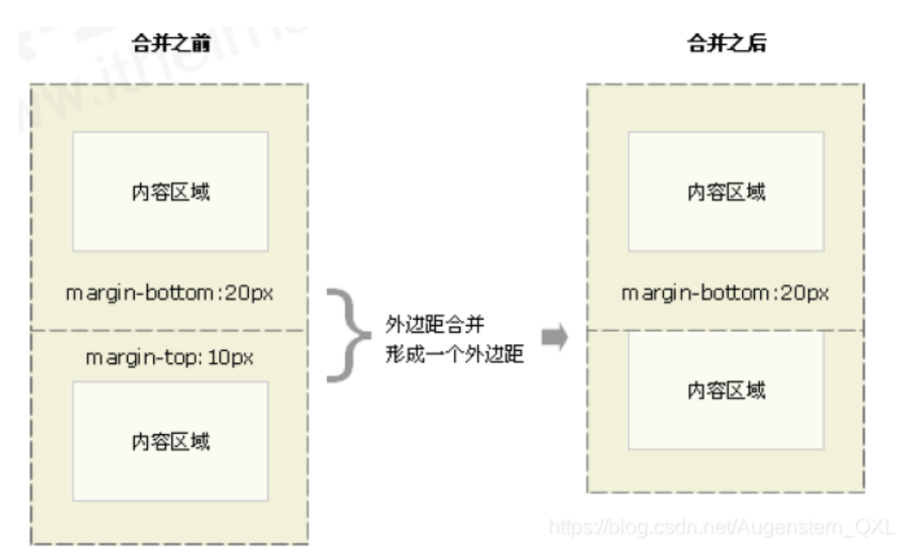

# **外邊距margin介紹**

> margin（外邊距）屬性用於設置外邊距，即控制盒子和盒子之間的距離。
> 
> 

```css
/* 可取 4 个值、3 个值、2 个值、1 个值 */
margin: 上 右 下 左;
margin: 上 左右 下;
margin: 上下 左右;
margin: 上下左右;

/* 单个方向 */
margin-top: 10px;
margin-bottom: 10px;
margin-left: 10px;
margin-right: 10px;
```

<aside>
💡

**margin 簡寫方式代表的意義跟 padding 完全一致。**

</aside>

# **外邊距的合併問題**

<aside>
💡

**使用 `margin` 定義塊元素的垂直外邊距時，可能會出現外邊距的合併。主要有兩種情況 :**

- 相鄰塊元素垂直外邊距的 **合併**。
- 嵌套塊元素垂直外邊距的 **塌陷**。
</aside>

### **相鄰塊元素垂直外邊距的合併**

> 當上下相鄰的兩個塊元素（兄弟關係）相遇時，如果上面的元素有下外邊距 margin-bottom，下面的元素有上外邊距 margin-top ，則他們之間的垂直間距不是 margin-bottom 與 margin-top 之和。而是取兩個值中的較大者這種現像被稱為相鄰塊元素垂直外邊距的合併。
> 
> 

```css
.damao, .ermao {
	width: 200px;
	height: 200px;
	background-color: pink;
}

.damao {
	 margin-bottom: 100px;
 }

.ermao {
	margin-top: 200px;
}
```

```html
<div class="damao">大毛</div>
<div class="ermao">二毛</div>

```

<aside>
💡

**解決方案 : 只給一個盒子添加 margin 值。**

</aside>

### **嵌套塊元素垂直外邊距的塌陷**

> 場景：相互嵌套的塊級元素，子元素的 margin-top 會作用在父元素上。

<aside>
💡

**解决方案 :**

1. 給父元素設置 `border-top` 或者 `padding-top` (分隔父子元素的 `margin-top` )
2. 可以為父元素添加 `overflow: hidden`。
3. 轉換為行內塊元素。
4. 設置浮動。
</aside>

```css
.box-father {
  width: 200px;
  height: 200px;
  background-color: #b2b6b6;
}

.box-child {
  width: 100px;
  height: 100px;
  background-color: #7f9faf;
  margin-top: 100px;
}

.resolve {
  overflow: hidden;
  margin-top: 20px;
}
```

```html
<!-- 元素的margin-top 作用在了父元素上 -->
<div class="box-father">
  <div class="box-child"></div>
</div>

<!-- [完美解决方案]给父元素设置 overflow:hidden; -->
<div class="box-father resolve">
  <div class="box-child"></div>
</div>
```

# **margin負值的運用**


- 兩個盒子加邊框 `1px`，浮動貼緊時會出現 `1 + 1 = 2px`。
- 給右邊盒子添加`margin-left: -1px`。
- 正數向右邊走，負數向左邊走。
- 當我們有多個盒子時的解決辦法：
    - 讓每個盒子 `margin` 往左側移動 `1px` 正好壓住相鄰盒子邊框。
    - 鼠標經過某個盒子的時候，提高當前盒子的層級即可。
- **如果沒有定位，則加相對定位範例程式碼 (保留位置)**
    
    ```css
    ul li {
      float: left;
      list-style: none;
      width: 150px;
      height: 200px;
      border: 1px solid red;
      margin-left: -1px;
    }
    
    ul li:hover {
    	/* 如果盒子沒有定位，則鼠標經過添加相對定位即可。 */
    	position: relative;
      border: 1px solid blue;
    }
    ```
    
    ```html
    <ul>
        <li>1</li>
        <li>2</li>
        <li>3</li>
        <li>4</li>
        <li>5</li>
    </ul>
    
    ```
    
- **如果有定位，則加 z-index**
    
    ```css
    ul li {
      position: relative;
      float: left;
      list-style: none;
      width: 150px;
      height: 200px;
      border: 1px solid red;
      margin-left: -1px;
    }
    
    ul li:hover {
    	/* 2.如果li都有定位，则利用 z-index提高层级 */
    	z-index: 1;
      border: 1px solid blue;
    }
    ```
    
    ```html
    <ul>
        <li>1</li>
        <li>2</li>
        <li>3</li>
        <li>4</li>
        <li>5</li>
    </ul>
    ```
