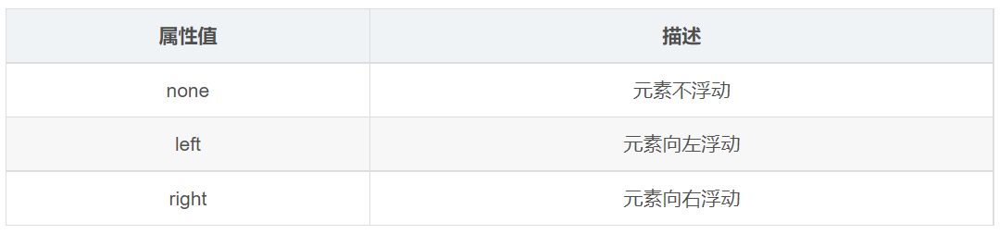

> float 屬性用於創建浮動框，將其移動到一邊，直到左邊緣或右邊緣觸及包含塊或另一個浮動框的邊緣。
> 
>  

```css
选择器 {
    float: 属性值;
}
```

> 💡 網頁佈局第二準則：先設置盒子大小，之後設置盒子的位置。

```css
.left,
.right {
  width: 200px;
  height: 200px;
  background-color: pink;
}

.left {
  float: left;
}

.right {
  float: right;
}
```

```html
<div class="left">左青龙</div>
<div class="right">右白虎</div>
```
