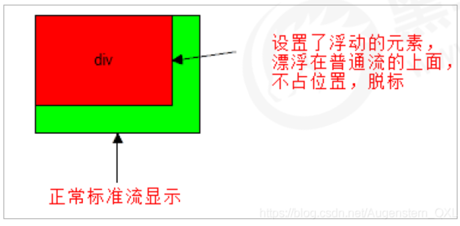

<aside>
⚠️

**注意點 → 浮動元素不能通過 `text-align: center` 或者 `margin: 0 auto` 實現水平居中。**

</aside>

# **脫標：浮動元素會脫離標準流**



- 脫離標準流的控制 ( 浮 ) 移動到指定位置 ( 動 )，俗稱脫標。
- 浮動的盒子`不再保留原先的位置`。

```css
.box1 {
	float: left;
	width: 200px;
	height: 200px;
	background-color: pink;
}

.box2 {
	width: 300px;
	height: 300px;
	background-color: rgb(0, 153, 255);
}
```

```html
<div class="box1">浮动的盒子</div>
<div class="box2">标准流的盒子</div>
```

# **如果多個盒子都設置了浮動，則它們會按照屬性值一行內顯示並且頂端對齊排列**


> 浮動的元素是相互貼靠在一起的（不會有縫隙），如果父級寬度裝不下這些浮動的盒子，多出的盒子會另起一行對齊。

```css
div {
	float: left;
	width: 200px;
	height: 200px;
	background-color: pink;
}

.two {
	background-color: purple;
	height: 249px;
}

.four {
	background-color: skyblue;
}
```

```html
<div>1</div>
<div class="two">2</div>
<div>3</div>
<div class="four">4</div>
```

# **浮動元素會具有行內塊元素特性**

- 任何元素都可以浮動。不管原先是什麼模式的元素，添加浮動之後都具有行內塊元素相似的特性。
- 如果塊級盒子沒有設置寬度，默認寬度和父級一樣寬，但是 **添加浮動後，它的大小根據內容來決定**。
- 如果行內元素有了浮動，則不需要轉換塊級、行內塊元素就可以直接給高度和寬度。
- 浮動的盒子中間是沒有縫隙的，是緊挨著一起的。
- 不會 margin 合併，也不會 margin 塌陷，能夠完美的設置四個方向的 margin 和 padding。

```css
/* 任何元素都可以浮动。不管原先是什么模式的元素，添加浮动之后具有行内块元素相似的特性。 */
span, 
div {
  float: left;
  width: 200px;
  height: 100px;
  background-color: pink;
}

/* 如果行内元素有了浮动，则不需要转换块级、行内块元素就可以直接给高度和宽度 */
a {
  float: right;
  width: 200px;
  height: 200px;
  background-color: purple;
}
```

```html
<span>1</span>
<span>2</span>
<div>div</div>
<a href="">aaaaa</a>
```
