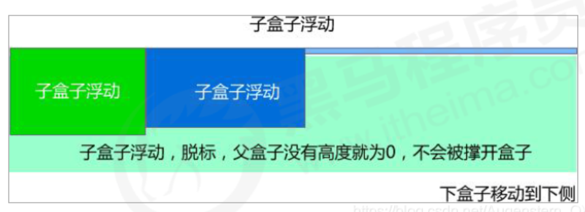

# **思考題**

我們前面浮動元素有一個標準流的父元素， 他們有一個共同的特點，都是有高度的；但是所有的父盒子都必須有高度嗎 ?


理想中的狀態，讓子盒子撐開父親，有多少孩子，我父盒子就有多高。

但是不給父盒子高度會有問題嗎 ?

# **為甚麼需要清除浮動?**

> 由於父級盒子很多情況下，不方便給高度，但是子盒子浮動又不佔有位置，最後父級盒子高度為 0 時，就會影響下面的標準流盒子。
> 
> 
> 
> - 由於浮動元素不再佔用原文檔流的位置，所以它會對後面的元素排版產生影響。

```css
.box {
	width: 800px;
	border: 1px solid blue;
	margin: 0 auto;
}

.damao {
	float: left;
	width: 300px;
	height: 200px;
	background-color: purple;
}

.ermao {
	float: left;
	width: 200px;
	height: 200px;
	background-color: pink;
}

.footer {
	height: 200px;
	background-color: black;
}
```

```html
<body>
    <div class="box">
        <div class="damao">大毛</div>
        <div class="ermao">二毛</div>
    </div>

    <div class="footer"></div>
</body>
```

<aside>
💡

理想中的狀態，讓子盒子撐開父親，有多少孩子，我父盒子就有多高。

</aside>

# **清除浮動的本質**

> 清除浮動的本質是清除浮動元素造成的影響，清除浮動之後，父級就會根據浮動的子盒子自動檢測高度，父級有了高度，就不會影響下面的標準流了。

- 如果父盒子本身有高度，則不需要清除浮動。
- 清除浮動的策略是：閉合浮動。
    - 只讓浮動在父盒子內部影響，不影響父盒子外面的其他盒子。

# **清除浮動的方法**

### **額外標籤法也稱為隔牆法，是W3C推薦的做法**


- 我們實際工作中，幾乎只用 `clear:both`。
- 額外標籤法會在浮動元素末尾添加一個空的標籤，例如:
    
    ```html
    <div style="clear:both"></div>
    ```
    
    - **⚠️ 注意：要求這個新的空標籤必須是塊級元素。**
- 優點：通俗易懂，書寫方便。
- 缺點：添加許多無意義的標籤，結構化較差。
- 實際工作可能會遇到，但是不常用。

```css
.box {
    width: 800px;
    border: 1px solid blue;
    margin: 0 auto;
}

.damao {
    float: left;
    width: 300px;
    height: 200px;
    background-color: purple;
}

.ermao {
    float: left;
    width: 200px;
    height: 200px;
    background-color: pink;
}

.footer {
    height: 200px;
    background-color: black;
}

.clear {
    clear: both;
}
```

```html
<body>
    <div class="box">
        <div class="damao">大毛</div>
        <div class="ermao">二毛</div>
        <div class="ermao">二毛</div>
        <div class="ermao">二毛</div>
        <div class="ermao">二毛</div>
				<!-- 这个新增的盒子要求必须是块级元素不能是行内元素 -->
				<div class="clear"></div>
    </div>
    <div class="footer"></div>
</body>
```

### **父級添加overflow屬性**

> 可以給父級添加 overflow 屬性，將其屬性值設置為 hidden、auto 或 scroll。

- 優點：代碼簡潔。
- 缺點：無法顯示溢出的部分。

```css
.box {
		/* 清除浮动 */
		overflow: hidden;
    width: 800px;
    border: 1px solid blue;
    margin: 0 auto;
}

.damao {
    float: left;
    width: 300px;
    height: 200px;
    background-color: purple;
}

.ermao {
    float: left;
    width: 200px;
    height: 200px;
    background-color: pink;
}

.footer {
    height: 200px;
    background-color: black;
}
```

```html
<body>
    <div class="box">
        <div class="damao">大毛</div>
        <div class="ermao">二毛</div>
    </div>

    <div class="footer"></div>
</body>
```

### **父級添加after偽元素**

> :after 方式是額外標籤法的升級版。也是給父元素添加，代表網站：百度、淘寶、網易等。

- 優點：沒有增加標籤，結構更簡單。
- 缺點：需要照顧低版本瀏覽器。

```css
.clearfix:after {
    content: "";
    display: block;
    height: 0;
    clear: both;
    visibility: hidden;
}

.clearfix {
		/* IE6、7 专有 */
    *zoom: 1;
}

.box {
    width: 800px;
    border: 1px solid blue;
    margin: 0 auto;
}

.damao {
    float: left;
    width: 300px;
    height: 200px;
    background-color: purple;
}

.ermao {
    float: left;
    width: 200px;
    height: 200px;
    background-color: pink;
}

.footer {
    height: 200px;
    background-color: black;
}

```

```html
<body>
    <div class="box clearfix">
        <div class="damao">大毛</div>
        <div class="ermao">二毛</div>
    </div>

    <div class="footer"></div>
</body>

```

### **父級添加雙偽元素**

> 也是給父元素添加，代表網站：小米、騰訊等。

- 優點：代碼更簡潔。
- 缺點：需要照顧低版本瀏覽器。

```css
.clearfix:before,
.clearfix:after {
    content: "";
    display: table;
}

.clearfix:after {
    clear: both;
}

.clearfix {
    *zoom: 1;
}

.box {
    width: 800px;
    border: 1px solid blue;
    margin: 0 auto;
}

.damao {
    float: left;
    width: 300px;
    height: 200px;
    background-color: purple;
}

.ermao {
    float: left;
    width: 200px;
    height: 200px;
    background-color: pink;
}

.footer {
    height: 200px;
    background-color: black;
}
```

```html
<body>
    <div class="box clearfix">
        <div class="damao">大毛</div>
        <div class="ermao">二毛</div>
    </div>

    <div class="footer"></div>
</body>

```

# **清除浮動總結**


<aside>
💡

**為什麼需要清除浮動？**

- 父級沒高度。
- 子盒子浮動了。
- 影響下面佈局了，我們就應該清除浮動了。
</aside>
