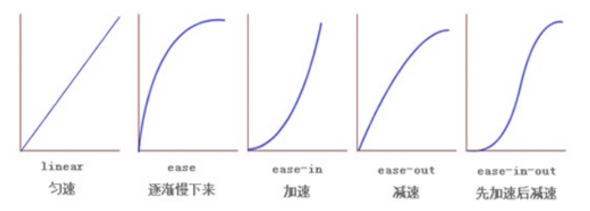

> 過渡(transition) : 是 CSS3 中具有顛覆性的特徵之一，我們可以在不使用 Flash 動畫或 JavaScript 的情況下，當元素從一種樣式變換為另一種樣式時為元素添加效果。
> 
- 過渡動畫：是從一個狀態漸漸的過渡到另外一個狀態。
- 過渡經常和 `：hover` 一起搭配使用。

```css
transition: 要過渡的屬性 花費時間 運動曲線 何時開始
```

- `要過渡的屬性`：想要變化的 CSS 屬性，寬度、高度，背景顏色，內外邊距都可以，如果想要所有的屬性都變化過渡，寫一個`all`就可以。
- `花費時間`：單位是秒 (必須寫單位)；比如 0.5s。
- `運動曲線`：默認是 `ease`(可以省略)。
    
    
    
- `何時開始`：單位是秒 (必須寫單位)，可以設置延遲觸發事件，默認是 `0s` (可以省略)。

```css
div {
  width: 200px;
  height: 100px;
  background-color: pink;

	/* transition: 变化的属性 花费时间 运动曲线 何时开始; */
	/* 如果想要寫多個屬性，利用逗號進行分割 */
	/* transition: width 0.5s, height 0.5s; */
	
	/* 如果想要多個屬性都變化，屬性寫all就可以了 */
	transition: all 0.5s;
}

div:hover {
  width: 400px;
  height: 200px;
  background-color: red;
}
```

```html
<body>
  <div></div>
</body>
```

<aside>
💡

**過渡的口訣：誰做過渡給誰加。**

</aside>
