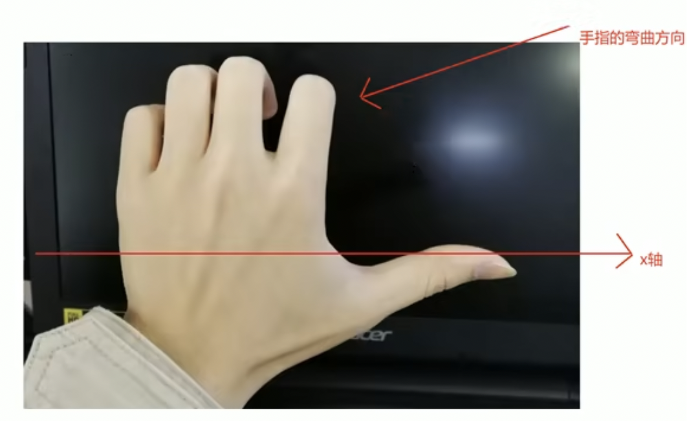
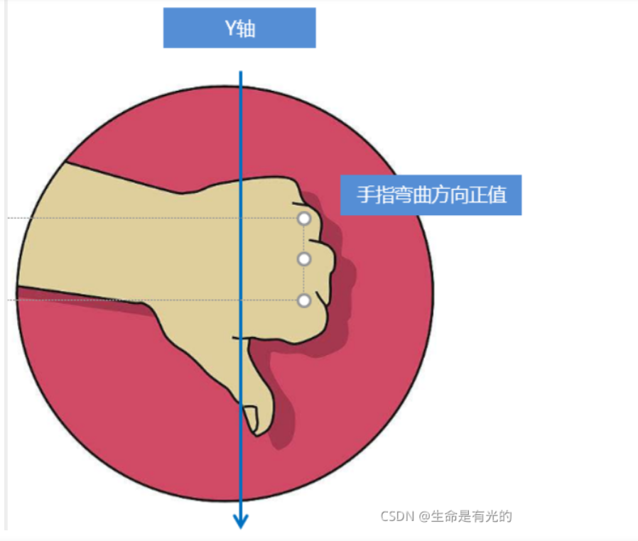

> 3D 旋轉是在 2D 旋轉的基礎之上，可以讓元素沿著 X 軸和 Y 軸旋轉，具體使用方式如下 :
> 

<aside>
💡

**`3D旋轉`：3D旋轉指可以讓元素在三維平面內沿著 `x軸`，`y軸`，`z軸`或者自定義軸進行旋轉。**

```css
transform: rotateZ(角度);
transform: rotateX(角度);
transform: rotateY(角度);
```

- `transform: rotateX(45deg)` ：沿著 X 軸正方向旋轉 45 度。
- `transform: rotateY(45deg)` ：沿著Y軸正方向旋轉45度。
- `transform: rotateZ(45deg)` ：沿著Z軸正方向旋轉45度。
- `transform: rotate3d(x, y, z, deg)` ：沿著自定義軸旋轉 deg 為角度 ( 了解即可 )
    - `xyz`是表示旋轉軸的矢量，是標示你是否希望沿著該軸旋轉，最後一個標示旋轉的角度。
        
        ```css
        /*沿着 X 轴旋转 45deg*/
        transform: rotate3d(1, 0, 0, 45deg)
        
        /*沿着对角线旋转45deg*/
        transform: rotate3d(1, 1, 0, 45deg)
        ```
        
</aside>

# **rotateX範例程式碼**

- 左手準則 1
    
    
    
    - 對於元素旋轉的方向判斷，我們需要先學習一個左手準則。
    - 左手的手拇指指向 x 軸的正方向。
    - 其餘手指的彎曲方向就是該元素沿著 x 軸旋轉的方向。

```css
body{
  transform-style: preserve-3d;
  perspective: 500px;
}

img {
  display: block;
  margin: 100px auto;
  transition: all 1s;
}

img:hover {
 transform: rotateX(45deg);
}
```

```html
<body>
    
</body>
```

# **rotateY範例程式碼**

- 左手準則 2
    
    
    
    - 左手的手拇指指向 y 軸的正方向。
    - 其餘手指的彎曲方向就是該元素沿著 y 軸旋轉的方向（正值）。

```css
body{
  transform-style: preserve-3d;
  perspective: 500px;
}

img {
  display: block;
  margin: 100px auto;
  transition: all 1s;
}

img:hover {
 transform: rotateY(45deg);
}
```

```html
<body>
    
</body>
```

# **rotateZ範例程式碼**

```css
body{
  transform-style: preserve-3d;
  perspective: 500px;
}

img {
  display: block;
  margin: 100px auto;
  transition: all 1s;
}

img:hover {
 transform: rotateZ(45deg);
}
```

```html
<body>
    
</body>
```

# **rotate3d範例程式碼**

```css
body{
  transform-style: preserve-3d;
  perspective: 500px;
}

img {
  display: block;
  margin: 100px auto;
  transition: all 1s;
}

img:hover {
	/* 沿著x軸旋轉 */
	/* transform: rotate3d(1, 0, 0, 45deg) */
	
	/* 沿著y軸旋轉 */
	/* transform: rotate3d(0, 1, 0, 45deg) */
	
	/* 沿著z軸旋轉 */
	/* transform: rotate3d(0, 0, 1, 45deg) */
	
	/* 沿著對角線旋轉 */
	transform: rotate3d(1, 1, 0, 45deg)
}
```

```html
<body>
    
</body>
```
