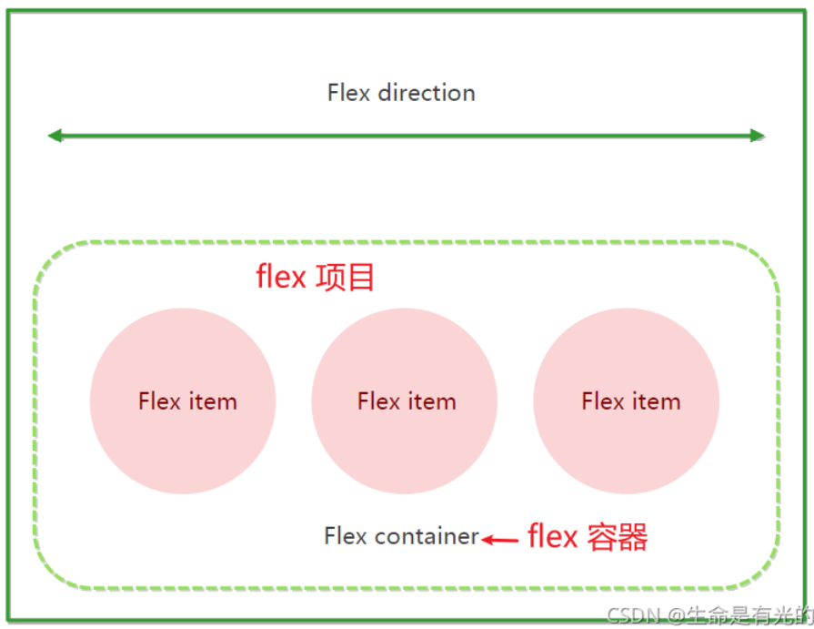

> flex 是 flexible Box 的縮寫，意為"彈性佈局"，用來為盒狀模型提供最大的靈活性，任何一個容器都可以指定為 flex 佈局。
> 
- 當我們為父盒子設為 `flex` 佈局以後，子元素的 `float`、`clear` 和 `vertical-align` 屬性將失效。
- 伸縮佈局 = 彈性佈局 = 伸縮盒佈局 = 彈性盒佈局 = flex佈局。
- 採用 Flex 佈局的元素，稱為 Flex 容器（flex container），簡稱"容器"。它的所有子元素自動成為容器成員，稱為 Flex 項目（flex item），簡稱"項目"。
    
    
    
- 容器 → 開啟了 flex 的元素就是容器。
    - 給元素設置 `display: flex;` 或 `display: inline-flex;` 該元素就變成了容器。
        - `display: inline-flex;` 很少使用，因為可以給多個容器的父容器也設置為伸縮容器。
    - 一個元素可以同時是容器、項目。
- 項目 → 容器所有子元素自動成為了項目。
    - 容器的子元素成為了項目，孫子元素、重孫子元素等後代不是項目。
- 初體驗
    
    ```css
    div {
      display: flex;
      width: 80%;
      max-width: 980px;
      min-width: 320px;
      margin: 0 auto;
      background-color: pink;
    }
    
    div span {
      height: 100px;
      background-color: purple;
      margin-right: 5px;
      flex: 1;
    }
    ```
    
    ```html
    <div>
      <span>1</span>
      <span>2</span>
      <span>3</span>
    </div>
    ```
    
- 初體驗的例子`div` 就是 `flex`父容器。
- 初體驗例子 `span`就是子容器 `flex`項目。
- 子容器可以橫向排列也可以縱向排列。

<aside>
💡

**總結 flex 佈局原理：就是通過給父盒子添加 flex 屬性，來控制子盒子的位置和排列方式。**

</aside>
