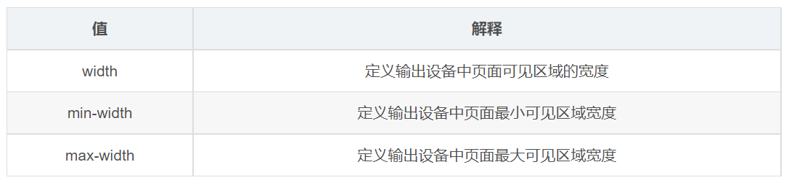

> **參考文章**
> 
> - [CSS 媒体查询 @media【详解】_51CTO博客_css媒体查询 @media](https://blog.51cto.com/u_15715491/5529588)
> - [CSS Media媒体查询使用大全，完整媒体查询总结 - 奔跑的太阳花 - 博客园](https://www.cnblogs.com/lguow/p/9316598.html)

# 媒體特性

每種媒體類型都具體各自不同的特性，根據不同媒體類型的媒體特性設置不同的展示風格。

一般來說，我們可以使用 `min-width`、`max-width` 和 `width` 媒體特徵。通過設置這些特徵，實現響應式佈局，能夠響應不同屏幕大小，給用戶一個良好的使用體驗。



- 媒體屬性是 CSS3 新增的內容，多數媒體屬性帶有 `min-` 和 `max-` 前綴，用於表達 **小於等於** 和 **大於等於**。
    - `min-` : 大於等於。
    - `max-` : 小於等於。
- 下表中列出了所有的媒體屬性
    - **width | min-width | max-width**
    - **height | min-height | max-height**
    - **device-width | min-device-width | max-device-width**
    - **device-height | min-device-height | max-device-height**
    - **aspect-ratio | min-aspect-ratio | max-aspect-ratio**
    - **device-aspect-ratio | min-device-aspect-ratio | max-device-aspect-ratio**
    - **color | min-color | max-color**
    - **color-index | min-color-index | max-color-index**
    - **monochrome | min-monochrome | max-monochrome**
    - **resolution | min-resolution | max-resolution**
    - **scan | grid**

# **常用媒體特徵如下**

## **顏色（color）**

媒體特徵中的 `color` 用來檢測設備能夠顯示的顏色深度，即每個像素可以顯示的顏色位數（color depth）。它可以幫助你根據設備的顯示能力來調整網頁的樣式，特別是在處理圖片、漸變或其他顏色相關的設計元素時。

`color` 媒體特徵有幾個關鍵變體：

1. **`color`**：檢查設備的每個像素能夠顯示的顏色位數。
2. **`min-color`** 和 **`max-color`**：用來檢查設備顏色深度的最小或最大值。

### `color` 媒體特徵的應用場景

假設你希望針對不同顏色深度的設備來提供不同的樣式或圖片版本，這些媒體特徵就會派上用場。

- **高色深設備**：如果設備顏色深度較高，你可以顯示較高質量的圖片或更豐富的漸變效果。
- **低色深設備**：如果顯示器顏色深度有限，你可能需要簡化圖片，或避免過於細緻的顏色變化，以防止效果不佳。

### 範例

假設我們有一個網站，需要根據設備的顏色深度來調整背景圖片。

```css
/* 當設備能顯示8位或更多的顏色時，使用高清圖片 */
@media (min-color: 8) {
  body {
    background-image: url('high-quality-background.png');
  }
}

/* 當設備的顏色深度較低時，使用簡單圖片 */
@media (max-color: 4) {
  body {
    background-image: url('low-quality-background.png');
  }
}
```

### `color` 的作用

`color` 媒體特徵最主要的作用是：

- **根據設備顯示能力**：確保圖片或顏色效果在不同設備上顯示得足夠清晰，避免因顏色深度不足而導致的畫面不美觀或顏色失真。
- **提升性能**：在低色深設備上，提供簡化的圖片或樣式可以提升加載性能，減少不必要的資源浪費。

儘管現代大部分設備支持較高的顏色深度，這些媒體特徵仍然有助於應對一些老舊設備或特定情況下的設計需求。

## **顏色索引（color-index）**

`color-index` 是 CSS 媒體特徵之一，用來檢查設備所支持的顏色索引數量，即顯示器使用的調色板中可用顏色的總數。它與 `color` 不同，`color` 是關於每像素的顏色深度，而 `color-index` 則是關於整個設備能夠顯示的顏色數量。

在現代顯示器中，尤其是支持數百萬種顏色的設備上，`color-index` 變得不太常見和重要，因為大多數設備都是使用全彩色模式。但在一些顯示色彩受限的情況下，這個媒體特徵仍然可以派上用場，例如早期的 CRT 顯示器或特定的嵌入式設備。

### `color-index` 媒體特徵的使用

你可以使用 `color-index` 來檢查設備的顏色數量，並根據顯示器支持的顏色索引來調整樣式。可以使用 `min-color-index` 和 `max-color-index` 來指定顏色索引的範圍。

### 範例

假設你有一個網頁，希望根據顯示器的顏色索引來調整背景圖片或樣式：

```css
/* 如果設備支持256種顏色或更多，使用高品質圖片 */
@media (min-color-index: 256) {
  body {
    background-image: url('high-quality-background.png');
  }
}

/* 如果設備只支持16種顏色，使用簡單的圖片或單一顏色背景 */
@media (max-color-index: 16) {
  body {
    background-color: #333; /* 使用深色背景代替圖片 */
  }
}
```

### `color-index` 的作用

1. **針對低彩色數設備進行樣式優化**：當設備只能顯示有限數量的顏色時，`color-index` 可以幫助設計者提供簡化的圖像或簡單的顏色方案，以避免顏色失真。
2. **提升設備相容性**：在針對老舊設備或嵌入式設備開發網頁時，可以根據顏色索引調整圖片或介面，確保不同設備上的用戶體驗一致。

### 實際應用中的重要性

目前，由於大多數設備都能夠顯示全彩色（數百萬甚至數十億種顏色），`color-index` 的應用變得很少見。然而，在特定的嵌入式系統或老舊設備上，它仍然有一些使用場景，尤其是那些僅支持有限顏色數的設備上。

總結來說，`color-index` 在現代應用中較少使用，但它曾經在色彩受限的顯示環境中具有重要作用。

## **寬高比（aspect-ratio）**

`aspect-ratio` 是 CSS 媒體特徵之一，用來檢測設備或視口的寬高比例（width-to-height ratio）。這對於設計響應式網頁特別有用，因為不同設備的屏幕寬高比可能差異很大。使用 `aspect-ratio` 可以根據設備屏幕的形狀來調整布局或樣式，使內容在各種屏幕上都顯得自然和美觀。

### `aspect-ratio` 的使用方法

`aspect-ratio` 可以檢測設備或視口的寬高比例。常用的媒體查詢方式包括：

- **`aspect-ratio`**：檢測設備或視口的實際寬高比。
- **`min-aspect-ratio`** 和 **`max-aspect-ratio`**：用來檢測設備寬高比是否在指定的範圍內。

寬高比通常以分數表示，如 `16/9` 表示 16:9 的寬高比，這是常見的電視和顯示器比例。

### 範例

假設你有一個網頁，想要根據不同設備的寬高比來調整佈局：

```css
/* 當設備的寬高比是 16:9 時，使用一種佈局 */
@media (aspect-ratio: 16/9) {
  .container {
    display: grid;
    grid-template-columns: repeat(3, 1fr);
  }
}

/* 當設備的寬高比是 4:3 時，使用另一種佈局 */
@media (aspect-ratio: 4/3) {
  .container {
    display: grid;
    grid-template-columns: repeat(2, 1fr);
  }
}

/* 當寬高比小於 1（縱向模式，如手機）時，改變顯示方式 */
@media (max-aspect-ratio: 1/1) {
  .container {
    flex-direction: column;
  }
}
```

### `aspect-ratio` 的作用

1. **響應式佈局調整**：不同設備有著不同的寬高比，例如手機、平板、桌面電腦和電視。通過檢測這些設備的寬高比，你可以靈活地改變佈局，使其更適合設備的形狀。例如，較寬的屏幕可能適合使用多欄佈局，而較高的屏幕則適合單欄或縱向佈局。
2. **針對特定設備進行優化**：例如，針對 16:9 的寬屏設備，你可能希望將重要內容放在屏幕寬的兩側，而針對 4:3 或 1:1 的設備，你可能更傾向於使用中心對齊的佈局。
3. **提高用戶體驗**：通過根據設備的寬高比調整圖片、視頻、文字和其他內容的呈現方式，可以確保內容不會在特定的寬高比下被過度拉伸或壓縮，從而提升用戶的閱讀和瀏覽體驗。

### 實際應用場景

- **橫向和縱向模式**：當設備由橫向轉到縱向時，寬高比會發生變化。你可以根據 `aspect-ratio` 調整佈局和圖片的尺寸。
- **多媒體設計**：在網頁設計中，某些多媒體元素如視頻和圖像的呈現形式取決於設備的寬高比，使用 `aspect-ratio` 可以確保它們不會在不合適的屏幕上失真。
- **全屏應用**：如全屏顯示視頻、幻燈片展示或遊戲，使用 `aspect-ratio` 可以確保內容在不同設備上顯示良好。

### 注意事項

- 使用分數形式表示寬高比，如 `16/9` 或 `4/3`。
- `aspect-ratio` 主要用於設計響應式佈局，但在某些情況下，結合其他媒體特徵（如 `width`、`height` 和 `orientation`）可以獲得更好的效果。

總結來說，`aspect-ratio` 可以幫助設計師根據設備的屏幕比例調整內容和佈局，確保網頁在不同設備上都能保持良好的顯示效果，這對於提高響應式設計的靈活性和用戶體驗非常重要。

## **設備寬高比（device-aspect-ratio）**

`device-aspect-ratio` 是 CSS 中的一個媒體特徵，用來檢測設備本身的物理寬高比，即設備屏幕的寬度與高度的比例。與 `aspect-ratio` 不同的是，`aspect-ratio` 檢測的是**視口**的寬高比，而 `device-aspect-ratio` 檢測的是設備的原生屏幕尺寸，不會因為瀏覽器窗口的調整或旋轉設備而改變。

雖然 `device-aspect-ratio` 曾經在響應式設計中比較常用，但隨著 CSS 的發展，現在更多使用 `aspect-ratio` 和其他現代媒體特徵來實現響應式佈局，因此 `device-aspect-ratio` 在現代開發中已經較少使用。

### `device-aspect-ratio` 的使用方法

像 `aspect-ratio` 一樣，`device-aspect-ratio` 也使用分數來表示寬高比。例如，`16/9` 表示 16:9 的寬高比。

使用媒體查詢來檢查設備的寬高比，可以根據不同的設備來設置特定樣式。

### 範例

```css
/* 當設備的寬高比是 16:9 時，使用一種佈局 */
@media (device-aspect-ratio: 16/9) {
  body {
    background-color: lightblue;
  }
}

/* 當設備的寬高比是 4:3 時，使用另一種佈局 */
@media (device-aspect-ratio: 4/3) {
  body {
    background-color: lightgreen;
  }
}
```

### `device-aspect-ratio` 的作用

1. **針對不同設備進行優化**：不同的設備（如手機、平板、電腦、電視）的屏幕寬高比不同，`device-aspect-ratio` 允許開發者為這些設備定制特定的佈局或樣式，從而提升用戶體驗。例如，針對寬屏設備可能需要顯示更多的橫向內容，而針對高屏設備可能更適合顯示縱向佈局。
2. **設計針對固定寬高比的應用**：某些應用程序（如視頻播放或遊戲）可能要求內容保持特定的寬高比。使用 `device-aspect-ratio` 可以確保這類應用在設備上的顯示效果達到最佳，而不會被拉伸或變形。
3. **處理設備橫向與縱向顯示的差異**：你可以使用 `device-aspect-ratio` 來根據設備的固定顯示比例（無論是橫向還是縱向）進行不同的佈局設計。

### 使用 `device-aspect-ratio` 的注意事項

- **不再是首選**：由於現代網頁開發更多依賴於 `aspect-ratio` 和其他更靈活的媒體特徵（如 `orientation`、`min-width` 等），`device-aspect-ratio` 在現代開發中較少使用。這是因為在移動端，窗口大小和視口可能頻繁變化，這使得直接檢測設備寬高比的實用性降低。
- **視口 vs. 設備寬高比**：如果你只關心瀏覽器窗口的大小變化，那麼應該使用 `aspect-ratio` 而不是 `device-aspect-ratio`，因為後者不會隨著窗口大小的改變而更新。

### 現代應用場景

雖然 `device-aspect-ratio` 曾經被廣泛用於早期的響應式設計，但隨著瀏覽器窗口和設備的多樣化，現在開發者更多依賴於其他媒體特徵來實現動態佈局和設計。這使得 `device-aspect-ratio` 的使用逐漸減少。

### 總結

`device-aspect-ratio` 用來檢測設備的物理寬高比，能夠幫助設計師針對不同設備進行優化。然而，由於現代的響應式設計更傾向於使用 `aspect-ratio` 和其他特徵，它在當代開發中並不常見。如果你的設計需要根據設備的實際寬高比來進行調整，這個媒體特徵仍然可以起到作用。

## **設備高度（device-height）**

`device-height` 是 CSS 媒體特徵之一，用來檢測設備屏幕的物理高度（即設備屏幕的總高度，不是瀏覽器窗口或視口的高度）。這個特徵可以幫助設計師針對設備的實際物理尺寸進行優化。

與 `height` 媒體特徵不同，`height` 是針對瀏覽器視口的高度，會隨著視口大小的變動而改變，而 `device-height` 檢測的是設備的固定屏幕高度。

### `device-height` 的使用方法

`device-height` 通常用於設置針對特定設備的樣式。你可以使用 `min-device-height` 和 `max-device-height` 來檢測設備的高度範圍，並根據設備的物理高度調整樣式。

### 範例

假設你希望針對不同設備高度進行優化，例如一些設備高度較高（如手機或平板），而一些設備高度較低（如小型顯示器或嵌入式設備）：

```css
css
複製程式碼
/* 當設備高度大於等於 800px 時，應用特定樣式 */
@media (min-device-height: 800px) {
  body {
    background-color: lightblue;
    font-size: 16px;
  }
}

/* 當設備高度小於 600px 時，應用另一種樣式 */
@media (max-device-height: 600px) {
  body {
    background-color: lightgreen;
    font-size: 14px;
  }
}

```

### `device-height` 的作用

1. **針對不同設備尺寸進行優化**：`device-height` 可以用來檢測設備的物理高度，幫助你針對設備屏幕的實際大小來調整內容和佈局。例如，針對小型設備，你可能希望減少顯示的內容，使用更小的字體或更簡化的佈局，而針對大型設備，則可以顯示更多的內容。
2. **提升全屏應用的體驗**：某些應用或設計需要根據設備的高度進行全屏展示。例如，在全屏模式下顯示視頻、圖片或遊戲時，檢測設備的物理高度可以確保內容充分利用設備的顯示空間，而不會過度拉伸或壓縮。
3. **針對特定設備類型的樣式設置**：不同設備的物理高度會有所不同，例如智能手機、平板、筆記本電腦和桌面顯示器等。使用 `device-height` 可以根據設備的實際尺寸來設置針對性的樣式，使內容在不同設備上都有最佳的顯示效果。

### 使用 `device-height` 的注意事項

- **不常用於現代開發**：隨著設備的多樣化和響應式設計的普及，`device-height` 僅適用於少數特定場景。大部分情況下，開發者更傾向於使用 `height`、`min-height` 和 `max-height` 等視口相關的媒體特徵，因為這些特徵能更靈活地應對視口變化。
- **瀏覽器窗口 vs. 設備高度**：`device-height` 針對的是設備的固定屏幕高度，與瀏覽器窗口的大小無關。因此，當你希望根據視口（瀏覽器窗口）的高度調整樣式時，應該使用 `height` 而不是 `device-height`。

### 實際應用場景

- **針對特定設備設計全屏體驗**：例如，在設計專門為手機或平板全屏使用的應用時，使用 `device-height` 可以確保應用在特定設備上達到最佳顯示效果。
- **處理嵌入式設備**：如果你需要針對一些嵌入式設備或特殊顯示器進行優化，這些設備的屏幕高度是固定的，可以使用 `device-height` 來針對它們進行樣式調整。

### 總結

`device-height` 用於檢測設備屏幕的物理高度，適合針對特定設備的屏幕尺寸進行樣式設置。它在現代網頁開發中的使用較為有限，因為大多數情況下，設計師更傾向於根據視口的高度進行調整，而不是設備的固定尺寸。然而，對於某些全屏應用或需要精確控制設備顯示行為的情境，`device-height` 仍然有其價值。

## **設備寬度（device-width）**

`device-width` 是 CSS 中的媒體特徵之一，用來檢測設備屏幕的物理寬度（即設備顯示區域的總寬度），而非瀏覽器窗口或視口的寬度。與 `width` 媒體特徵不同，`device-width` 針對的是設備本身的物理尺寸，即使用戶調整了瀏覽器的窗口大小，`device-width` 也不會變化。

### `device-width` 的使用方法

可以使用 `min-device-width` 和 `max-device-width` 來針對不同設備的寬度設置樣式，這對於根據設備的實際屏幕寬度進行設計和調整佈局非常有用。

### 範例

假設你想要根據設備的物理寬度調整佈局和內容的呈現方式：

```css
css
複製程式碼
/* 當設備寬度大於等於 1024px 時，應用桌面樣式 */
@media (min-device-width: 1024px) {
  body {
    font-size: 18px;
    margin: 0 auto;
    max-width: 1000px;
  }
}

/* 當設備寬度小於 768px 時，應用手機樣式 */
@media (max-device-width: 768px) {
  body {
    font-size: 14px;
    padding: 10px;
  }
}

```

### `device-width` 的作用

1. **針對不同設備進行優化**：不同的設備（如手機、平板、桌面電腦）具有不同的物理寬度。`device-width` 可以幫助你針對這些不同的設備設計不同的佈局，讓內容在不同的屏幕上都能顯示得自然、美觀。
2. **全屏應用優化**：在某些全屏應用中（如網頁遊戲、視頻播放或多媒體展示），你可能需要根據設備的物理寬度來設計內容的佈局，確保內容能夠充分利用屏幕寬度，而不會被壓縮或拉伸。
3. **針對特定設備設計**：對於特定設備或設備類型（例如智能手機和平板電腦），你可以根據設備的寬度來定制樣式。這可以確保應用或網站在這些設備上獲得最佳顯示效果，並提供更好的用戶體驗。

### 使用 `device-width` 的注意事項

- **視口寬度 vs. 設備寬度**：如果你想根據用戶調整瀏覽器窗口大小來動態改變佈局，應該使用 `width` 或 `min-width` 和 `max-width`。`device-width` 針對的是設備的實際屏幕寬度，因此無論瀏覽器窗口如何變化，它的值都不會改變。
- **不常用於現代響應式設計**：隨著響應式設計的普及，開發者更傾向於使用基於視口的 `width` 特徵來適應不同大小的窗口，而非僅依賴於設備的物理尺寸。這樣可以更靈活地應對設備橫豎屏切換或窗口縮放的情況。

### 現代應用場景

儘管 `device-width` 在現代開發中使用相對較少，但在某些情況下它仍然有價值。例如：

- **嵌入式設備或特殊顯示器**：針對一些物理尺寸固定的設備（如嵌入式顯示器、智慧家居設備），`device-width` 可以用來確保內容針對這些特定設備進行優化。
- **全屏應用或特定場景**：在一些需要全屏顯示的應用中，使用 `device-width` 可以確保內容根據設備的實際屏幕尺寸進行自適應調整。

### 總結

`device-width` 是用來檢測設備屏幕物理寬度的媒體特徵，適合用於針對不同設備的寬度進行優化。然而，由於響應式設計更關注視口的變化和動態佈局，`device-width` 的使用在現代開發中較為有限。通常，開發者會更多使用 `width` 等與視口相關的特徵來實現更靈活的佈局。

## **網格（grid）**

CSS 中的媒體特徵 `grid` 用來檢測設備是否使用網格來顯示內容。這通常與基於網格顯示的終端、設備或用戶介面有關，主要用於分辨設備顯示是以「網格」還是「像素」為基礎。

### `grid` 的使用方法

`grid` 媒體特徵是一個布爾值特徵，它的值只有兩種：

- `grid: 1`（或 `grid: true`）：表示設備是基於網格顯示的。
- `grid: 0`（或 `grid: false`）：表示設備不是基於網格顯示的，而是像素顯示。

可以使用它來為不同顯示設備設置不同的樣式。

### 範例

```css
css
複製程式碼
/* 當設備基於網格顯示時，應用特定樣式 */
@media (grid: 1) {
  body {
    font-size: 12px;
  }
}

/* 當設備不基於網格顯示時，應用其他樣式 */
@media (grid: 0) {
  body {
    font-size: 16px;
  }
}

```

### `grid` 的作用

1. **針對不同顯示模式優化樣式**：`grid` 用來檢測設備是否使用網格顯示，在某些終端（如文字界面設備）中，顯示可能基於一個固定的字符或單元格網格來顯示內容。通過這個媒體特徵，你可以為這些設備設置特定的樣式。
2. **確保內容在網格設備上顯示正常**：一些特殊的設備（如早期的文字終端或命令行界面）基於網格來顯示文本。檢測是否為網格顯示可以確保你的網頁或應用在這類設備上以可讀的方式呈現。
3. **提高舊式設備的兼容性**：`grid` 特徵可以幫助設計師針對一些不常見或舊式的設備進行兼容性設計，這對於需要支持廣泛設備的系統或應用尤其有用。

### 使用 `grid` 的注意事項

- **現代設備一般不使用**：大多數現代設備（如手機、平板、桌面瀏覽器）都基於像素顯示，而非網格顯示。這意味著在現代網頁開發中，`grid` 的實際應用較少見，更多用於針對一些特殊終端進行調整。
- **與 CSS Grid Layout 無關**：`grid` 媒體特徵與 CSS 中的網格布局（Grid Layout）無直接關聯。CSS Grid Layout 是一種佈局技術，用來創建基於網格的頁面佈局，而這個 `grid` 媒體特徵主要用來檢測顯示模式是否是基於網格的字符單元格。

### 總結

`grid` 媒體特徵主要用來檢測設備是否使用基於網格的顯示方式。它在現代開發中的使用率較低，因為大多數現代設備都基於像素顯示。它主要適用於需要支持某些特殊或舊式設備的場合，讓內容在這些設備上顯示更具可讀性和兼容性。

## **高度（height、min-height、max-height）**

CSS 中的 `height`、`min-height` 和 `max-height` 是媒體特徵，用來根據視口（瀏覽器窗口或顯示區域）的高度來應用不同的樣式。這些媒體特徵對於根據視口高度的變化進行響應式設計非常有用，特別是在調整垂直佈局時。

### `height`、`min-height` 和 `max-height` 的使用方法

1. **`height`**: 檢測視口的確切高度。
2. **`min-height`**: 當視口的高度等於或大於某個指定值時觸發。
3. **`max-height`**: 當視口的高度小於或等於某個指定值時觸發。

### 使用範例

```css
/* 當視口高度等於 800px 或更高時應用 */
@media (min-height: 800px) {
  body {
    background-color: lightblue;
  }
}

/* 當視口高度小於或等於 500px 時應用 */
@media (max-height: 500px) {
  body {
    font-size: 12px;
  }
}

/* 當視口高度正好為 600px 時應用 */
@media (height: 600px) {
  body {
    background-color: lightgreen;
  }
}
```

### `height` 媒體特徵的作用

1. **針對不同視口高度進行優化**：在垂直佈局中，視口的高度可能會對設計產生重大影響，特別是在移動設備上。通過使用 `min-height` 或 `max-height`，可以根據不同設備的屏幕高度調整佈局，使其在小型屏幕和大型屏幕上都顯示良好。
2. **調整內容的可視性**：有時，當視口高度變得非常小時，可能需要調整內容的可視性。例如，隱藏某些不重要的元素，或者縮小圖片和字體大小，從而確保內容的核心部分始終可見。
3. **處理全屏顯示**：在全屏應用或多媒體展示（如視頻、遊戲、幻燈片）中，檢測視口的高度可以幫助確保內容充分填充屏幕的高度而不被裁剪。
4. **提升用戶體驗**：`min-height` 和 `max-height` 對於優化用戶體驗至關重要。例如，當視口高度較小時，可以減少垂直空間的佈局，讓用戶能夠更好地瀏覽和使用網站。

### 實際應用場景

- **移動端設計**：在手機上，視口高度會隨著瀏覽器 UI（如地址欄、選單）顯示與隱藏而發生變化。這些媒體特徵可以幫助你應對這些變化，使得內容適應屏幕。
- **全屏應用**：在設計需要占滿全屏的應用（如網頁遊戲或全屏視頻播放器）時，檢測視口的高度可以確保內容充分利用整個屏幕的空間。
- **動態佈局調整**：當視口高度發生變化時，這些媒體特徵允許你動態調整佈局。例如，在窗口縮小時調整佈局，讓其適應更小的顯示區域。

### `min-height` 和 `max-height` 的區別

- **`min-height`**：只在視口高度等於或大於某個特定值時觸發，通常用來設置針對較大屏幕的樣式。
- **`max-height`**：只在視口高度等於或小於某個特定值時觸發，通常用來針對較小屏幕或縮小視口的情況進行樣式優化。

### 使用注意事項

- **隨瀏覽器窗口變動**：`height`、`min-height` 和 `max-height` 針對的是視口（瀏覽器窗口）的高度，而不是設備的物理高度。當用戶調整瀏覽器窗口的大小時，這些媒體查詢會隨之觸發。
- **適應不同的設備屏幕**：在設計時，這些媒體特徵可以幫助確保內容能夠在各種不同高度的屏幕上正常顯示，特別是當視口高度可能變得非常小的移動設備。

### 總結

- **`height`** 用來檢測視口的確切高度，當視口高度等於某個值時觸發。
- **`min-height`** 用來針對較大視口進行優化，當視口高度大於或等於指定值時應用樣式。
- **`max-height`** 用來針對較小視口進行優化，當視口高度小於或等於指定值時應用樣式。

這些媒體特徵對於響應式設計非常有用，幫助設計師針對不同高度的視口優化佈局和內容顯示，特別是在移動設備和垂直佈局中。

## **寬度（width、min-width、max-width）**

CSS 中的媒體特徵 `width`、`min-width` 和 `max-width` 用來根據視口（瀏覽器窗口或顯示區域）的寬度來應用不同的樣式。這些媒體特徵在響應式設計中非常常用，能根據視口寬度的變化動態調整佈局，確保內容在不同設備上顯示良好。

### `width`、`min-width` 和 `max-width` 的使用方法

1. **`width`**: 檢測視口的確切寬度。
2. **`min-width`**: 當視口寬度等於或大於某個指定值時觸發。
3. **`max-width`**: 當視口寬度小於或等於某個指定值時觸發。

### 使用範例

```css
/* 當視口寬度等於或大於 1200px 時，應用大屏幕樣式 */
@media (min-width: 1200px) {
  body {
    font-size: 18px;
    margin: 0 auto;
    max-width: 1100px;
  }
}

/* 當視口寬度小於或等於 768px 時，應用手機樣式 */
@media (max-width: 768px) {
  body {
    font-size: 14px;
    padding: 10px;
  }
}

/* 當視口寬度正好為 1024px 時應用 */
@media (width: 1024px) {
  body {
    background-color: lightblue;
  }
}
```

### `width` 媒體特徵的作用

1. **適應不同設備的寬度**：不同設備（如手機、平板、桌面電腦）的顯示寬度差異很大。`min-width` 和 `max-width` 能幫助你根據這些設備的寬度設計不同的樣式，使得內容在各類設備上都能很好地呈現。
2. **響應式設計**：響應式設計的核心思想是根據視口寬度動態改變佈局。通過設置不同的斷點（通常使用 `min-width` 和 `max-width`），可以根據設備的屏幕寬度調整佈局，確保用戶在不同設備上都能獲得最佳的閱讀體驗。
3. **調整佈局的可用性**：當視口變小時，可以隱藏不必要的元素或調整佈局；當視口變大時，可以展示更多內容或增加更多佈局元素。這種根據寬度自適應的能力讓頁面更具靈活性，適應不同設備的需求。
4. **提升可讀性和佈局優化**：`min-width` 和 `max-width` 能幫助優化文本內容的顯示，使得在大屏幕或小屏幕上都能保持良好的可讀性和佈局一致性。例如，可以根據寬度調整字體大小、內容間距等。

### 實際應用場景

1. **桌面與移動設備的佈局切換**：響應式網站通常會根據 `min-width` 和 `max-width` 將佈局調整為桌面版或移動版。當寬度小於某個值時，會應用移動佈局，反之則應用桌面佈局。
2. **自適應佈局**：網站可能會根據不同設備寬度調整列數、圖片大小、字體大小等。例如，當寬度大於 1200px 時，可以顯示多列內容，而當寬度小於 600px 時，可能會調整為單列佈局。
3. **內容的顯示與隱藏**：有時候，在較窄的視口中可以選擇隱藏次要內容或縮小一些不重要的視覺元素。當寬度變大時，可以重新顯示這些元素，以充分利用可用空間。

### `min-width` 和 `max-width` 的區別

- **`min-width`**：這個特徵用於針對視口寬度大於或等於某個特定值的情況進行樣式設置，通常用於為較大視口應用特定樣式。例如，當設備寬度足夠大時，可以顯示更多的內容。
- **`max-width`**：這個特徵用於針對視口寬度小於或等於某個特定值的情況進行樣式設置，通常用於為較小視口進行優化。當設備寬度較窄時，可以調整佈局，讓內容更緊湊、可讀。

### 注意事項

- **根據不同斷點進行設計**：在使用 `min-width` 和 `max-width` 時，通常會設置多個斷點，以便針對不同設備類型進行精細調整。例如，針對 600px 以下的手機設置一個斷點，針對 768px 到 1024px 的平板設置另一個斷點，並針對桌面設置 1200px 以上的斷點。
- **動態響應**：當用戶調整瀏覽器窗口大小時，這些媒體查詢會實時觸發，從而動態改變頁面的樣式。

### 現代應用

1. **手機優先設計（Mobile First Design）**：現代響應式設計中，通常採取手機優先的設計思路，先為較小的屏幕設計樣式，然後使用 `min-width` 來為較大設備設置樣式。
2. **全屏應用和多欄佈局**：例如，當視口寬度較大時，可以使用多欄佈局來展示內容，讓大屏幕顯示更豐富的資訊。當視口變小時，可以自動調整為單欄佈局，以提高可讀性。

### 總結

- **`width`**：檢測視口的具體寬度。
- **`min-width`**：當視口寬度等於或大於某個值時觸發，適用於針對較大設備進行設計。
- **`max-width`**：當視口寬度小於或等於某個值時觸發，適用於針對較小設備進行設計。

這些媒體特徵是響應式設計的核心，幫助開發者針對不同寬度的設備調整佈局，確保網站或應用在各類設備上都具有良好的用戶體驗。

## **黑白（monochrome）**

CSS 中的 `monochrome` 媒體特徵用於檢測設備是否使用黑白顯示模式。這個特徵通常用於支持那些只顯示單色（如黑白或灰度）的設備，比如某些老式的顯示器、閱讀器或打印機。

### `monochrome` 的使用方法

`monochrome` 是一個數值特徵，代表顯示器的顏色深度。它表示設備是否僅支持單色顯示，或者顯示的顏色數量。數值越高，表示顯示的顏色越多。這個特徵的值通常為 1 或 0：

- `monochrome: 1` 表示設備僅支持單色顯示。
- `monochrome: 0` 表示設備支持多種顏色（即不是單色顯示）。

### 使用範例

假設你要為僅支持單色顯示的設備設置特定樣式：

```css
/* 當設備僅支持單色顯示時應用 */
@media (monochrome: 1) {
  body {
    color: black;
    background-color: white;
  }
}

/* 當設備支持多種顏色時應用 */
@media (monochrome: 0) {
  body {
    color: #333;
    background-color: #f0f0f0;
  }
}
```

### `monochrome` 的作用

1. **針對單色顯示設備進行樣式優化**：一些設備（例如早期的電子閱讀器、老式顯示器或某些低成本設備）僅支持單色顯示。使用 `monochrome` 媒體特徵可以為這些設備提供簡化的樣式，以確保內容仍然可讀和可用。
2. **提高兼容性**：有些打印機或黑白顯示器也可能只支持單色顯示。通過檢測 `monochrome`，你可以為這些設備設計適合的樣式，確保在所有設備上都能有良好的顯示效果。
3. **設計簡化**：對於僅支持單色的設備，通常需要減少顏色使用和圖像複雜度，以提高可讀性和兼容性。`monochrome` 媒體特徵可以幫助你簡化樣式，使其更適合單色顯示。

### 使用 `monochrome` 的注意事項

- **現代設備中使用較少**：隨著顯示技術的進步，支持單色顯示的設備越來越少見。在現代網頁設計中，這個媒體特徵的使用相對較少，主要集中在特定設備或特殊需求的設計中。
- **設計考慮**：即使設備支持多種顏色，考慮到色盲或顏色弱視的用戶，設計時仍然需要注意顏色對比和可讀性。`monochrome` 媒體特徵可以用來提供一種額外的方式來適應不同的顯示需求，但不應該完全依賴於它來解決所有顏色兼容性問題。

### 總結

- **`monochrome`** 媒體特徵用於檢測設備是否支持單色顯示（黑白或灰度）。
- **`monochrome: 1`** 表示設備僅支持單色顯示，適合用來提供簡化的樣式。
- **`monochrome: 0`** 表示設備支持多種顏色，可以用來設置更多顏色和更豐富的樣式。

這個媒體特徵有助於確保在所有設備上提供最佳的用戶體驗，即使在那些不支持彩色顯示的設備上。

## **方向（orientation）**

CSS 中的 `orientation` 媒體特徵用於檢測視口的方向，即設備的顯示方向。它可以用來調整樣式以適應不同的屏幕方向，這對於響應式設計尤其重要。

### `orientation` 的使用方法

`orientation` 媒體特徵有兩個主要值：

- `portrait`：表示設備的顯示方向為縱向（縱向模式），即屏幕的高度大於寬度。
- `landscape`：表示設備的顯示方向為橫向（橫向模式），即屏幕的寬度大於高度。

### 使用範例

```css
/* 當設備處於縱向模式時應用 */
@media (orientation: portrait) {
  body {
    background-color: lightblue;
  }
  .container {
    padding: 20px;
  }
}

/* 當設備處於橫向模式時應用 */
@media (orientation: landscape) {
  body {
    background-color: lightgreen;
  }
  .container {
    padding: 40px;
  }
}
```

### `orientation` 的作用

1. **適應不同顯示方向**：`orientation` 媒體特徵可以用來根據設備的顯示方向調整樣式。例如，在縱向模式下，你可能希望顯示更高的內容，而在橫向模式下，你可能希望顯示更多的內容或進行不同的佈局。
2. **提高可讀性和可用性**：在不同的顯示方向下，內容的顯示和佈局可能需要不同的調整。`orientation` 可以幫助你根據顯示方向調整字體大小、間距、排版等，確保內容在所有方向下都能保持良好的可讀性。
3. **增強用戶體驗**：根據設備的顯示方向進行樣式調整可以提供更一致和友好的用戶體驗。例如，移動設備在旋轉屏幕時會自動改變顯示方向，你可以使用 `orientation` 媒體特徵來確保內容能夠適應這種變化。

### 實際應用場景

1. **移動設備和桌面顯示**：在手機或平板上，`orientation` 媒體特徵可以幫助你針對縱向和橫向模式設計不同的佈局。例如，在縱向模式下，你可能會使用單列佈局，而在橫向模式下，則可能使用多列佈局。
2. **廣告和內容展示**：對於需要適應不同顯示方向的廣告或內容展示，`orientation` 媒體特徵可以幫助你在不同方向下顯示不同的廣告或內容樣式，提升展示效果。
3. **導航和側邊欄**：在某些應用中，導航欄或側邊欄的顯示方式可能會根據顯示方向而有所不同。例如，橫向模式下可以顯示側邊欄，而縱向模式下可以顯示底部導航。

### 使用 `orientation` 的注意事項

- **配合其他媒體特徵使用**：`orientation` 媒體特徵通常會與 `width` 或 `height` 等其他媒體特徵結合使用，以便更精確地調整樣式。例如，你可以結合 `min-width` 和 `orientation` 來設計針對不同寬度和方向的樣式。
- **測試多種設備**：在使用 `orientation` 媒體特徵時，務必在不同的設備和屏幕尺寸上進行測試，以確保樣式在各種顯示方向下都能正常顯示。

### 總結

- **`orientation`** 媒體特徵用於檢測設備的顯示方向，即縱向（portrait）或橫向（landscape）。
- **`orientation: portrait`**：當設備處於縱向模式時觸發，用於設置縱向模式下的樣式。
- **`orientation: landscape`**：當設備處於橫向模式時觸發，用於設置橫向模式下的樣式。

這個媒體特徵是響應式設計的重要工具，幫助你根據設備的顯示方向調整樣式，從而提升用戶體驗並確保內容在不同顯示方向下均能正常顯示。

## **分辨率（resolution）**

CSS 中的 `resolution` 媒體特徵用來檢測設備顯示器的解析度。這個特徵可以用來根據顯示器的像素密度或分辨率來應用不同的樣式，這對於適配高解析度顯示器（如 Retina 屏幕）尤其有用。

### `resolution` 的使用方法

`resolution` 媒體特徵的值通常以 `dpi`（每英寸點數）或 `dppx`（每像素點數）為單位：

- `dpi`（Dots Per Inch）：每英寸顯示的點數，用來描述設備的解析度。
- `dppx`（Dots Per Pixel）：每像素的點數，通常用於描述高解析度屏幕。1 dppx 等於 96 dpi，因為 CSS 的標準分辨率是 96 dpi。

### 使用範例

```css
/* 當設備解析度為 150dpi 或更高時應用 */
@media (min-resolution: 150dpi) {
  body {
    background-image: url('high-res-background.jpg');
  }
}

/* 當設備解析度為 2dppx 或更高時應用 */
@media (min-resolution: 2dppx) {
  body {
    background-image: url('high-res-background.jpg');
  }
}

/* 當設備解析度為 72dpi 或更低時應用 */
@media (max-resolution: 72dpi) {
  body {
    background-image: url('low-res-background.jpg');
  }
}
```

### `resolution` 的作用

1. **適配高解析度顯示器**：`resolution` 媒體特徵允許你為高解析度顯示器（如 Retina 屏幕）提供更清晰的圖像和更細緻的樣式。這有助於確保在高解析度設備上顯示的圖像不會模糊或失真。
2. **提升圖片和媒體質量**：根據解析度選擇合適的圖片和媒體資源。對於高解析度顯示器，可以使用更高分辨率的圖片，以確保顯示效果最佳。
3. **改善用戶體驗**：在不同解析度的設備上應用不同的樣式，能夠改善用戶體驗。例如，根據屏幕的像素密度調整字體和界面元素的大小，使得在高解析度設備上顯示清晰，而在低解析度設備上不會顯示過大的圖像。

### 實際應用場景

1. **高解析度顯示器**：當設備具有高解析度屏幕（如 Retina 屏幕）時，你可以使用 `min-resolution` 媒體特徵提供高解析度的圖像資源，讓圖像和圖形顯示更清晰。
2. **打印設計**：在設計打印介質（如 PDF）時，可以根據 `resolution` 媒體特徵來選擇不同的圖像分辨率，確保打印效果清晰。
3. **高 DPI 顯示設備**：對於具有高 DPI 的顯示設備，使用 `resolution` 媒體特徵可以確保 UI 元素、字體和圖像在這些設備上顯示得更為細緻。

### 使用 `resolution` 的注意事項

- **根據顯示器密度選擇圖像**：為不同解析度的顯示器提供不同的圖像資源。對於高解析度顯示器，應使用更高分辨率的圖片，對於標準解析度顯示器，則可以使用較低分辨率的圖片。
- **性能考量**：在使用 `resolution` 媒體特徵時，應注意圖片的大小和質量，以避免加載過多的高分辨率圖片影響性能。
- **兼容性**：不同瀏覽器和設備對 `resolution` 的支持可能會有所不同。測試和調整樣式以確保兼容性和一致的顯示效果。

### 總結

- **`resolution`** 媒體特徵用於檢測設備顯示器的解析度，幫助根據像素密度調整樣式。
- **`min-resolution`** 和 **`max-resolution`** 允許你根據顯示器的解析度選擇合適的樣式。
- **`dppx`** 和 **`dpi`** 是 `resolution` 的主要單位，分別代表每像素的點數和每英寸的點數。

使用 `resolution` 媒體特徵可以提升高解析度顯示器上的顯示效果，確保在不同解析度的設備上提供最佳的用戶體驗。

## **掃描（scan）**

CSS 中的 `scan` 媒體特徵用於檢測顯示設備的掃描方式。這個特徵主要用於識別設備是使用逐行掃描（逐行）還是逐場掃描（逐場）方式來顯示內容。雖然這個特徵在現代網頁設計中的使用並不廣泛，但它對於某些特定的顯示設備和情境仍然有用。

### `scan` 的值

- **`interlace`**：表示設備使用逐場掃描（Interlaced Scan）。在逐場掃描中，顯示器分兩次掃描一幀的圖像，每次掃描一半的像素，這樣可以降低對帶寬的需求，並可能降低顯示延遲。
- **`progressive`**：表示設備使用逐行掃描（Progressive Scan）。在逐行掃描中，顯示器一次掃描整個圖像的所有像素，這樣能夠提供更清晰的圖像，尤其是在動態畫面中。

### 使用範例

```css
/* 當設備使用逐行掃描時應用 */
@media (scan: progressive) {
  body {
    background-color: lightblue;
  }
}

/* 當設備使用逐場掃描時應用 */
@media (scan: interlace) {
  body {
    background-color: lightgreen;
  }
}
```

### `scan` 的作用

1. **顯示優化**：根據設備的掃描方式進行樣式優化。例如，逐場掃描的設備可能會在顯示動態內容時出現閃爍或掃描線，你可以根據掃描方式調整樣式來改善顯示效果。
2. **提高兼容性**：在一些特定的顯示設備上，使用 `scan` 媒體特徵可以幫助你針對不同的掃描方式提供適當的樣式，確保內容在所有設備上都能以最佳方式顯示。

### 使用 `scan` 的注意事項

- **兼容性**：`scan` 媒體特徵在現代設備和瀏覽器中的支持相對有限，主要因為許多現代顯示設備使用逐行掃描，並且大多數網頁設計不需要根據掃描方式進行樣式調整。
- **特定設備**：如果你設計的網站或應用程序需要支持特定的顯示設備（如老式電視或某些顯示器），使用 `scan` 媒體特徵可能會有所幫助。

### 總結

- **`scan`** 媒體特徵用於檢測顯示設備的掃描方式，即逐行掃描（progressive）或逐場掃描（interlace）。
- **`scan: progressive`**：當設備使用逐行掃描時應用的樣式，通常提供更清晰的顯示效果。
- **`scan: interlace`**：當設備使用逐場掃描時應用的樣式，可能需要考慮閃爍或掃描線的影響。

儘管 `scan` 媒體特徵在現代網頁設計中的使用相對有限，它仍然是一個有用的工具，特別是當你需要針對特定顯示設備進行樣式調整時。

<aside>
💡

**需要再次强调的是，scan 媒体特性的使用场景非常有限，因为大多数现代设备都不再使用扫描器或传统打印机。在实际项目中，更常见的是使用其他媒体特性，如 screen 和 print，来定义针对屏幕和打印设备的样式。**

</aside>

## **判斷深色模式 prefers-color-scheme**

CSS 中的 `prefers-color-scheme` 媒體特徵用於檢測用戶的色彩模式偏好，讓你可以根據用戶的系統或瀏覽器設置自動應用合適的主題，例如深色模式或淺色模式。這是一個非常有用的功能，可以幫助你提升用戶體驗，使你的網站或應用程序能夠自動適應用戶的顏色偏好。

### `prefers-color-scheme` 的值

- **`no-preference`** 表示系統沒有告知用戶使用的顏色方案。
- **`light`**：表示用戶偏好淺色主題（Light Mode）。
- **`dark`**：表示用戶偏好深色主題（Dark Mode）。

### 使用範例

```css
/* 當用戶偏好淺色主題時應用 */
@media (prefers-color-scheme: light) {
  body {
    background-color: white;
    color: black;
  }
}

/* 當用戶偏好深色主題時應用 */
@media (prefers-color-scheme: dark) {
  body {
    background-color: black;
    color: white;
  }
}
```

### `prefers-color-scheme` 的作用

1. **自動適應用戶偏好**：通過檢測 `prefers-color-scheme`，你可以根據用戶的系統設置自動切換到淺色模式或深色模式，提供更符合用戶喜好的界面顏色。
2. **提升可讀性和舒適度**：深色模式對於在低光環境中使用設備的用戶來說，通常會減少眼睛疲勞，而淺色模式則在明亮環境中提供更好的可讀性。使用 `prefers-color-scheme` 可以根據這些需求自動調整樣式，提升用戶體驗。
3. **一致的體驗**：通過支持系統級的顏色主題設置，你可以確保你的網站或應用程序與用戶操作系統的主題設定保持一致，提供一致的視覺體驗。

### 實際應用場景

1. **網站主題切換**：根據用戶的色彩模式偏好自動切換網站的顏色主題。例如，在深色模式下，提供深色背景和淺色文字，以提高可讀性。
2. **設計和開發**：當開發應用程序時，使用 `prefers-color-scheme` 可以幫助你快速實現多主題設計，減少用戶手動切換主題的需求。
3. **改進 UX**：自動根據系統設置適配顏色模式，能夠提高用戶滿意度，特別是對於那些在不同光照條件下使用設備的用戶。
4. **js 判斷深淺模式 :** 是否支持深色模式，返回 true 或 false。
    1. `window.matchMedia("(prefers-color-scheme: dark)").matches;`

### 使用 `prefers-color-scheme` 的注意事項

- **兼容性**：大多數現代瀏覽器（如 Chrome、Firefox、Safari 和 Edge）都支持 `prefers-color-scheme` 媒體特徵。可以通過瀏覽器的支持文檔確認兼容性。
- **測試**：在實際使用之前，請測試不同的系統和瀏覽器設置，以確保色彩模式切換能在所有預期的環境中正常工作。
- **主題切換功能**：如果你的網站或應用程序允許用戶手動切換主題，`prefers-color-scheme` 可以與這種功能協同工作。你可以根據用戶的偏好來設定預設主題，同時提供手動切換的選項。

### 總結

- **`prefers-color-scheme`** 媒體特徵用於檢測用戶的顏色模式偏好，即淺色模式（light）或深色模式（dark）。
- **`prefers-color-scheme: light`**：用戶偏好淺色主題，適用於亮光環境。
- **`prefers-color-scheme: dark`**：用戶偏好深色主題，適用於低光環境。

這個媒體特徵幫助你根據用戶的系統設置自動應用合適的顏色主題，從而提升用戶體驗和滿意度。

## **判斷是否關閉不必要的動畫 prefers-reduced-motion**

CSS 中的 `prefers-reduced-motion` 媒體特徵用於檢測用戶是否偏好減少動態效果。這是為了提供對於有運動敏感的用戶（如那些對動畫、滾動效果或轉場效果容易感到不適的用戶）更友好的體驗。

### `prefers-reduced-motion` 的值

- **`reduce`**：表示用戶偏好減少動態效果。這通常用於那些有運動敏感問題的用戶，希望減少頁面上的動畫和過渡效果。
- **`no-preference`**：表示用戶沒有特別的減少動態效果的偏好，或者系統沒有提供這個設置。

### 使用範例

```css
/* 當用戶偏好減少動態效果時應用 */
@media (prefers-reduced-motion: reduce) {
  .animated-element {
    animation: none;
    transition: none;
  }
}

/* 當用戶沒有偏好時應用（這是默認情況） */
@media (prefers-reduced-motion: no-preference) {
  .animated-element {
    animation: slide-in 1s ease-in-out;
    transition: opacity 0.5s ease-in-out;
  }
}
```

### `prefers-reduced-motion` 的作用

1. **改善無障礙性**：`prefers-reduced-motion` 媒體特徵可以幫助你為有運動敏感的用戶提供更友好的體驗。例如，對於那些容易感到暈眩或不適的用戶，你可以選擇不顯示動畫效果或減少動畫的使用。
2. **提供更好的用戶體驗**：根據用戶的偏好來調整動態效果，可以提升網站的可用性和舒適度，使所有用戶都能有更好的體驗，無論他們的敏感度如何。
3. **尊重用戶設置**：許多操作系統和瀏覽器允許用戶設置減少動畫的選項，使用 `prefers-reduced-motion` 可以讓你的網站尊重這些系統設置。

### 實際應用場景

1. **動態效果和過渡**：在設計具有動畫效果的網站時，使用 `prefers-reduced-motion` 可以為那些希望減少動畫的用戶提供靜態的替代版本。例如，將滾動效果、模態窗口的轉場動畫和其他動畫效果設置為靜態版本。
2. **提高可用性**：如果你有一些顯著的動畫效果（如大型背景動畫、滾動視差效果），可以使用 `prefers-reduced-motion` 來提供不包含這些效果的選擇。
3. **增強無障礙設計**：確保網站或應用程序符合無障礙標準，尤其是當動態效果可能對某些用戶造成困擾時。

### 使用 `prefers-reduced-motion` 的注意事項

- **兼容性**：大多數現代瀏覽器（如 Chrome、Firefox、Safari 和 Edge）都支持 `prefers-reduced-motion` 媒體特徵。可以通過瀏覽器的支持文檔確認兼容性。
- **測試**：在實際使用之前，請測試不同的系統設置和瀏覽器，以確保減少動態效果的樣式能在所有預期的環境中正常工作。
- **全面考慮**：除了使用 `prefers-reduced-motion` 媒體特徵，還應考慮其他的無障礙設計標準和最佳實踐，確保你的網站對所有用戶都友好。

### 總結

- **`prefers-reduced-motion`** 媒體特徵用於檢測用戶是否偏好減少動態效果，提供對運動敏感用戶更友好的體驗。
- **`prefers-reduced-motion: reduce`**：當用戶偏好減少動態效果時應用的樣式，通常可以禁用動畫或過渡效果。
- **`prefers-reduced-motion: no-preference`**：當用戶沒有特別偏好時應用的樣式（通常為默認情況）。

通過使用 `prefers-reduced-motion`，你可以尊重用戶的顯示設置，提供更舒適的瀏覽體驗，並符合無障礙設計的最佳實踐。

## **判斷是否能懸停 any-hover、hover**

CSS 中的 `any-hover` 和 `hover` 媒體特徵用於檢測設備是否支持懸停效果，並根據這些檢測結果應用不同的樣式。這對於設計適合不同輸入設備（如觸摸屏和桌面鼠標）的用戶界面非常有用。

### `hover` 媒體特徵

- **`hover`** 媒體特徵用來檢測設備是否支持懸停操作（如鼠標懸停）。它有兩個主要的值：
    - **`none`**：表示設備不支持懸停操作（例如觸摸屏設備）。
    - **`hover`**：表示設備支持懸停操作（例如桌面設備上的鼠標）。

### 使用範例

```css
/* 當設備支持懸停操作時應用 */
@media (hover: hover) {
  .button {
    background-color: blue;
  }

  .button:hover {
    background-color: darkblue;
  }
}

/* 當設備不支持懸停操作時應用 */
@media (hover: none) {
  .button {
    background-color: gray;
  }
}
```

### `any-hover` 媒體特徵

- **`any-hover`** 媒體特徵檢測設備的任何一個輸入設備是否支持懸停操作。這對於有多種輸入方式的設備（如觸摸屏和外接鼠標）特別有用。它有以下兩個值：
    - **`none`**：表示所有輸入設備都不支持懸停操作。
    - **`hover`**：表示至少一個輸入設備支持懸停操作。

### 使用範例

```css
css
複製程式碼
/* 當任何輸入設備支持懸停操作時應用 */
@media (any-hover: hover) {
  .button {
    background-color: blue;
  }

  .button:hover {
    background-color: darkblue;
  }
}

/* 當所有輸入設備都不支持懸停操作時應用 */
@media (any-hover: none) {
  .button {
    background-color: gray;
  }
}

```

### `hover` 和 `any-hover` 的作用

1. **適配不同設備**：這些媒體特徵幫助你根據設備是否支持懸停操作來調整樣式。例如，在觸摸屏設備上，懸停效果無法使用，你可以選擇不使用懸停效果或提供替代的交互方式。
2. **提升用戶體驗**：根據設備的特性提供更適合的交互方式。對於支持懸停的設備，可以使用懸停效果來顯示額外的資訊或狀態，對於不支持懸停的設備，則可以提供其他交互方式。
3. **改善無障礙設計**：確保你的網站或應用程序在不同類型的設備上都能提供良好的可用性。例如，為觸摸屏設備提供更大的按鈕和明確的觸摸區域，而為桌面設備提供更細緻的懸停效果。

### 使用 `hover` 和 `any-hover` 的注意事項

- **設備多樣性**：在設計時考慮到不同設備的特性，尤其是在支持懸停和不支持懸停的設備上提供一致的用戶體驗。
- **測試**：測試不同設備和瀏覽器中的懸停效果，以確保它們按預期工作並提供良好的用戶體驗。
- **交互替代**：對於不支持懸停的設備，確保你提供了有效的交互替代方式，例如觸摸操作或點擊操作，來補充原本的懸停效果。

### 總結

- **`hover`** 媒體特徵檢測設備是否支持懸停操作，並根據結果應用不同的樣式。
    - **`hover: hover`**：設備支持懸停操作，適用於桌面設備。
    - **`hover: none`**：設備不支持懸停操作，適用於觸摸屏設備。
- **`any-hover`** 媒體特徵檢測設備的任何一個輸入設備是否支持懸停操作。
    - **`any-hover: hover`**：至少一個輸入設備支持懸停操作。
    - **`any-hover: none`**：所有輸入設備都不支持懸停操作。

通過使用 `hover` 和 `any-hover` 媒體特徵，你可以更靈活地設計和調整樣式，以適應不同設備的特性，從而提供更佳的用戶體驗。

## **判斷是否可點擊 any-pointer、pointer**

CSS 中的 `any-pointer` 和 `pointer` 媒體特徵用於檢測設備的輸入方式，這有助於你根據設備的指針輸入方式（如鼠標、觸摸屏或其他指針設備）調整樣式和交互設計。這些媒體特徵可以幫助你針對不同的設備提供最佳的用戶體驗。

### `pointer` 媒體特徵

- **`pointer`** 媒體特徵檢測設備是否支持指針輸入，並提供不同的值來表示指針的精確度：
    - **`none`**：表示設備不支持指針輸入（例如，只有觸摸屏的設備）。
    - **`coarse`**：表示設備支持指針輸入，但指針精確度較低（例如，觸摸屏設備上的手指）。
    - **`fine`**：表示設備支持指針輸入，且指針精確度較高（例如，桌面設備上的鼠標或觸控板）。

### 使用範例

```css
css
複製程式碼
/* 當設備的指針輸入精確度較高時應用 */
@media (pointer: fine) {
  .button {
    padding: 10px 20px;
  }
}

/* 當設備的指針輸入精確度較低時應用 */
@media (pointer: coarse) {
  .button {
    padding: 20px 40px;
  }
}

/* 當設備不支持指針輸入時應用 */
@media (pointer: none) {
  .button {
    /* 針對沒有指針輸入的設備，設置適合的樣式 */
    padding: 20px;
  }
}

```

### `any-pointer` 媒體特徵

- **`any-pointer`** 媒體特徵檢測設備的任何一個輸入設備是否支持指針輸入。它也提供以下值：
    - **`none`**：表示所有輸入設備都不支持指針輸入。
    - **`coarse`**：表示至少有一個輸入設備支持指針輸入，但指針精確度較低。
    - **`fine`**：表示至少有一個輸入設備支持指針輸入，且指針精確度較高。

### 使用範例

```css
css
複製程式碼
/* 當任何一個輸入設備的指針精確度較高時應用 */
@media (any-pointer: fine) {
  .button {
    padding: 10px 20px;
  }
}

/* 當任何一個輸入設備的指針精確度較低時應用 */
@media (any-pointer: coarse) {
  .button {
    padding: 20px 40px;
  }
}

/* 當所有輸入設備都不支持指針輸入時應用 */
@media (any-pointer: none) {
  .button {
    padding: 20px;
  }
}

```

### `pointer` 和 `any-pointer` 的作用

1. **適配不同設備**：這些媒體特徵幫助你根據設備的指針輸入方式調整樣式。例如，對於觸摸屏設備，你可以提供更大的點擊區域以便於觸摸操作，而對於使用鼠標的設備，則可以使用較小的點擊區域並提供精確的懸停效果。
2. **提高用戶體驗**：根據指針精確度提供適合的樣式和交互設計，確保所有設備上的用戶體驗都能夠達到最佳狀態。
3. **增強無障礙設計**：針對不同的指針設備提供適當的設計和交互方式，有助於改善網站或應用程序的可用性，尤其是對於不同精確度的指針設備。

### 使用 `pointer` 和 `any-pointer` 的注意事項

- **設備多樣性**：考慮到不同設備可能具有不同的指針精確度，設計時應考慮到這些差異，以提供最佳的用戶體驗。
- **測試**：在不同設備上測試樣式和交互效果，以確保它們按預期工作並提供良好的用戶體驗。
- **交互替代**：確保對於不支持指針輸入的設備（如觸摸屏）提供合適的替代交互方式，例如觸摸操作或點擊操作。

### 總結

- **`pointer`** 媒體特徵用於檢測設備是否支持指針輸入及其精確度：
    - **`pointer: none`**：設備不支持指針輸入（如只有觸摸屏的設備）。
    - **`pointer: coarse`**：設備支持指針輸入但精確度較低（如觸摸屏）。
    - **`pointer: fine`**：設備支持指針輸入且精確度較高（如桌面鼠標）。
- **`any-pointer`** 媒體特徵檢測設備的任何一個輸入設備是否支持指針輸入：
    - **`any-pointer: none`**：所有輸入設備都不支持指針輸入。
    - **`any-pointer: coarse`**：至少一個輸入設備支持指針輸入，但精確度較低。
    - **`any-pointer: fine`**：至少一個輸入設備支持指針輸入，且精確度較高。

使用這些媒體特徵可以讓你根據設備的指針輸入方式提供更適合的樣式和交互設計，從而提升用戶體驗。
