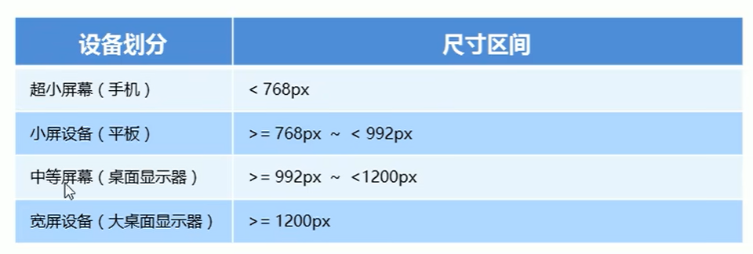

# **響應式開發原理**

> 就是使用媒體查詢針對不同寬度的設備進行布局和樣式的設置，從而適配不同設備的目的。
> 
> 
> 
> 

# **響應式布局容器**

> 響應式需要一個父級作為布局容器，來配合子級元素來實現變化效果。原理就是在不同屏幕下，通過媒體查詢來改變這個布局容器的大小，再改變裡面子元素的排列方式和大小，從而實現不同屏幕下，看到不同的頁面布局和樣式變化。
> 

<aside>
💡

**平時我們的響應式尺寸劃分 :**

- 超小屏幕 ( 手機 : 小於 768px ) : 設置寬度為 100%。
- 小屏幕 ( 平板 : 大於等於 768px ) : 設置寬度為 750px。
- 中等屏幕 ( 桌面顯示器 : 大於等於 992px ) : 寬度設置為 970px。
- 大屏幕 ( 大桌面顯示器 : 大於等於 1200px ) : 寬度設置為 1170px。
</aside>

- **範例程式碼**
    
    ```html
    <!DOCTYPE html>
    <html lang="en">
    
    <head>
      <meta charset="UTF-8">
      <meta name="viewport" content="width=device-width, initial-scale=1.0">
      <title>Document</title>
      <style>
        .container {
          height: 150px;
          background-color: pink;
          margin: 0 auto;
        }
    
        @media screen and (max-width: 767px) {
          .container {
            width: 100%;
          }
        }
    
        @media screen and (min-width: 768px) {
          .container {
            width: 750px;
          }
        }
    
        @media screen and (min-width: 992px) {
          .container {
            width: 970px;
          }
        }
    
        @media screen and (min-width: 1200px) {
          .container {
            width: 1170px;
          }
        }
      </style>
    </head>
    
    <body>
      <!-- 響應式開發裡面，首先需要一個布局容器 -->
      <div class="container"></div>
    </body>
    
    </html>
    ```
    

# **引入資源**

> 💡 引入資源就是: 針對不同的屏幕尺寸，調用不同的 css 文件。
> 
- 當樣式比較繁多的時候，我們可以針對不同的媒體使用不同 `stylesheets`（樣式表）。
- 原理，就是直接在`link`中判斷設備的尺寸，然後引用不同的`css`文件。

**語法:**

```css
<link rel="stylesheet" media="mediatype and|not|only (media feature)" href="mystylesheet.css">
```

- **範例程式碼 :**
    
    ```html
    <body>
        <div></div>
        <div></div>
    </body>
    ```
    
    ```html
    <!-- 引入資源就是: 針對不同的屏幕尺寸，調用不同的 css 文件 -->
    <!-- 當我們屏幕尺寸大於等於 640px 以上時，我們讓 div 一行顯示 2 個 -->
    <!-- 當我們屏幕尺寸小於 640px 時，我們讓 div 一行顯示一個 -->
    <link rel="stylesheet" href="style320.css" media="screen and (min-width: 320px)">
    <link rel="stylesheet" href="style640.css" media="screen and (min-width: 640px)">
    ```
    
    ```css
    /* style320.css */
    div {
      width: 100%;
      height: 100px;
    }
    
    div:nth-child(1){
      background-color: purple;
    }
    
    div:nth-child(2){
      background-color: pink;
    }
    ```
    
    ```css
    /* style640.css */
    div {
      float: left;
      width: 50%;
      height: 100px;
    }
    
    div:nth-child(1){
      background-color: purple;
    }
    
    div:nth-child(2){
      background-color: pink;
    }
    ```
    

# **響應式小案例**


- **範例程式碼**
    
    ```html
    <!DOCTYPE html>
    <html lang="en">
    
    <head>
      <meta charset="UTF-8">
      <meta name="viewport" content="width=device-width, initial-scale=1.0">
      <title>Document</title>
      <style>
        * {
          margin: 0;
          padding: 0;
        }
    
        .container {
          width: 750px;
          margin: 0 auto;
        }
    
        .container ul li {
          float: left;
          width: 93.75px;
          height: 30px;
          background-color: green;
        }
    
        @media screen and (max-width: 767px) {
          .container {
            width: 100%;
          }
    
          .container ul li {
            height: 33.33%;
          }
        }
      </style>
    </head>
    
    <body>
      <!-- 響應式開發裡面，首先需要一個布局容器 -->
      <div class="container">
        <ul>
          <li>導航欄</li>
          <li>導航欄</li>
          <li>導航欄</li>
          <li>導航欄</li>
          <li>導航欄</li>
          <li>導航欄</li>
          <li>導航欄</li>
          <li>導航欄</li>
        </ul>
      </div>
    </body>
    
    </html>
    ```
