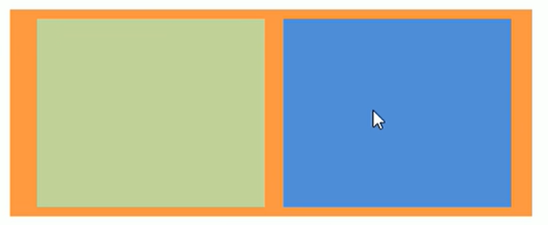

> 效果: 寬度自適應，高度固定。
> 



- 流式佈局，就是百分比佈局，也稱非固定像素佈局。
- 通過盒子的寬度設置成百分比來根據屏幕的寬度來進行伸縮，不受固定像素的限制，內容向兩側填充。

<aside>
💡

**流式布局方式式移動 web 開發使用的比較常見的布局方式。**

- `max-width` : 最大寬度。
- `max-height` : 最大高度。
- `min-width` : 最小寬度。
- `min-height`: 最小高度。
</aside>

```html
<!DOCTYPE html>
<html lang="en">

<head>
  <meta charset="UTF-8">
  <meta name="viewport" content="width=device-width, initial-scale=1.0">
  <title>Document</title>
  <style>
    * {
      margin: 0;
      padding: 0;
    }

    section {
      width: 100%;
      max-width: 980px;
      min-width: 320px;
      margin: 0 auto;
    }

    section div {
      float: left;
      width: 50%;
      height: 400px;
    }

    section div:nth-child(1) {
      background-color: pink;
    }

    section div:nth-child(2) {
      background-color: purple;
    }
  </style>
</head>

<body>
  <section>
    <div></div>
    <div></div>
  </section>
</body>

</html>
```
