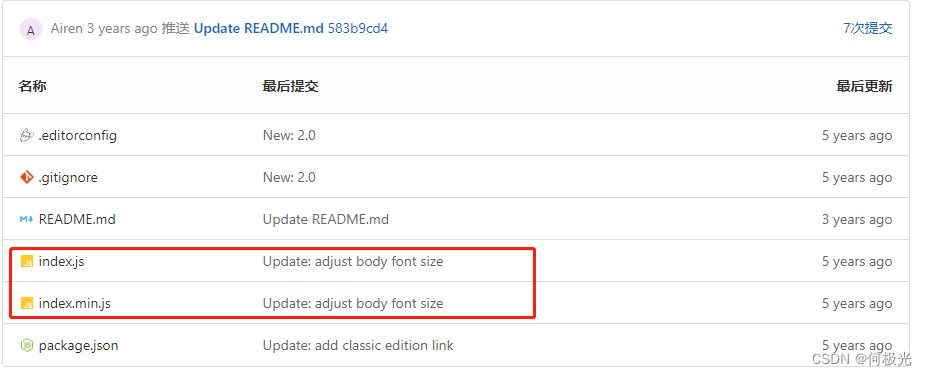
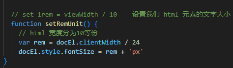
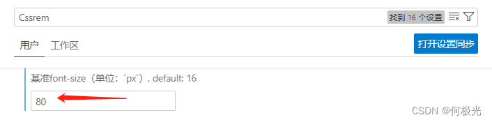
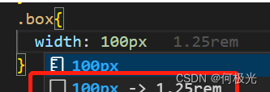

我們來看幾個問題：

1. 頁面佈局文字能否隨著屏幕大小變化而變化？
2. `流式佈局`和`flex佈局`主要針對於寬度佈局，那高度如何設置？
3. 怎麼樣讓屏幕發生變化的時候元素高度和寬度等比例縮放？

# **rem基礎**

- `rem` 是一個相對單位，類似於 `em`，`em`是父元素字體大小。
- 不同的是`rem`的基準是相對於`html`元素的字體大小。
    
    
    
    - 比如，根元素（html）設置`font-size=12px;` 非根元素設置`width:2rem;` 則換成`px`表示就是`24px`。
    - `rem`的優勢：父元素文字大小可能不一致， 但是整個頁面只有一個`html`，可以很好來控制整個頁面的元素大小。

```html
<!DOCTYPE html>
<html lang="en">

<head>
  <meta charset="UTF-8">
  <meta name="viewport" content="width=device-width, initial-scale=1.0">
  <title>Document</title>
  <style>
    html {
      font-size: 12px;
    }

    div {
      font-size: 12px;
      width: 15rem;
      height: 15rem;
      background-color: purple;
    }

    p {
      /* 1. em相对于父元素 的字体大小来说的 */
      /* width: 10em;
      height: 10em; */
      
      /* 2. rem 相对于 html元素 字体大小来说的 */
      width: 10rem;
      height: 10rem;
      background-color: pink;
    }
  </style>
</head>

<body>
  <div>
    <p></p>
  </div>
</body>

</html>
```

# **媒體查詢+rem實現元素動態大小變化**

- `rem`單位是跟著`html`來走的，有了`rem`頁面元素可以設置不同大小尺寸。
- 媒體查詢可以根據不同設備寬度來修改樣式。
- `媒體查詢 + rem` 就可以實現不同設備寬度，實現頁面元素大小的動態變化。
- 上述代碼的意思是：屏幕尺寸小於 320px， div 大小為 0.5 * 50 = 25px，屏幕尺寸大於 320px 小於 640px， div 大小為 0.5 * 100 = 50px
    
    ```html
    <!DOCTYPE html>
    <html lang="en">
    
    <head>
      <meta charset="UTF-8">
      <meta name="viewport" content="width=device-width, initial-scale=1.0">
      <title>Document</title>
      <style>
        * {
          margin: 0;
          padding: 0;
        }
    
        /* 从小到大的顺序 */
        @media screen and (min-width: 320px) {
          html {
            font-size: 50px;
          }
        }
    
        @media screen and (min-width: 640px) {
          html {
            font-size: 100px;
          }
        }
    
        .top {
          height: 1rem;
          font-size: .5rem;
          background-color: green;
          color: #fff;
          text-align: center;
          line-height: 1rem;
        }
      </style>
    </head>
    
    <body>
      <div class="top">购物车</div>
    </body>
    
    </html>
    ```
    

# **rem 適配方案**

- 讓一些不能等比自適應的元素，達到當設備尺寸發生改變的時候，等比例適配當前設備。
- 使用媒體查詢根據不同設備按比例設置`html`的字體大小，然後頁面元素使用`rem`做尺寸單位，當`html`字體大小變化元素尺寸也會發生變化，從而達到等比縮放的適配。

<aside>
💡

**`rem` 單位尺寸**

- 確定設計稿對應的設備 HTML 標籤字號。

```
基准根字号 = 设备宽度（视口宽度）/ 10

rem 单位的尺寸 = px单位数值 / 基准根字号

eg:
设计稿设备宽度  375px
设计稿元素宽度  75px
rem宽度 = 75px / (375px / 10) = 2rem
```

- ✍️ 目前 rem 布局方案中，將網頁等分分成 10 份，HTML 標籤的字號為視口寬度的 1/10。
</aside>

- **範例程式碼**
    
    ```html
    <!DOCTYPE html>
    <html lang="en">
    
    <head>
      <meta charset="UTF-8">
      <meta name="viewport" content="width=device-width, initial-scale=1.0">
      <title>Document</title>
      <style>
        * {
          margin: 0;
          padding: 0;
        }
    
        /* 視口寬度 320px，根字號為 32px */
        @media screen and (min-width: 320px) {
          html {
            font-size: 32px;
          }
        }
    
        /* 視口寬度 640px，根字號為 64px */
        @media screen and (min-width: 640px) {
          html {
            font-size: 64px;
          }
        }
    
        .box {
          width: 5rem;
          height: 3rem;
          background-color: pink;
        }
      </style>
    </head>
    
    <body>
      <div class="box"></div>
    </body>
    
    </html>
    ```
    
- **`rem`** 適配方案技術使用
    - 按照設計稿與設備寬度的比例，動態計算並設置 `html` 根標籤的 `font-size` 大小；（媒體查詢）。
    - `CSS` 中，設計稿元素的寬、高、相對位置等取值，按照同等比例換算為 `rem` 為單位的值。
- `rem` 實際開發中適配方案
    - **方案一  ⇒  css、媒體查詢、rem**
    - **方案二  ⇒  flexble.js、rem**
    - 兩種方案都存在，方案 2 更為簡單。

### **rem 實際開發適配方案一  ⇒**  rem + 媒體查詢 + css 技術

> ✍️ 一般情況下，我們以一套或兩套效果圖適應大部分的屏幕，放棄極端屏或對其優雅降級，犧牲一些效果。現在基本以750為準。
> 
> 
> 
> 

<aside>
💡

- **動態設置 `html` 標籤 `font-size` 大小**
    - 假設設計稿是`750px`。
    - 假設我們把整個屏幕劃分為`15等份`（劃分標準不一，可以是`20等份`也可以是`10等份`）。
    - 每一份作為`html`字體大小，這裡就是`50px`。
    - 那麼在`320px`設備的時候，字體大小為`320/15` 就是 `21.33px` 。
    - 用我們頁面元素的大小，除以不同的 `html` 字體大小會發現他們比例還是相同的。
    - 比如我們以 `750` 為標准設計稿。
    - 一個`100*100`像素的頁面元素，在`750`屏幕下， 就是 `100 / 50` 轉換為`rem`是 `2rem * 2rem`比例是 1 比 1。
    - `320` 屏幕下， `html` 字體大小為 `21.33` 則 `2rem = 42.66px` ，此時寬和高都是 `42.66` 但是寬和高的比例還是 1 比 1。
    - 但是已經能實現不同屏幕下，頁面元素盒子等比例縮放的效果。
</aside>

<aside>
💡

- **元素大小取值方法**
    - 最後的公式： 頁面元素的`rem`值 = `頁面元素值（px） / （屏幕寬度 / 劃分的份數）`。
    - `屏幕寬度/劃分的份數` 就是 `html` `font-size` 的大小。
    - 或者： 頁面元素的`rem`值 = `頁面元素值（px） / html font-size 字體大小`。
</aside>

- **範例程式碼**
    
    ```html
    <!DOCTYPE html>
    <html lang="en">
    
    <head>
      <meta charset="UTF-8">
      <meta name="viewport" content="width=device-width, initial-scale=1.0">
      <title>Document</title>
      <style>
        @media screen and (min-width: 320px) {
          html {
            font-size: 21.33px;
          }
        }
    
        @media screen and (min-width: 750px) {
          html {
            font-size: 50px;
          }
        }
    
        div {
          width: 2rem;
          height: 2rem;
          background-color: pink;
        }
      </style>
    </head>
    
    <body>
      <div></div>
    </body>
    
    </html>
    ```
    

### **rem 實際開發適配方案二  ⇒  flexble.js、rem**

flexible.js是手淘开发出的一个用来适配移动端的js框架。手淘框架的核心原理就是根据制不同的width给网页中html根节点设置不同的font-size，然后所有的px都用rem来代替，这样就实现了不同大小的屏幕都适应相同的样式了。其实它就是一个终端设备适配的解决方案，也就是说它可以让你在不同的终端设备中实现页面适配。

flexible.js是用来使内容适应屏幕大小的插件。

rem，是相对单位，是相对HTML根元素，可谓集相对大小和绝对大小的优点于一身，通过它既可以做到只修改根元素就成比例地调整所有字体大小，又可以避免字体大小逐层复合的连锁反应。

- **安装**
    - 方式一：github下载地址
        
        
        
    - 方式二：`npm i -S amfe-flexible`
- **导入**
    
    ```jsx
    <meta name="viewport" content="width=device-width, initial-scale=1, maximum-scale=1, minimum-scale=1, user-scalable=no">
    <script src="./index.js"></script>
    ```
    
- **使用**
    - 如要转化为 1rem=80px；将 flexible.js 中的 10 改为 24，因为 1920/24=80。
        
        
        
    - vscode 安装 cssrem 插件（方便写代码时px与rem的换算）。
        
        
        
    - 修改扩展设置中的 root font size 值为 80（设置1rem=80px）。
        
        
        
    - 代码效果
        
        
        
- **flexible.js代码解读**
    
    ```jsx
    (function flexible(window, document) {
        // 获取的html 的根元素
        var docEl = document.documentElement
        // dpr 物理像素比 
        //window.devicePixelRatio 当前浏览器物流像素比
        var dpr = window.devicePixelRatio || 1
    
        // adjust body font size  设置我们body 的字体大小
        function setBodyFontSize() {
            // 如果页面中有body 这个元素 就设置body的字体大小
            if (document.body) {
                document.body.style.fontSize = (12 * dpr) + 'px'
            } else {
                // 如果页面中没有body 这个元素，则等着 我们页面主要的DOM元素加载完毕再去设置body 的字体大小
                // DOMContentLoaded   DOM元素加载后执行
                document.addEventListener('DOMContentLoaded', setBodyFontSize)
            }
        }
        setBodyFontSize();
    
        // set 1rem = viewWidth / 10    设置我们 html 元素的文字大小
        function setRemUnit() {
            // html 宽度分为10等份 
            var rem = docEl.clientWidth / 10
            docEl.style.fontSize = rem + 'px'
        }
    
        setRemUnit()
    
        // reset rem unit on page resize  当我们页面尺寸大小发生变化的时候，要重新设置下rem 的大小
        window.addEventListener('resize', setRemUnit)
            // pageshow 是我们重新加载页面触发的事件
        window.addEventListener('pageshow', function(e) {
            // e.persisted 返回的是true 就是说如果这个页面是从缓存取过来的页面，也需要从新计算一下rem 的大小
            if (e.persisted) {
                setRemUnit()
            }
        })
    
        // detect 0.5px supports  有些移动端的浏览器不支持0.5像素的写法
        if (dpr >= 2) {
            var fakeBody = document.createElement('body')
            var testElement = document.createElement('div')
            testElement.style.border = '.5px solid transparent'
            fakeBody.appendChild(testElement)
            docEl.appendChild(fakeBody)
            if (testElement.offsetHeight === 1) {
                docEl.classList.add('hairlines')
            }
            docEl.removeChild(fakeBody)
        }
    }(window, document))
    ```