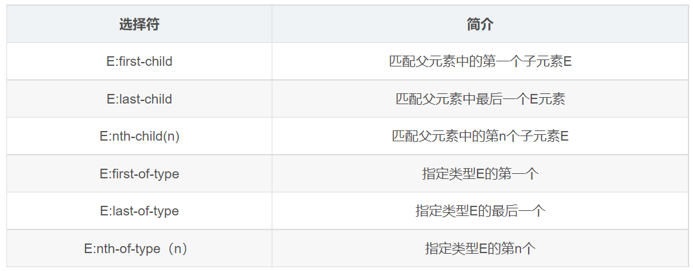

<aside>
👉

**本篇整理複合與進階選擇器。**

- 這些選擇器建立在基礎選擇器之上，用來描述元素關係、組合多個選擇條件，或選取特定狀態與位置。
- 常見類型包含：關係選擇器、組合選擇器、條件選擇器、偽類選擇器與偽元素選擇器。
</aside>

# **關係選擇器**

## **後代選擇器**

> 後代選擇器又稱為包含選擇器，可以選擇父元素裡面的子元素。
> 
- ✍️ 其寫法就是把外層標籤寫在前面，內層標籤寫在後面，中間用空格分隔，當標籤發生嵌套時，內層標籤就稱為外層標籤的後代。
    
    ```css
    元素1 元素2 {
      样式声明
    }
    
    /* 選擇 ul 裡面的所有 li 標籤元素 */
    ul li {
      样式声明
    }
    ```
    

<aside>
⚠️

**注意點 :**

- 元素 1 和元素 2 中間用空格隔開。
- 元素 1 是父級，元素 2 是子級，最終選擇的是元素 2。
- 元素 2 可以是兒子，也可以是孫子，只要是元素 1 的後代即可。
- 元素 1 和元素 2 可以是任意基礎選擇器。
</aside>

```css
/* 我想要把 ol 裡面的小 li 選出來改為 pink */
ol li {
  color: pink;
}

ol li a {
  color: red;
}

.nav li a {
  color: orange;
}

```

```html
<ol>
  变态写法
  <li>我是ol 的孩子</li>
  <li>我是ol 的孩子</li>
  <li>我是ol 的孩子</li>
  <li>
    <a href="#">我是孙子</a>
  </li>
</ol>

<ul>
  <li>我是ul 的孩子</li>
  <li>我是ul 的孩子</li>
  <li>我是ul 的孩子</li>
  <li><a href="#">不会变化的</a></li>
</ul>

<ul class="nav">
  <li>我是ul 的孩子</li>
  <li>我是ul 的孩子</li>
  <li>我是ul 的孩子</li>
  <li><a href="#">不会变化的</a></li>
  <li><a href="#">不会变化的</a></li>
  <li><a href="#">不会变化的</a></li>
  <li><a href="#">不会变化的</a></li>
</ul>
```

## **子選擇器**

> 💡 只能選擇作為某元素的最近一級子元素，簡單理解就是選親兒子元素。
> 

```css
元素1 > 元素2{
    样式声明
}

/* 選擇 div 裡面所有最近一級 p 標籤元素 */
div > p{
    样式声明
}
```

<aside>
⚠️

**注意點：**

- 上述語法表示選擇元素 1 裡面的所有直接後代元素 2。
- 元素 1 和元素 2 中間用大於號隔開。
- 元素 1 是父級，元素 2 是子級，最終選擇的是元素 2 。
- **元素 2 必須是親兒子**，其孫子、重孫之類都不歸他管，你也可以叫他親兒子選擇器。
</aside>

```css
.nav > a {
	color: red;
}
```

```html
<div class="nav">
  <a href="#">我是儿子</a>

  <p>
    <a href="#">我是孙子</a>
  </p>
</div>
```

## **兄弟選擇器**

> **參考文章：**
> 
> 
> [兄弟选择器(+ 和 ~)_+选择器-CSDN博客](https://blog.csdn.net/weixin_46683341/article/details/119006368)
> 

### **+選擇器**

> 如果需要選擇緊接在另一個元素後的元素，而且二者有相同的父元素，可以使用相鄰兄弟選擇器。
> 
- 基礎範例程式碼
    
    ```css
    /* 兄弟只會影響下面的 p 標籤的樣式，不影響上面兄弟的樣式。*/
    h1 + p {
      margin-top: 50px;
      color: red;
    }
    ```
    
    ```html
    <p>This is paragraph.</p>
    <h1>This is a heading.</h1>
    <p>This is paragraph.</p>
    <p>This is paragraph.</p>
    ```
    
- 當然這個也會循環查找，即當兩個兄弟元素相同時，會一次循環查找：
    
    ```css
    li + li {
      color: red;
    }
    ```
    
    ```html
    <div>
      <ul>
        <!-- 可以看出第一個 li 字體顏色沒有變紅，第二個和第三個元素字體變紅，這就是因為第三個 li 是第二個 li 的兄弟元素，所以也會應用樣式。 -->
        <li>List item 1</li>
        <li>List item 2</li>
        <li>List item 3</li>
      </ul>
    </div>
    ```
    

### **~選擇器**

> 作用是查找某一個指定元素的後面的所有兄弟結點。
> 

```css
h1 ~ p {
  color: red;
}
```

```html
<p>1</p>
<h1>2</h1>
<p>3</p>
<p>4</p>
<p>5</p>
```

# **組合選擇器**

## **並集選擇器**

> 並集選擇器可以選擇多組標籤，同時為它們定義相同的樣式。
> 
- 並集選擇器是各選擇器通過英文逗號連接而成，任何形式的選擇器都可以作為並集選擇器的一部分。
    
    ```css
    元素1, 元素2 {
        样式声明
    }
    
    /* 選擇  ul  和  div 標籤元素 */
    ul, div {
        样式声明
    }
    ```
    

<aside>
⚠️

**注意點 :**

- 元素1 和 元素2 中間用逗號隔開。
- 逗號可以理解為`和`的意思。
- 並集選擇器通常用於集體聲明。
</aside>

```css
/* 要求1: 请把熊大和熊二改为粉色 */
/*
div, p {
    color: pink;
}
*/

/* 要求2: 请把熊大和熊二改为粉色 还有 小猪一家改为粉色 */
div, p, .pig li {
    color: pink;
}
```

```html
<div>熊大</div>

<p>熊二</p>

<span>光头强</span>

<ul class="pig">
  <li>小猪佩奇</li>
  <li>猪爸爸</li>
  <li>猪妈妈</li>
</ul>
```

## **交集選擇器**

> 作用: 選中頁面中同時滿足多個選擇器的標籤。
> 
- 語法:
    
    ```css
    选择器1选择器2: {
    	样式声明
    }
    ```
    
    - 結果 → 找到頁面中既能被選擇器1選中，又能被選擇器2選中的標籤，設置樣式。

<aside>
⚠️

**注意點 :**

- **交集選擇器中的選擇器之間是緊挨著的，沒有東西分隔**。
- 交集選擇器中如果有標籤選擇器，標籤選擇器必須寫在最前面。
</aside>

```css
/* 必須是 p 標籤，而且添加了 box 類。 */
p.box{
  color: red;
}
```

```html
<!-- 找到第一個 p 帶 box 類的；設置文字顏色是紅色。 -->
<p class="box">這是 p 標籤</p>
<p>ppppp</p>
<div class="box">這是 div 標籤</div>
```

# **條件選擇器**

## **屬性選擇器**

> 屬性選擇器可以根據元素特定的屬性來選擇元素，這樣就可以不用借助於類或者 id 選擇器。
> 
> 
> 
> 
- 利用屬性選擇器就可以不借助於類或者id選擇器
    
    ```css
    input[value] {
      color: pink;
    }
    ```
    
    ```html
    <!-- 1.利用属性选择器可以不借助类或者id选择器 -->
    <input type="text" value="请输入用户名">
    <input type="text">
    ```
    
- 屬性選擇器還可以選擇 `屬性 = 值`的某些元素
    
    ```css
    input[type=text] {
      color: pink;
    }
    ```
    
    ```html
    <!-- 2.属性选择器还可以选择 属性=值的某些元素 -->
    <input type="text" name="" id="">
    <input type="password" name="" id="">
    ```
    
- 屬性選擇器可以選擇屬性值開頭的某些元素
    
    ```css
    /* 选择首先是 div，然后具有class属性，并且是icon开头的值 */
    div[class^=icon] {
      color: pink;
    }
    ```
    
    ```html
    <!-- 3.属性选择器可以选择属性值开头的某些元素 -->
    <div class="icon1">小图标1</div>
    <div class="icon2">小图标2</div>
    <div class="icon3">小图标3</div>
    <div class="icon4">小图标4</div>
    ```
    
- 屬性選擇器可以選擇屬性值結尾的某些元素
    
    ```css
    section[class$=data] {
      color: pink;
    }
    ```
    
    ```html
    <!-- 4.属性选择器可以选择属性值结尾的某些元素 -->
    <section class="icon1-data">1</section>
    <section class="icon2-data">2</section>
    <section class="icon3-data">3</section>
    ```
    

<aside>
⚠️

**注意：類選擇器，屬性選擇器，偽類選擇器，權重為10。**

</aside>

# **偽類選擇器**

> 因為偽類選擇器很多，比如有鏈接偽類、結構偽類等等；這裡先記錄常用的。
> 
- 偽類選擇器用於向某些選擇器添加特殊的效果，比如給鏈接添加特殊效果、或選擇第一個、第 n 個元素。
- 偽類選擇器書寫最大的特點是用冒號表示，例如 `:hover`、`:first-child`。

### **:link、:visited、:hover、:active偽類選擇器**

> 💡 為了確保生效，請按照 LVHA 的順序聲明 → :link、:visited、:hover、:active。
> 

```css
/* 1.未訪問的鏈接 a:link  把沒有點擊過的(訪問過的)鏈接選出來 */
a:link {
    color: #333;
    text-decoration: none;
}

/* 2. a:visited 選擇點擊過的(訪問過的)鏈接 */
a:visited {
    color: orange;
}

/*3. a:hover 選擇鼠標經過的那個鏈接 */
a:hover {
    color: skyblue;
}

/* 4. a:active 選擇的是我們鼠標正在按下還沒有彈起鼠標的那個鏈接 */
a:active {
    color: green;
}

/*
5. :focus偽類選擇器用於選取獲得焦點的表單元素
一般情況<input>類表單元素才能獲取，因此這個選擇器也主要針對錶單元素來說
*/
input:focus {
    background-color: yellow;
}
```

```html
<a href="#">小猪佩奇</a>
<a href="http://www.xxxxxxxx.com">未知的网站</a>
<input type="text">
```

### **:focus偽類選擇器**

> :focus 偽類選擇器用於選取獲得焦點的表單元素。
> 
> - 焦點就是光標，一般情況 `<input>` 類表單元素才能獲取，因此這個選擇器也主要針對表單元素來說。

```css
input:focus {
  background-color: pink;
  color: red;
}
```

```html
<input type="text">
<input type="text">
<input type="text">
```

## **結構偽類選擇器**

> 結構偽類選擇器主要根據文檔結構來選擇元素。常用於根據父級選擇器選擇裡面的子元素。
> 
> 
> 
> 

### `E:first-child` 和 `E:last-child`

```css
/* 1. 選擇 ul 裡面的第一個孩子 小 li */
ul li:first-child {
  background-color: pink;
}

/* 2. 選擇 ul 裡面的最後一個孩子 小 li */
ul li:last-child {
  background-color: pink;
}
```

```html
<ul>
  <li>我是第1个孩子</li>
  <li>我是第2个孩子</li>
  <li>我是第3个孩子</li>
  <li>我是第4个孩子</li>
  <li>我是第5个孩子</li>
  <li>我是第6个孩子</li>
  <li>我是第7个孩子</li>
  <li>我是第8个孩子</li>
</ul>
```

### `E:nth-child(n)`

> nth-child(n) 選擇某個父級元素的一個或多個特定的子元素（重點）。
> 
> 
> 
> 
- `n`可以是數字，關鍵字和公式。
- `n`如果是數字，就是選擇第`n`個子元素，裡面數字從`1`開始。
- `n`可以是關鍵字：`even 偶數`，`odd 奇數`。
- `n`可以是公式：常見的公式如下（如果`n`是公式，則從`0`開始計算，但是第`0`個元素或者超出了元素的個數會被忽略）。
- **範例程式碼 1**
    
    ```css
    /* 選擇 ul 裡面的第 2 個孩子 小 li */
    ul li:nth-child(2) {
      background-color: pink;
    }
    ```
    
    ```html
    <ul>
      <li>我是第1个孩子</li>
      <li>我是第2个孩子</li>
      <li>我是第3个孩子</li>
      <li>我是第4个孩子</li>
      <li>我是第5个孩子</li>
      <li>我是第6个孩子</li>
      <li>我是第7个孩子</li>
      <li>我是第8个孩子</li>
    </ul>
    ```
    
- 範例程式碼 2
    
    ```css
    /* 1. 把所有的偶數 even 的孩子選出來 */
    ul li:nth-child(even) {
      background-color: #ccc;
    }
    
    /* 2. 把所有的奇數 odd 的孩子選出來 */
    ul li:nth-child(odd) {
      background-color: gray;
    }
    
    /* 3.nth-child(n) 從 0 開始每次加 1 往後面計算，這裡面必須是 n 不能是其他的字母，選擇了所有的孩子 */
    /* 
    ol li:nth-child(n) {
      background-color: pink;
    } 
    */
    
    /* 4.nth-child(2n) 選擇了所有的偶數孩子 等價於 even */
    /* 
    ol li:nth-child(2n) {
      background-color: pink;
    } 
    */
    
    /* 5. 其他如下*/
    /* 
    ol li:nth-child(2n+1) {
      background-color: skyblue;
    } 
    */
    /* 
    ol li:nth-child(n+3) {
      background-color: pink;
    } 
    */
    /* 
    ol li:nth-child(-n+3) {
      background-color: pink;
    } 
    */
    ```
    
    ```html
    <ul>
      <li>我是第1个孩子</li>
      <li>我是第2个孩子</li>
      <li>我是第3个孩子</li>
      <li>我是第4个孩子</li>
      <li>我是第5个孩子</li>
      <li>我是第6个孩子</li>
      <li>我是第7个孩子</li>
      <li>我是第8个孩子</li>
    </ul>
    <ol>
      <li>我是第1个孩子</li>
      <li>我是第2个孩子</li>
      <li>我是第3个孩子</li>
      <li>我是第4个孩子</li>
      <li>我是第5个孩子</li>
      <li>我是第6个孩子</li>
      <li>我是第7个孩子</li>
      <li>我是第8个孩子</li>
    </ol>
    ```
    

### `E:first-of-type`、`E:last-of-type`、`E:nth-last-child(n)`

- E:first-of-type  ⇒  指定類型E的第一個
- E:last-of-type  ⇒  指定類型E的最後一個
- E:nth-last-child(n)  ⇒  指定類型E倒數第 n 個子元素

```css
ul li:first-of-type {
  background-color: pink;
}

ul li:last-of-type {
  background-color: pink;
}

ul li:nth-last-child(2) {
  background-color: purple;
}
```

```html
<ul>
  <li>我是第1个孩子</li>
  <li>我是第2个孩子</li>
  <li>我是第3个孩子</li>
  <li>我是第4个孩子</li>
  <li>我是第5个孩子</li>
  <li>我是第6个孩子</li>
  <li>我是第7个孩子</li>
  <li>我是第8个孩子</li>
</ul>
```

### `E:nth-child(n)` 和 `E:nth-of-type(n)`區別 ?

- `E:nth-child`對父元素裡面所有孩子排序選擇(序號是固定的)，先找到第 `n` 個孩子，然後看看是否和 `E` 匹配。
    - 元素類型沒有限制。
- `E:nth-of-type`對父元素裡面`指定子元素`進行排序選擇，先去匹配`E`，然後再根據`E` 找第`n`個孩子。
    - 匹配屬於父元素的特定類型。

```css
/* nth-child 会把所有的盒子都排列序号 */
/* 执行的时候首先看  :nth-child(1) 之后回去看 前面 div */
section div:nth-child(1) {
    background-color: red;
}

/* nth-of-type 会把指定元素的盒子排列序号 */
/* 执行的时候首先看  div指定的元素  之后回去看 :nth-of-type(1) 第几个孩子 */
section div:nth-of-type(1) {
    background-color: blue;
}
```

```html
<section>
  <p>光头强</p>
  <div>熊大</div>
  <div>熊二</div>
</section>
```

<aside>
💡

**總結**

- 結構偽類選擇器一般用於選擇父級裡面的第幾個孩子。
- `nth-child` 對父元素裡面所有孩子排序選擇（序號是固定的），先找到第`n`個孩子，然後看看是否和`E`匹配。
- `nth-of-type` 對父元素裡面指定子元素進行排序選擇，先去匹配`E`，然後再根據`E`找第`n`個孩子。
- 關於`nth-child(n)`， 我們要知道`n`是從`0`開始計算的，要記住常用的公式。
- 如果是無序列表，我們肯定用 `nth-child` 更多。
- 類選擇器，屬性選擇器，偽類選擇器，權重為10。
</aside>

# **偽元素選擇器**

- 偽元素選擇器和標籤選擇器一樣，權重為 1。
- 💡 新創建的這個元素在文檔樹中是找不到的，所以我們稱為偽元素。

### **::first-letter**

> 💡 選中元素中的第一個文字
> 

```css
p::first-letter {
  font-size: 30px;
  color: blueviolet;
}
```

```html
<p>Lorem ipsum dolor, sit amet consectetur adipisicing elit. Similique consectetur quo recusandae eveniet magnam unde
  praesentium? Soluta perspiciatis similique quae quos modi consequatur, ipsam atque libero cum mollitia nam possimus!
</p>
```

### **::first-line**

> 💡 選中元素中的第一行文字。
> 

```css
p::first-line {
  color: blue;
}
```

```html
<p>Lorem ipsum dolor, sit amet consectetur adipisicing elit. Similique consectetur quo recusandae eveniet magnam unde
  praesentium? Soluta perspiciatis similique quae quos modi consequatur, ipsam atque libero cum mollitia nam possimus!
</p>
```

### **::selection**

> 💡 選中被鼠標選中的內容。
> 

```css
p::selection {
  color: aqua;
}
```

```html
<p>Lorem ipsum dolor, sit amet consectetur adipisicing elit. Similique consectetur quo recusandae eveniet magnam unde
  praesentium? Soluta perspiciatis similique quae quos modi consequatur, ipsam atque libero cum mollitia nam possimus!
</p>
```

### **::before、::after**

> 可以幫我們利用CSS創建新標籤元素，而不需要HTML標籤，從而簡化HTML結構。
> 
> 
> 
> 

<aside>
⚠️

**注意**

- `before` 和 `after` 創建一個元素，但是是屬於行內元素。
- `before` 和 `after` 都是一個盒子，都作為父元素的孩子。
- `before` 和 `after` 必須有`content` 屬性。
- `before` 在父元素內容的前面創建元素 ，`after`在父元素內容的後面插入元素。
</aside>

```css
div {
    width: 200px;
    height: 200px;
    background-color: pink;
}

/* div::before 权重是2 */
div::before {
	/* 这个 content 是必须要写的 */
	content: '我';
}

div::after {
    content: '小猪佩奇';
}
```

```html
<div>
    是
</div>
```
