**以下有 6 個屬性是對父元素設置的**

- `flex-direction`：設置主軸的方向。
- `justify-content`：設置主軸上的子元素排列方式。
- `align-items`：設置側軸上的子元素排列方式（單行）。
- `align-content`：設置側軸上的子元素的排列方式（多行）。
- `flex-wrap`：設置子元素是否換行。
- `flex-flow`：複合屬性，相當於同時設置了 `flex-direction` 和 `flex-wrap`。
</aside>

# **設置主軸方向 flex-direction**

- 主軸和側軸：在 `flex` 佈局中，是分為主軸和側軸兩個方向，同樣的叫法有：行和列、`x軸` 和 `y軸`。
    
    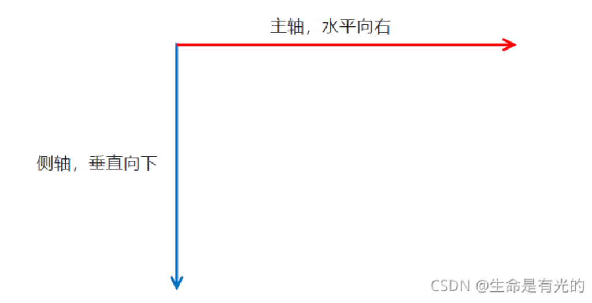
    
    - 默認主軸方向就是 x 軸方向，水平向右。
    - 默認側軸方向就是 y 軸方向，水平向下。
- flex-direction 屬性決定主軸的方向（即項目的排列方向）
    
    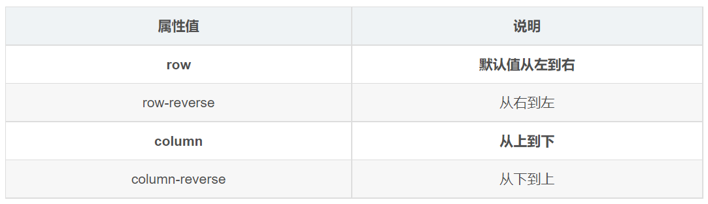
    
- 注意主軸和側軸是會變化的，就看 flex-direction 設置誰為主軸，剩下的就是側軸。而我們的子元素是跟著主軸來排列的
    
    
    

```css
.box-wrap {
  margin: 0 auto;
  display: flex;

	/* 修改主轴方向为垂直方向 */
	/* 先确定主轴方向，再设置主轴或侧轴对齐 */
	flex-direction: column;

	/* 视觉效果：垂直居中 */
	justify-content: center;

	/* 视觉效果：水平居中 */
	align-items: center;

  width: 500px;
  height: 200px;
  border: 1px solid #666;
}

.box {
  width: 100px;
  height: 100px;
  background-color: skyblue;
}
```

```html
<body>
  <div class="box-wrap">
    <div class="box"></div>
  </div>
</body>
```

# **主軸對齊方式 justify-content**

> justify-content 屬性定義了項目在主軸上的對齊方式。
> 
- 常用值如下:
    - flex-start: 左對齊（默認值）
        
        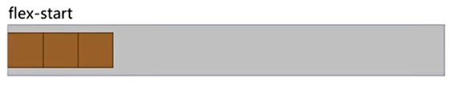
        
    - flex-end: 右對齊
        
        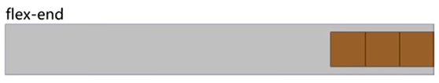
        
    - center: 居中
        
        
        
    - space-around: 均勻排列每個元素，每個元素周圍分配相同的空間。( 兩端距離是中間距離的一半。 )
        
        
        
    - space-between: 均勻排列每個元素，首個元素放置於起點，末尾元素放置於終點。( 兩端對齊 )
        
        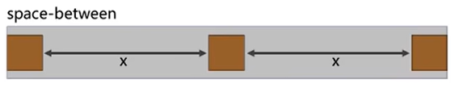
        
    - space-evenly: 均勻排列每個元素，每個元素之間的間隔相等。( 兩端距離與中間距離一致。 )
        
        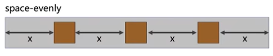
        

```css
h3 {
  text-align: center;
}

.box-wrap {
  display: flex;
  margin: 0 auto;
  width: 500px;
  border: 1px solid #eee;
}

.box-wrap+.box-wrap {
  margin-top: 20px;
}

.box {
  width: 100px;
  height: 100px;
  font-size: 20px;
  line-height: 100px;
  text-align: center;
  background-color: skyblue;
}

/* 居中 */
.box-center {
  justify-content: center;
}

/* 间距在盒子之间 */
.box-between {
  justify-content: space-between;
}

/* 间距在子两侧，视觉效果：子级之间的距离是两头距离的 2 倍 */
.box-around {
  justify-content: space-around;
}

/* 盒子和容器所有间距相等 */
.box-evenly {
  justify-content: space-evenly;
}
```

```html
<body>
  <h3>默认</h3>
  <div class="box-wrap">
    <div class="box">1</div>
    <div class="box">2</div>
    <div class="box">3</div>
  </div>

  <h3>justify-content: center;</h3>
  <div class="box-wrap box-center">
    <div class="box">1</div>
    <div class="box">2</div>
    <div class="box">3</div>
  </div>

  <h3>justify-content: space-between;</h3>
  <div class="box-wrap box-between">
    <div class="box">1</div>
    <div class="box">2</div>
    <div class="box">3</div>
  </div>

  <h3>justify-content: space-around;</h3>
  <div class="box-wrap box-around">
    <div class="box">1</div>
    <div class="box">2</div>
    <div class="box">3</div>
  </div>

  <h3>justify-content: space-evenly;</h3>

  <div class="box-wrap box-evenly">
    <div class="box">1</div>
    <div class="box">2</div>
    <div class="box">3</div>
  </div>
</body>
```

# **設置側軸上的子元素排列方式 align-items (單行)**

- 常用值如下:
    - flex-start : 側軸的起點對齊。
        
        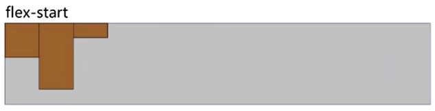
        
    - flex-end : 側軸的終點對齊。
        
        
        
    - center : 側軸的中點對齊。
        
        
        
    - baseline : 項目的第一行文字的基線對齊。
        
        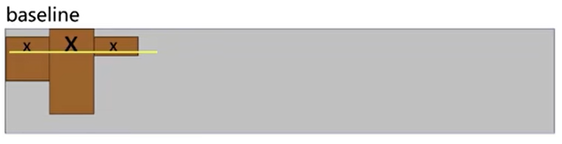
        
    - stretch : （默認值）如果項目未設置高度，項目將佔滿整個容器的高度。
        
        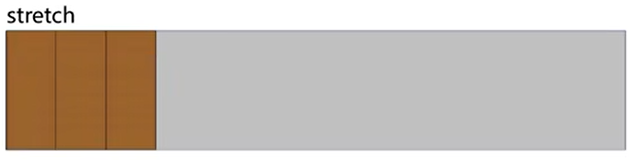
        

```css
h3 {
  text-align: center;
}

.box-wrap {
  width: 500px;
  margin: 0 auto;
  display: flex;
  height: 200px;
  border: 1px solid #666;
}

.box {
  width: 100px;
  background-color: skyblue;
}

.box-wrap-height .box {
  height: 100px;
}

/* 拉伸 */
.stretch {
  align-items: stretch;
}

/* 顶对齐 */
.flex-start {
  align-items: flex-start;
}

/* 底对齐 */
.flex-end {
  align-items: flex-end;
}

/* 上下居中 */
.center {
  align-items: center;
}

.child-center .box:nth-child(2) {
  align-self: center;
}
```

```html
<body>
  <h3>子元素没有设置高度，默认撑开和父级一样高</h3>
  <div class="box-wrap">
    <div class="box"></div>
    <div class="box"></div>
    <div class="box"></div>
  </div>

  <h3>子元素没有设置高度，默认：align-items: stretch;</h3>
  <div class="box-wrap stretch">
    <div class="box"></div>
    <div class="box"></div>
    <div class="box"></div>
  </div>

  <h3>子元素设置高度，默认</h3>
  <div class="box-wrap box-wrap-height">
    <div class="box"></div>
    <div class="box"></div>
    <div class="box"></div>
  </div>

  <h3>子元素设置高度，默认：align-items: flex-start;</h3>
  <div class="box-wrap box-wrap-height flex-start">
    <div class="box"></div>
    <div class="box"></div>
    <div class="box"></div>
  </div>

  <h3>align-items: flex-end;</h3>
  <div class="box-wrap box-wrap-height flex-end">
    <div class="box"></div>
    <div class="box"></div>
    <div class="box"></div>
  </div>

  <h3>align-items: center;</h3>
  <div class="box-wrap box-wrap-height center">
    <div class="box"></div>
    <div class="box"></div>
    <div class="box"></div>
  </div>

  <h3>设置单独子元素 align-self: center</h3>
  <div class="box-wrap box-wrap-height child-center">
    <div class="box"></div>
    <div class="box"></div>
    <div class="box"></div>
  </div>
</body>
```

# **設置側軸上的子元素的排列方式 align-content(多行)**

> 設置子項在側軸上的排列方式 並且只能用於子項出現換行的情況（多行），在單行下是沒有效果的。
> 
- 常用值如下: (取值和 justify-content 基本相同 )
    - flex-start : 與側軸的起點對齊。
        
        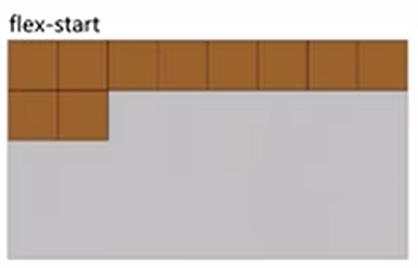
        
    - flex-end : 與側軸的終點對齊。
        
        
        
    - center : 與側軸的中點對齊。
        
        
        
    - space-between : 與側軸兩端對齊，中間平均分布。
        
        
        
    - space-around : 項目間的距離相等，比軸線與邊框的間隔大一倍。
        
        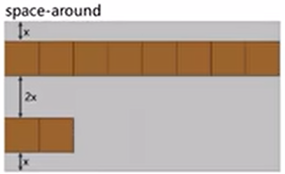
        
    - space-evenly : 在側軸上完全平分。
        
        
        
    - stretch : 占滿整個側軸 ( 默認值 )。
        
        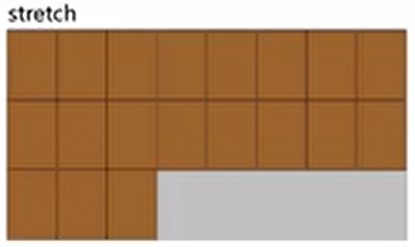
        

```html
<body>
    <div>
        <span>1</span>
        <span>2</span>
        <span>3</span>
        <span>4</span>
        <span>5</span>
        <span>6</span>
    </div>
</body>
```

```css
div {
	/* 默认主轴是 x 轴 */
  display: flex;
  width: 800px;
  height: 400px;
  background-color: pink;
	
	/* 换行 */
	flex-wrap: wrap;
	
	/* 因为有了换行，此时我们侧轴上控制子元素的对齐方式我们用 align-content */
  align-content: flex-start;
	/* align-content: flex-end; */
	/* align-content: center; */
	/* align-content: space-between; */
	/* align-content: space-around; */
}

div span {
  width: 150px;
  height: 100px;
  background-color: purple;
  color: #fff;
  margin: 10px;
}
```

# **設置子元素是否換行 flex-wrap**

> 默認情況下，項目都排在一條線（又稱”軸線”）上。 flex-wrap屬性定義，flex佈局中默認是不換行的；意思就是如果按照我們設置的盒子大小，一行只能裝 3 個盒子，但是我們有 5 個盒子，那麼 flex 佈局默認會給我們塞上去，自動縮小盒子大小。
> 
- flex-wrap 屬性用於設置容器內項目是否自動換行。語法格式如下：
    
    ```css
    .container {
      flex-wrap: nowrap | wrap | wrap-reverse
    }
    ```
    
- nowrap 項目不換行（這個是默認值）。
    
    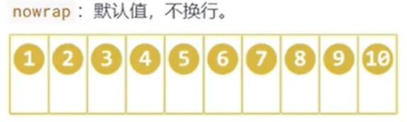
    
- wrap 項目在超出容器時進行換行。
    
    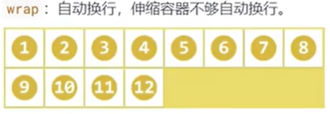
    
- wrap-reverse 同 wrap 值，只是換成反序方向。
    
    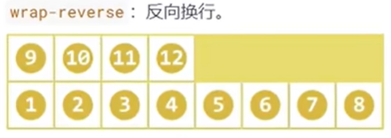
    

```html
<body>
    <div>
        <span>1</span>
        <span>2</span>
        <span>3</span>
        <span>4</span>
        <span>5</span>
    </div>
</body>
```

```css
div {
  display: flex;
  width: 600px;
  height: 400px;
  background-color: pink;
  
	/* flex布局中，默认的子元素是不换行的， 如果装不开，会缩小子元素的宽度，放到父元素里面  */
	/* flex-wrap: nowrap; */
	flex-wrap: wrap;
}

div span {
  width: 150px;
  height: 100px;
  background-color: purple;
  color: #fff;
  margin: 10px;
}
```

# **flex-flow**

> flex-flow 屬性是 flex-direction 和 flex-wrap 屬性的複合屬性，值沒有順序要求。
> 

```css
flex-flow: row wrap;
```

```html
<body>
    <div>
        <span>1</span>
        <span>2</span>
        <span>3</span>
        <span>4</span>
        <span>5</span>
    </div>
</body>
```

```css
div {
    display: flex;
    width: 600px;
    height: 300px;
    background-color: pink;

		/* 把设置主轴方向和是否换行（换列）简写 */
		flex-flow: row wrap;
}

div span {
    width: 150px;
    height: 100px;
    background-color: purple;
}
```

# **align-content 和 align-items 區別**

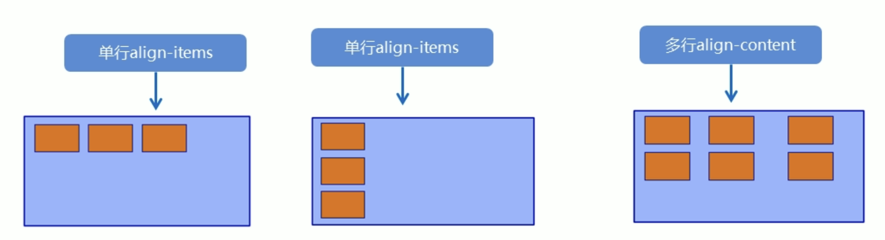

- `align-items` 適用於單行情況下， 只有上對齊、下對齊、居中和拉伸。
- `align-content` 適應於換行（多行）的情況下（單行情況下無效）， 可以設置上對齊、 下對齊、居中、拉伸以及平均分配剩餘空間等屬性值。

<aside>
💡

**總結就是單行找 align-items多行找 align-content。**

</aside>