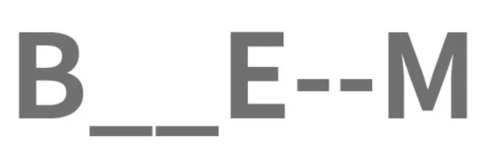
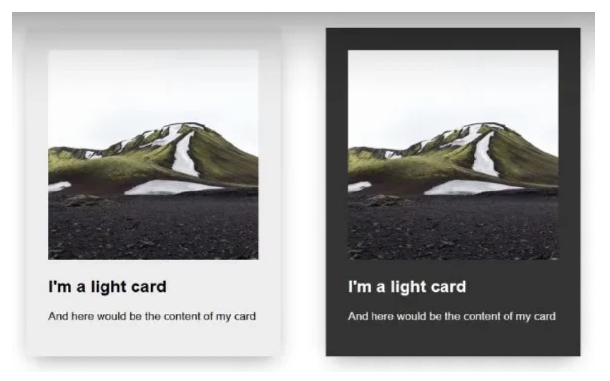
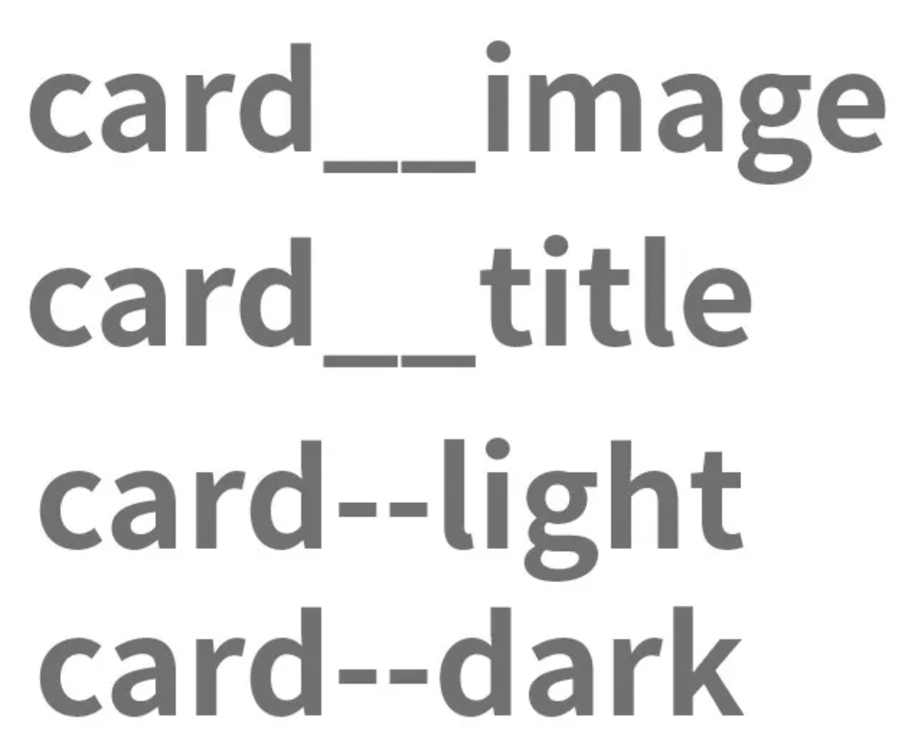

# BEM 命名模式

## 章節入口

- 返回章節入口：[第七章 BEM 命名模式](./README.md)

## 參考文章

- [BEM 命名模式](https://medium.com/ivycodefive/bem-%E5%91%BD%E5%90%8D%E6%A8%A1%E5%BC%8F-e942fd2f816a)
- [juejin.cn](https://juejin.cn/post/6844903672162304013#heading-3)

## 關鍵字

- BEM
- Block
- Element
- Modifier
- `__`
- `--`
- class 命名
- CSS 命名規範
- SCSS 巢狀寫法
- 元件化命名

## 學習目標

讀完這份筆記後，應該要能理解：

1. BEM 是什麼，以及它想解決什麼問題。
2. Block、Element、Modifier 分別代表什麼。
3. `block`、`block__element`、`block--modifier`、`block__element--modifier` 的差異。
4. 什麼時候該把一個區塊當成新的 Block，什麼時候該當成 Element。
5. BEM 搭配 SCSS 時，如何寫得清楚又不過度巢狀。
6. 實務上常見的 BEM 誤用方式。

## 什麼是 BEM

BEM 是 `Block`、`Element`、`Modifier` 的簡寫，是一種常見的 CSS class 命名方法論。

它的目的不是單純把 class 名稱變長，而是讓 class 名稱可以表達「這個元素屬於哪個元件」、「它在元件中扮演什麼角色」、「它目前有什麼狀態或變體」。

BEM 主要想解決幾個問題：

- class 名稱語意不明確
- 元件內部結構不容易從 class 名稱看出來
- 樣式容易互相污染
- 多人協作時命名規則不一致
- 元件越來越大後，CSS 越來越難維護

簡單來說，BEM 是一種讓 CSS 命名更有結構、更容易維護的方法。

## BEM 的三個部分

BEM 由三個部分組成：

- `Block`：區塊、元件本身
- `Element`：區塊裡面的子元素
- `Modifier`：區塊或元素的狀態、外觀、尺寸、行為變體

## Block

Block 是一個可以獨立存在的區塊或元件。

它通常代表一個完整的 UI 單位，例如：

- `card`
- `form`
- `button`
- `modal`
- `menu`
- `article`
- `user-card`

Block 的重點是「可以獨立理解、獨立重用」。

例如 `card` 可以出現在首頁、商品頁、文章列表頁，它本身就是一個可以被重複使用的元件，所以適合當作 Block。

```html
<div class="card"></div>
```

如果 Block 名稱需要多個單字，通常會用 kebab-case：

```html
<div class="user-card"></div>
```

## Element

Element 是 Block 裡面的子元素，不能脫離 Block 單獨理解。

例如一張卡片中的標題、圖片、內容、按鈕：

```html
<div class="card">
  
  <h2 class="card__title">標題</h2>
  <p class="card__content">內容</p>
  <button class="card__button">確認</button>
</div>
```

其中：

- `card` 是 Block
- `card__image` 是 card 裡面的圖片
- `card__title` 是 card 裡面的標題
- `card__content` 是 card 裡面的內容
- `card__button` 是 card 裡面的按鈕

Element 的命名方式是：

```text
block__element
```

`__` 用來連接 Block 和 Element。

## Modifier

Modifier 是用來表示狀態、外觀、尺寸、行為變體的 class。

常見 Modifier 例如：

- `primary`
- `success`
- `danger`
- `disabled`
- `active`
- `large`
- `small`
- `dark`
- `light`

Modifier 可以修飾 Block，也可以修飾 Element。

### 修飾 Block

```html
<button class="button button--primary">確認</button>
<button class="button button--danger">刪除</button>
```

其中：

- `button` 是 Block
- `button--primary` 是 button 的主要樣式變體
- `button--danger` 是 button 的危險樣式變體

### 修飾 Element

```html
<div class="article">
  <button class="article__button article__button--primary">送出</button>
  <button class="article__button article__button--secondary">取消</button>
</div>
```

其中：

- `article` 是 Block
- `article__button` 是 Element
- `article__button--primary` 是這個按鈕元素的主要樣式變體
- `article__button--secondary` 是這個按鈕元素的次要樣式變體

## 命名規則

BEM 常見的命名方式如下：

| 類型 | 命名格式 | 範例 |
| --- | --- | --- |
| Block | `block` | `card` |
| Element | `block__element` | `card__title` |
| Block Modifier | `block--modifier` | `card--dark` |
| Element Modifier | `block__element--modifier` | `card__button--disabled` |

其中：

- `__` 用來連接 Block 和 Element
- `--` 用來連接被修飾的對象和 Modifier
- 多個單字通常使用 kebab-case，例如 `user-card__avatar-image`

## Modifier 通常不要單獨使用

在實務上，Modifier 通常是「附加樣式」，不是「基礎樣式」。

所以通常會這樣寫：

```html
<button class="button button--primary">確認</button>
```

而不是只寫：

```html
<button class="button--primary">確認</button>
```

原因是：

- `button` 放共用樣式，例如 padding、border、font-size
- `button--primary` 只放變體樣式，例如 background-color、color

也就是說，Modifier 通常只描述「差異」，基礎樣式還是放在原本的 Block 或 Element 上。

Element Modifier 也是一樣：

```html
<button class="card__button card__button--disabled">送出</button>
```

而不是只寫：

```html
<button class="card__button--disabled">送出</button>
```

## 圖示理解



## 為什麼要用 BEM

BEM 的重點，不只是命名長一點，而是讓結構更清楚。

它帶來的好處包括：

- 從 class 名稱就能看出元件關係
- 比較容易維護
- 比較容易協作
- 比較不容易讓樣式互相污染
- 比較容易拆分元件
- 比較容易在大型專案中統一命名規則

例如看到：

```html
<button class="article__button article__button--primary"></button>
```

就可以知道：

- 這是一個 `article` 元件裡面的按鈕
- 這個按鈕是 `primary` 變體
- 它不是全域的 `.button-primary`

這種命名可以讓 CSS 的作用範圍更清楚。

## 用卡片理解 BEM

以下用卡片元件來理解 BEM。



如果把卡片拆開來看：

- `B`：整個卡片元件，例如 `card`
- `E`：卡片內的圖片、標題、內文，例如 `card__image`、`card__title`、`card__content`
- `M`：狀態或變體，例如 `card--dark`、`card__button--disabled`

看過命名後，就比較容易理解元件關係：



## 一般寫法和 BEM 寫法

### 一般寫法

```html
<div class="article">
  <div class="body">
    <button class="button-primary"></button>
    <button class="button-success"></button>
  </div>
</div>
```

這種寫法可以看出大概結構，但 class 名稱和元件關係不夠明確。

問題包括：

- `.body` 太通用，不知道是哪個元件的 body
- `.button-primary` 看不出它是 article 裡面的按鈕，還是全域按鈕
- 專案變大後，容易和其他地方的 `.body`、`.button-primary` 撞名

### BEM 寫法

```html
<div class="article">
  <div class="article__body">
    <button class="article__button article__button--primary"></button>
    <button class="article__button article__button--success"></button>
  </div>
</div>
```

這種寫法把元件關係直接寫進 class 名稱裡，閱讀上更直觀。

其中：

- `article` 是整個文章元件
- `article__body` 是文章內容區塊
- `article__button` 是文章元件裡面的按鈕
- `article__button--primary` 是文章按鈕的主要變體
- `article__button--success` 是文章按鈕的成功變體

## Block 裡面可以放另一個 Block

BEM 並不是說所有子元素都一定要寫成父層的 Element。

如果某個區塊可以獨立存在、獨立重用，它可以作為新的 Block。

例如：

```html
<article class="article">
  <div class="article__body">
    <span class="tag tag--primary">Vue</span>
  </div>
</article>
```

這裡的 `tag` 可以視為一個獨立元件，因為它可能也會出現在商品卡片、文章列表、搜尋結果中。

所以它可以寫成：

```html
<span class="tag tag--primary">Vue</span>
```

而不是一定要寫成：

```html
<span class="article__tag article__tag--primary">Vue</span>
```

判斷方式可以這樣想：

- 如果這個東西只能在 `article` 裡面理解，適合寫成 `article__xxx`
- 如果這個東西可以離開 `article`，在其他地方也能重用，適合寫成新的 Block

## Block、Element、Modifier 判斷流程

當不知道該怎麼命名時，可以用下面的流程判斷。

### 第一步：它能不能獨立重用？

如果可以獨立重用，通常是 Block。

```html
<div class="card"></div>
<button class="button"></button>
<span class="tag"></span>
```

### 第二步：它是不是某個 Block 裡面的一部分？

如果它只能依附某個 Block 才有意義，通常是 Element。

```html
<div class="card">
  <h2 class="card__title">標題</h2>
</div>
```

### 第三步：它是不是只是狀態或變體？

如果它只是改變外觀、狀態、尺寸、行為，通常是 Modifier。

```html
<div class="card card--dark"></div>
<button class="button button--disabled"></button>
```

## 什麼時候該用 BEM

不是每個 class 都需要寫成 BEM。

比較適合用 BEM 的情況是：

- 這個元素屬於某個元件的內部結構
- 這個元素和元件之間有明確關聯
- 這個元素需要表達狀態或變體
- 這個元件會被多次重用
- 這個樣式需要多人協作維護
- 這個區塊未來可能會越長越複雜

例如：

```html
<form class="login-form">
  <div class="login-form__field">
    <label class="login-form__label">帳號</label>
    <input class="login-form__input" type="text" />
  </div>
  <button class="login-form__submit login-form__submit--disabled">登入</button>
</form>
```

## 什麼時候不一定要用 BEM

不太需要用 BEM 的情況是：

- 單純的通用工具類
- 和元件關係不大的樣式
- 已經由 utility class 處理的樣式
- 全域輔助樣式

例如：

```css
.hide {
  display: none !important;
}

.text-center {
  text-align: center;
}

.mt-16 {
  margin-top: 16px;
}
```

這些 class 的目的很單純，不一定要硬套成：

```css
.utility__hide {}
.utility__text-center {}
```

因為那樣反而會讓命名變得不自然。

## BEM 搭配 SCSS

如果 class 名稱太長，可以搭配 SCSS 的巢狀寫法來減少重複。

### 基本寫法

```scss
.card {
  padding: 16px;
  border: 1px solid #ddd;
  border-radius: 8px;

  &__image {
    width: 100%;
    display: block;
  }

  &__title {
    margin-top: 12px;
    font-size: 20px;
  }

  &__content {
    margin-top: 8px;
    line-height: 1.6;
  }

  &__button {
    padding: 8px 12px;
    border: none;
    cursor: pointer;
  }

  &__button--primary {
    background-color: #2f80ed;
    color: white;
  }

  &__button--disabled {
    cursor: not-allowed;
    opacity: 0.5;
  }

  &--dark {
    background-color: #333;
    color: white;
  }
}
```

對應 HTML：

```html
<div class="card card--dark">
  
  <h2 class="card__title">標題</h2>
  <p class="card__content">內容</p>
  <button class="card__button card__button--primary">確認</button>
</div>
```

這樣可以把重複的 `card` 前綴集中管理。

### 另一種巢狀寫法

也可以把 Element Modifier 寫在 Element 裡面：

```scss
.card {
  &__button {
    padding: 8px 12px;

    &--primary {
      background-color: #2f80ed;
      color: white;
    }

    &--disabled {
      cursor: not-allowed;
      opacity: 0.5;
    }
  }
}
```

這會編譯成：

```css
.card__button {
  padding: 8px 12px;
}

.card__button--primary {
  background-color: #2f80ed;
  color: white;
}

.card__button--disabled {
  cursor: not-allowed;
  opacity: 0.5;
}
```

## SCSS 巢狀不要過深

SCSS 巢狀只是為了減少重複，不是為了完全模仿 HTML 結構。

不建議這樣寫：

```scss
.card {
  .card__body {
    .card__title {
      .card__text {
        color: #333;
      }
    }
  }
}
```

這樣會讓 CSS 選擇器變長，維護成本變高。

比較推薦：

```scss
.card {
  &__body {
    padding: 16px;
  }

  &__title {
    font-size: 20px;
  }

  &__text {
    color: #333;
  }
}
```

BEM 的核心精神是：class 名稱已經表達結構，所以不需要再靠很深的 CSS 選擇器表達結構。

## 根據 Modifier 改變內部元素樣式

有時候 Modifier 加在 Block 上，但會影響內部 Element 的樣式。

例如：

```html
<div class="card card--dark">
  <h2 class="card__title">標題</h2>
  <p class="card__content">內容</p>
</div>
```

SCSS 可以這樣寫：

```scss
.card {
  &__title {
    color: #222;
  }

  &__content {
    color: #666;
  }

  &--dark {
    background-color: #333;

    .card__title,
    .card__content {
      color: white;
    }
  }
}
```

這種寫法表示：當 `card` 是 `dark` 變體時，內部的 `card__title` 和 `card__content` 樣式也跟著改變。

## 避免過深的命名

不建議把 class 寫得過度巢狀，例如：

```css
.card__body__title {}
.card__body__content__text {}
```

原因是：

- 可讀性會下降
- 名稱會變得很長
- DOM 結構一改，class 名稱可能也要跟著改
- 反而不容易維護

BEM 的 Element 不需要完全對應 HTML 的每一層。

即使 HTML 是多層結構，也可以這樣命名：

```html
<div class="card">
  <div class="card__body">
    <div class="card__content">
      <h2 class="card__title">標題</h2>
    </div>
  </div>
</div>
```

推薦寫法：

```css
.card {}
.card__body {}
.card__content {}
.card__title {}
```

不推薦寫法：

```css
.card {}
.card__body {}
.card__body__content {}
.card__body__content__title {}
```

## 推薦寫法

```scss
.form {}
.form--theme-xmas {}
.form--simple {}
.form__input {}
.form__submit {}
.form__submit--disabled {}
```

```html
<form class="form form--theme-xmas form--simple">
  <input class="form__input" type="text" />
  <input
    class="form__submit form__submit--disabled"
    type="submit"
  />
</form>
```

這個範例中：

- `form` 是 Block
- `form--theme-xmas` 是 form 的主題變體
- `form--simple` 是 form 的簡化版變體
- `form__input` 是 form 裡面的輸入框
- `form__submit` 是 form 裡面的送出按鈕
- `form__submit--disabled` 是送出按鈕的 disabled 狀態

## 常見錯誤

### 錯誤一：Modifier 單獨當成基礎 class

不推薦：

```html
<button class="button--primary">確認</button>
```

推薦：

```html
<button class="button button--primary">確認</button>
```

因為 `button` 放基礎樣式，`button--primary` 放變體樣式。

### 錯誤二：把 DOM 層級全部寫進 class

不推薦：

```css
.card__body__content__title {}
```

推薦：

```css
.card__body {}
.card__content {}
.card__title {}
```

BEM 的 Element 是 Block 的一部分，不需要一層一層往下串。

### 錯誤三：把可以重用的元件硬寫成 Element

如果 `tag` 是可以重用的標籤元件，不一定要寫成：

```html
<span class="article__tag article__tag--primary">Vue</span>
```

可以寫成：

```html
<span class="tag tag--primary">Vue</span>
```

因為 `tag` 本身可以是一個獨立 Block。

### 錯誤四：把工具類硬套 BEM

不一定要把：

```css
.hide {}
.text-center {}
```

改成：

```css
.utility__hide {}
.utility__text-center {}
```

工具類本身就是工具類，不需要硬套 BEM。

### 錯誤五：Block 切得太大或太小

Block 太大會導致命名過長、元件責任太多。

Block 太小則會讓 class 過度分散，看不出整體結構。

判斷原則是：

- 可以獨立重用的，適合當 Block
- 只能依附某個元件存在的，適合當 Element
- 只是狀態或變體的，適合當 Modifier

## BEM 和 Vue 的關係

在 Vue 單檔元件中，即使用了 `scoped`，BEM 仍然有價值。

`scoped` 主要解決的是樣式作用範圍問題，BEM 解決的是 class 命名語意和元件結構問題。

例如：

```vue
<template>
  <section class="user-card user-card--active">
    
    <div class="user-card__body">
      <h3 class="user-card__name">小明</h3>
      <p class="user-card__description">前端工程師</p>
    </div>
  </section>
</template>

<style scoped lang="scss">
.user-card {
  display: flex;
  gap: 12px;

  &__avatar {
    width: 48px;
    height: 48px;
    border-radius: 50%;
  }

  &__name {
    font-weight: bold;
  }

  &__description {
    color: #666;
  }

  &--active {
    border: 1px solid #2f80ed;
  }
}
</style>
```

這樣即使在 Vue 元件中，仍然可以從 class 名稱看出元件結構。

## 一句話總結

BEM 是一種把「元件」、「子元素」、「狀態或變體」拆清楚的 CSS 命名方式。

它的核心不是讓 class 名稱變長，而是讓 class 名稱能表達結構，讓樣式更好讀、更好維護、更適合多人協作。

最重要的規則可以記成：

```text
block
block__element
block--modifier
block__element--modifier
```

最重要的觀念是：

- 能獨立重用的是 Block
- 依附 Block 的是 Element
- 表示狀態或變體的是 Modifier
- Modifier 通常要搭配原本的 Block 或 Element 使用
- 不要把 DOM 層級全部串進 class 名稱裡
