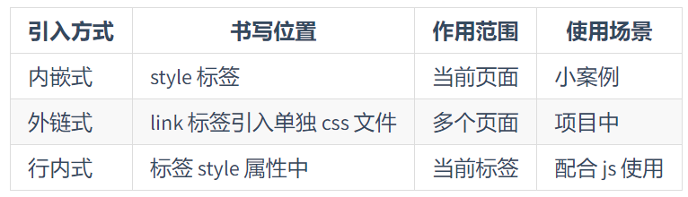

# 第03章 CSS 的引入方式

> 所屬章節：[第三章 CSS 的引入方式](./README.md)  
> 課程入口：[CSS 筆記總覽](../README.md)  
> 關鍵字：行內樣式、內部樣式表、外部樣式表、`style`、`link`、結構與樣式分離、樣式複用、瀏覽器快取  
> 建議回查情境：忘了三種 CSS 引入方式差異、想判斷正式開發該用哪種方式、忘了 `<style>` 或 `<link>` 的基本寫法時

## 本節導讀

這一章在說明 CSS 常見的三種引入方式：行內樣式、內部樣式表、外部樣式表。

第一次閱讀時，建議先看「先講結論」，先建立三種方式的使用場景，再回頭看各自的寫法與比較表。之後如果你只想快速回查差異，可以直接跳到「三種方式怎麼選」。

## 你會在這篇學到什麼

- CSS 三種引入方式各自是什麼
- 每一種方式的基本寫法
- 三種方式的適用場景與限制
- 為什麼正式開發通常優先使用外部樣式表

## 先講結論

- 行內樣式表適合臨時調整單一元素，不適合大量使用
- 內部樣式表適合單一頁面或練習範例
- 外部樣式表最適合正式開發，因為樣式可複用，也更容易維護

一句話記法：

> 單一元素用行內，單一頁面用內部，多頁面與正式專案用外部。

## 1. 行內樣式表

行內樣式表是直接把 CSS 寫在 HTML 標籤的 `style` 屬性裡。

```html
<p style="color: pink; font-size: 20px;">給我一個粉紅的回憶</p>
```

### 特點

- 樣式只作用在當前元素
- 寫法直接，修改單一元素時很快
- HTML 與 CSS 會混在一起，可讀性與可維護性都比較差

### 適合什麼情況

- 臨時測試某個樣式
- 只想快速調整單一標籤
- 特殊情境下需要直接覆蓋單一元素樣式

### 不適合什麼情況

- 頁面有很多樣式要管理
- 團隊協作或正式開發
- 需要重複使用同一組樣式

### 小提醒

- 行內樣式雖然優先權通常較高，但這不是推薦大量使用它的理由
- 真正的缺點是樣式難以複用，而且會破壞結構與樣式分離

## 2. 內部樣式表

內部樣式表是把 CSS 集中寫在 HTML 頁面中的 `<style>` 標籤內，通常放在 `<head>` 裡。

```html
<!DOCTYPE html>
<html lang="zh-Hant">
<head>
    <meta charset="UTF-8">
    <meta name="viewport" content="width=device-width, initial-scale=1.0">
    <title>內部樣式表</title>
    <style>
        div {
            color: pink;
        }
    </style>
</head>
<body>
    <div>這段文字會套用同一頁面中的內部樣式。</div>
</body>
</html>
```

### 特點

- 樣式集中在同一個 HTML 檔案中
- 可以一次控制當前頁面的多個元素
- 比行內樣式更清楚，但還沒有完全和 HTML 分離

### 適合什麼情況

- 教學範例
- 單頁練習
- 小型頁面或快速 demo

### 不適合什麼情況

- 多個頁面需要共用同一份樣式
- 專案樣式越來越多、需要長期維護

### 小提醒

- `<style>` 理論上可出現在文件中，但實務上通常放在 `<head>`，結構較清楚
- 內部樣式表可以在同一頁面內重複使用樣式，但不能像外部樣式表那樣跨頁複用

## 3. 外部樣式表

外部樣式表是把 CSS 獨立寫在 `.css` 檔案中，再用 `<link>` 把它引入 HTML。

引入外部樣式表通常分成兩步：

1. 建立 CSS 檔案
2. 在 HTML 中使用 `<link>` 引入

`style.css`

```css
div {
    color: pink;
}
```

`index.html`

```html
<!DOCTYPE html>
<html lang="zh-Hant">
<head>
    <meta charset="UTF-8">
    <meta name="viewport" content="width=device-width, initial-scale=1.0">
    <title>外部樣式表</title>
    <link rel="stylesheet" href="./style.css">
</head>
<body>
    <div>來呀，快活呀，反正有大把時間。</div>
</body>
</html>
```

### 特點

- HTML 與 CSS 完全分開
- 同一份樣式可以被多個頁面共用
- 樣式量變多時，仍然比較容易維護

### 適合什麼情況

- 正式開發
- 多頁網站
- 團隊協作
- 需要長期維護的專案

### 優勢

- 可重複使用
- 結構清楚
- 方便分工與維護
- 瀏覽器可快取 CSS 檔案，後續載入通常更有效率

## 4. 三種方式怎麼選

| 方式 | 作用範圍 | 優點 | 缺點 | 適合情境 |
| --- | --- | --- | --- | --- |
| 行內樣式表 | 當前元素 | 修改直接、即時 | 難維護、難複用、結構與樣式混在一起 | 臨時測試、單一元素微調 |
| 內部樣式表 | 當前頁面 | 同頁可集中管理 | 不能跨頁共用、仍未完全分離 | 單頁練習、教學 demo |
| 外部樣式表 | 多個頁面 | 可複用、易維護、結構最清楚 | 需要額外引入檔案 | 正式專案、多頁網站 |



## 5. 常見混淆點

### 行內樣式的優先權高，是不是代表最好用？

不是。

優先權高只代表它在樣式覆蓋上比較強，不代表它最適合專案維護。真正選擇哪種引入方式，應該先看樣式是否需要複用、是否要長期維護，以及是否要保持 HTML 與 CSS 分離。

### 內部樣式表能不能複用？

可以，但通常只限於「同一個頁面內」的多個元素共用同一組規則。  
如果是多個頁面都要用同一份樣式，還是外部樣式表更合適。

## 6. 30 秒複習

- 行內樣式表：改單一元素最快，但最難維護
- 內部樣式表：適合單頁面練習與 demo
- 外部樣式表：最適合正式開發與多頁面共用

如果只記一句話：

> 能用外部樣式表時，通常就不要把樣式直接寫進 HTML。

## 延伸閱讀

- 寫樣式前想先建立基礎觀念，請回看 [第01章 CSS簡介](../第一章_CSS簡介/第01章_CSS簡介.md)
- 如果想整理 CSS 屬性的書寫順序，請接著看 [第02章 CSS屬性書寫順序](../第二章_CSS屬性書寫順序/第02章_CSS屬性書寫順序.md)
- 如果要回到本章入口，請看 [第三章 CSS 的引入方式](./README.md)
- 如果要返回整份筆記總覽，請看 [CSS 筆記總覽](../README.md)
