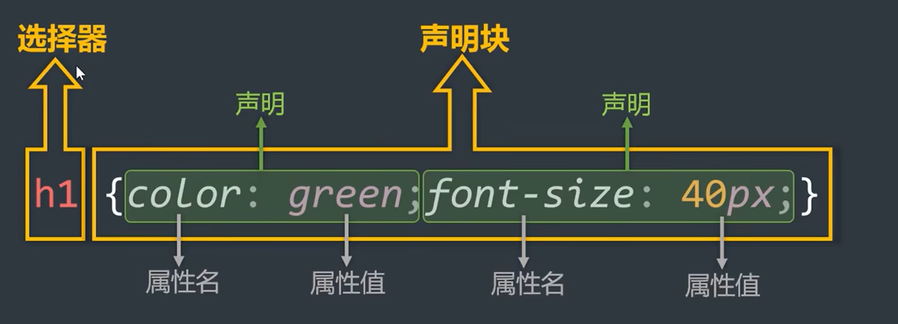

# 選擇器的作用

## 章節入口

- 返回章節入口：[第六章_選擇器 README](./README.md)

## 本節導讀

選擇器的核心作用，是把想要套用樣式的標籤找出來。  
先找到目標，再對目標設定樣式，這就是 CSS 選擇器最基本的用途。

## 關鍵字

- CSS 選擇器
- selector
- 標籤
- 基礎選擇器
- 複合選擇器

## 選擇器在做什麼

選擇器就是根據需求，把符合條件的標籤選出來。

可以把它理解成兩件事：

1. 找到要處理的標籤
2. 對這些標籤設定樣式

## 圖示理解

圖中的重點是：

- 先找到標籤，才知道要作用在哪裡
- 找到目標之後，CSS 才能套用樣式

## 與選擇器分類的關係

在 CSS 中，選擇器可以先分成：

- 基礎選擇器
- 複合選擇器

複合選擇器是在基礎選擇器的基礎上，再做組合與延伸。

## 一句話總結

選擇器的作用，就是把要套樣式的標籤選出來，再對它們設計外觀。
