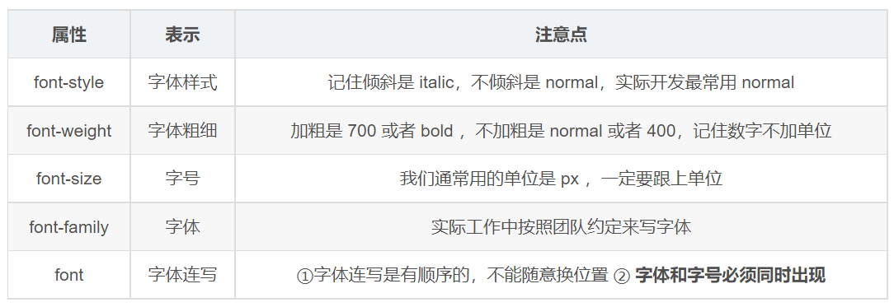
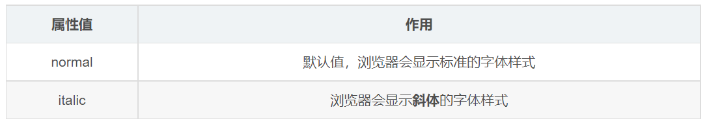

# 第11章 字體屬性

> 返回章節首頁：[README.md](./README.md)
>
> 本章整理 CSS 常見的字體相關屬性：`font-family`、`font-size`、`font-weight`、`font-style` 和 `font` 簡寫。



## 本章定位

CSS 的字體屬性主要用來控制「文字使用哪種字體、文字多大、文字多粗、是否斜體，以及是否用簡寫一次設定多個字體屬性」。

本章聚焦在字體本身，暫時不討論 `color`、`text-align`、`text-decoration`、`letter-spacing` 這些偏文字外觀或排版的屬性。

## 導讀

- `font-family`：決定文字優先使用哪一組字體，並設定備援字體。
- `font-size`：決定文字大小，可使用 `px`、`rem`、`em`、`%` 等方式設定。
- `font-weight`：決定文字粗細，常用 `400` 表示正常、`700` 表示加粗。
- `font-style`：決定文字是否使用斜體，常見值是 `normal` 與 `italic`。
- `font`：把多個字體相關設定合併成一行，但必須包含 `font-size` 與 `font-family`。

## 關鍵字

- font-family
- font-size
- font-weight
- font-style
- font
- 字體系列
- 備援字體
- 字體大小
- 字體粗細
- 斜體
- 簡寫屬性
- px
- rem
- em
- line-height

## 30 秒複習入口

- `font-family` 可以寫多個字體，瀏覽器會由左到右依序嘗試。
- 字體名稱如果有空格，建議加引號，例如 `"Microsoft JhengHei"`。
- `font-size` 如果使用長度值，非 `0` 通常要帶單位，例如 `16px`、`1rem`。
- `font-size` 除了長度單位，也可以使用百分比或關鍵字，例如 `100%`、`medium`。
- `font-weight` 常用 `400` 和 `700`；`400` 等同於 `normal`，`700` 等同於 `bold`。
- `font-style` 常見值是 `normal` 和 `italic`。
- `font` 簡寫至少要包含 `font-size` 與 `font-family`。
- `font` 簡寫如果沒寫某些字體子屬性，那些子屬性可能會被重設為初始值。

## 速查區

| 屬性 | 常見用法 | 重點 |
| --- | --- | --- |
| `font-family` | `Arial, "Microsoft JhengHei", sans-serif` | 由左到右依序備援，最後通常放通用字體系列 |
| `font-size` | `16px`、`1rem`、`100%` | 非 `0` 長度值要帶單位，也可用百分比或關鍵字 |
| `font-weight` | `400`、`700`、`normal`、`bold` | `400 = normal`，`700 = bold` |
| `font-style` | `normal`、`italic`、`oblique` | 常用來控制是否斜體 |
| `font` | `italic 700 16px/1.5 Arial, sans-serif` | 簡寫屬性，至少要有 `font-size` 和 `font-family` |

## 正文

### 1. `font-family`

`font-family` 用來定義文字使用的字體系列。

因為不同作業系統、不同裝置安裝的字體不一定相同，所以實務上通常不會只寫一個字體，而是會寫一串字體清單，讓瀏覽器由左到右依序尋找可用字體。

```css
body {
  font-family: Arial, "Microsoft JhengHei", "Noto Sans TC", sans-serif;
}
```

上面這段可以這樣理解：

1. 瀏覽器先嘗試使用 `Arial`。
2. 如果沒有或不適合顯示中文字，再嘗試使用 `Microsoft JhengHei`。
3. 如果仍然找不到，再嘗試使用 `Noto Sans TC`。
4. 最後使用通用字體系列 `sans-serif` 作為保底。

注意：

- 多個字體之間要用英文逗號 `,` 分隔。
- 字體名稱如果有空格，建議加引號，例如 `"Microsoft JhengHei"`。
- 最後通常會放一個通用字體系列，例如 `serif`、`sans-serif`、`monospace`。
- 中文網站常見字體可以考慮 `"Microsoft JhengHei"`、`"Noto Sans TC"`。
- 不建議只寫某一個特定字體，否則在沒有該字體的裝置上，顯示效果可能和預期不同。

#### 常見通用字體系列

| 通用字體系列 | 說明 | 常見情境 |
| --- | --- | --- |
| `serif` | 有襯線字體 | 文章、書籍感排版 |
| `sans-serif` | 無襯線字體 | 網頁介面、後台系統、一般內容 |
| `monospace` | 等寬字體 | 程式碼、終端機、表格式數字 |
| `cursive` | 手寫風格 | 裝飾性文字，較少用於正式介面 |
| `fantasy` | 特殊裝飾字體 | 標題或特殊視覺效果，較少用於正文 |

### 2. `font-size`

`font-size` 用來設定文字大小。

```css
body {
  font-size: 16px;
}

h2 {
  font-size: 24px;
}
```

初學時可以先掌握 `px`，因為它直觀、容易觀察效果。不過實務開發中也常會看到 `rem`、`em`、`%`，尤其是在需要響應式、可維護性或全站比例控制時。

#### 常見單位比較

| 單位 | 參考基準 | 特點 | 範例 |
| --- | --- | --- | --- |
| `px` | 固定像素 | 直觀、穩定、初學最容易理解 | `font-size: 16px;` |
| `rem` | 根元素 `html` 的字體大小 | 適合全站統一縮放 | `font-size: 1rem;` |
| `em` | 目前元素或父層的字體大小 | 適合局部比例，但巢狀時要小心累加 | `font-size: 1.2em;` |
| `%` | 通常相對於父層字體大小 | 適合做相對比例 | `font-size: 100%;` |

#### 關於「一定要寫單位」的精確說法

如果 `font-size` 使用的是數字長度值，除了 `0` 以外，通常都需要寫單位。

```css
/* 正確 */
p {
  font-size: 16px;
}

/* 正確 */
p {
  font-size: 1rem;
}

/* 錯誤：16 沒有單位 */
p {
  font-size: 16;
}
```

但 `font-size` 不只可以使用長度單位，也可以使用百分比或關鍵字。

```css
p {
  font-size: 100%;
}

small {
  font-size: smaller;
}
```

補充：

- 多數瀏覽器的預設文字大小通常是 `16px`。
- 實務上不建議完全依賴預設值，尤其是大型專案或後台系統。
- 若專案想統一字級比例，常會從 `html` 或 `body` 設定基準字體大小。

### 3. `font-weight`

`font-weight` 用來設定文字粗細。

```css
.title {
  font-weight: 700;
}

.description {
  font-weight: 400;
}
```

常見值如下：

| 寫法 | 意義 | 常見用途 |
| --- | --- | --- |
| `normal` | 正常粗細，等同於 `400` | 一般文字 |
| `bold` | 加粗，等同於 `700` | 標題、重點文字 |
| `400` | 正常粗細 | 實務常用 |
| `500` | 中等偏粗 | UI 標籤、按鈕文字 |
| `600` | 半粗體 | 小標題 |
| `700` | 粗體 | 標題、強調內容 |
| `bolder` | 比父層更粗 | 較少使用 |
| `lighter` | 比父層更細 | 較少使用 |

注意：

- `font-weight: 700;` 不需要加單位。
- `font-weight: 700px;` 是錯誤寫法。
- 傳統字重常見範圍是 `100` 到 `900`，每 `100` 為一階。
- 並不是所有字體都支援完整字重；如果字體沒有對應字重，瀏覽器可能會取相近字重或模擬粗細。


範例：

```html
<h2>前端學習筆記</h2>
<p>這是一段普通文字。</p>
<p class="bold">這是一段需要強調的文字。</p>
```

```css
h2 {
  font-weight: 700;
}

p {
  font-weight: 400;
}

.bold {
  font-weight: 700;
}
```

### 4. `font-style`

`font-style` 用來設定文字風格，最常見的用途是控制文字是否斜體。

```css
p {
  font-style: normal;
}

.note {
  font-style: italic;
}
```

常見值如下：

| 值 | 說明 | 常見程度 |
| --- | --- | --- |
| `normal` | 正常字形 | 最常用 |
| `italic` | 使用斜體字形 | 常用 |
| `oblique` | 傾斜字形 | 較少用 |

一般文字通常維持 `normal` 即可。`italic` 常用於補充說明、引用語氣或特殊標示。

`em` 和 `i` 這類 HTML 標籤在瀏覽器預設樣式中通常會呈現斜體；如果設計稿不希望它們斜體，可以改回 `normal`。

```css
em,
i {
  font-style: normal;
}
```

```html
<p>這是一般文字。</p>
<em>這是語氣強調文字，但可以透過 CSS 改回正常字形。</em>
```



### 5. `font` 簡寫屬性

`font` 是字體相關屬性的簡寫，可以把多個設定合併成一行。

最常見的推薦順序是：

```text
font-style font-weight font-size/line-height font-family
```

範例：

```css
div {
  font: italic 700 16px/1.5 Arial, "Microsoft JhengHei", sans-serif;
}
```

這一行等價於概念上設定了：

```css
div {
  font-style: italic;
  font-weight: 700;
  font-size: 16px;
  line-height: 1.5;
  font-family: Arial, "Microsoft JhengHei", sans-serif;
}
```

#### 最小合法寫法

`font` 簡寫至少要包含：

1. `font-size`
2. `font-family`

所以最小合法寫法可以是：

```css
div {
  font: 16px Arial;
}
```

也可以是：

```css
div {
  font: 1rem sans-serif;
}
```

#### 常見錯誤寫法

```css
/* 錯誤：缺少 font-family */
div {
  font: 16px;
}

/* 錯誤：缺少 font-size */
div {
  font: Arial;
}

/* 錯誤：font-family 放在 font-size 前面 */
div {
  font: Arial 16px;
}
```

#### 使用 `font` 簡寫時要注意重設問題

`font` 是簡寫屬性。當你使用簡寫時，沒有明確寫出的某些字體相關子屬性可能會被重設為初始值。

例如：

```css
.title {
  font-style: italic;
  font-weight: 700;
}

.title {
  font: 16px Arial;
}
```

後面的 `font: 16px Arial;` 可能會讓原本的斜體與粗體設定被重設，最後文字不再是斜體或粗體。

因此在實務上：

- 如果只想改文字大小，優先使用 `font-size`。
- 如果只想改字體，優先使用 `font-family`。
- 如果要一次定義完整字體樣式，才使用 `font` 簡寫。

## 實務推薦寫法

### 1. 全站基礎字體設定

在一般網站或後台系統中，常會在 `body` 設定全站基礎字體。

```css
html {
  font-size: 16px;
}

body {
  font-family: system-ui, -apple-system, BlinkMacSystemFont, "Segoe UI", "Microsoft JhengHei", "Noto Sans TC", Arial, sans-serif;
  font-size: 1rem;
  line-height: 1.5;
  font-weight: 400;
}
```

這樣做的好處是：

- 全站文字有一致的基礎樣式。
- 中文、英文、不同作業系統都有較好的備援。
- `line-height: 1.5` 可以讓正文閱讀性更好。
- 後續元件可以在這個基礎上局部覆蓋。

### 2. 表單元素繼承字體

某些瀏覽器中，`button`、`input`、`textarea`、`select` 可能不會完全繼承 `body` 的字體設定。實務上可以統一處理：

```css
button,
input,
textarea,
select {
  font: inherit;
}
```

這代表表單元素會繼承父層的字體相關設定，避免表單和一般文字看起來不一致。

### 3. 標題與正文分層

```css
h1 {
  font-size: 2rem;
  font-weight: 700;
  line-height: 1.25;
}

h2 {
  font-size: 1.5rem;
  font-weight: 700;
  line-height: 1.3;
}

p {
  font-size: 1rem;
  font-weight: 400;
  line-height: 1.6;
}
```

這種寫法比到處隨意設定 `font-size` 更容易維護，因為標題、正文、說明文字會有清楚的層級。

## 常見錯誤與修正

| 錯誤寫法 | 問題 | 修正寫法 |
| --- | --- | --- |
| `font-size: 16;` | 非 `0` 長度值缺少單位 | `font-size: 16px;` |
| `font-weight: 700px;` | `font-weight` 不需要單位 | `font-weight: 700;` |
| `font: 16px;` | `font` 缺少 `font-family` | `font: 16px Arial;` |
| `font: Arial;` | `font` 缺少 `font-size` | `font: 16px Arial;` |
| `font: Arial 16px;` | `font-family` 和 `font-size` 順序錯誤 | `font: 16px Arial;` |
| `font-family: "Microsoft JhengHei";` | 只有單一字體，備援不足 | `font-family: "Microsoft JhengHei", sans-serif;` |

## 常見混淆點

### 1. `font-family` 不是保證一定使用第一個字體

`font-family` 寫在最前面的字體只是「優先嘗試」。如果使用者裝置沒有該字體，瀏覽器會繼續往後找備援字體。

### 2. `font-size` 的 `em` 和 `rem` 不一樣

- `rem` 參考 `html` 的字體大小，適合做全站一致比例。
- `em` 會受到父層或當前元素字體大小影響，巢狀結構多時要小心比例累加。

### 3. `font-weight: 700` 不需要單位

`700` 是字重數值，不是長度，所以不能寫成 `700px`。

### 4. `font-style` 主要控制字形風格，不是控制粗細

- 控制粗細：用 `font-weight`。
- 控制斜體：用 `font-style`。
- 控制大小：用 `font-size`。

### 5. `font` 簡寫不是越短越好

`font` 簡寫雖然方便，但可能會重設部分字體相關屬性。若只是修改單一屬性，使用單獨屬性通常更安全。

## 面試與實務回查題

### Q1：為什麼 `font-family` 通常要寫多個字體？

因為不同裝置安裝的字體不同。寫多個字體可以讓瀏覽器依序尋找可用字體，避免在某些裝置上顯示效果失控。

### Q2：`font-size: 16;` 為什麼無效？

因為 `16` 是非 `0` 的長度值，必須加上單位，例如 `16px`、`1rem`。

### Q3：`font-weight: 700` 和 `bold` 有什麼關係？

`700` 通常等同於 `bold`，`400` 通常等同於 `normal`。實務開發中常直接使用數字，因為更容易控制字重層級。

### Q4：`font` 簡寫最少要寫什麼？

最少要寫 `font-size` 和 `font-family`。

```css
div {
  font: 16px Arial;
}
```

### Q5：什麼時候不建議使用 `font` 簡寫？

如果你只是想改 `font-size`、`font-weight` 或 `font-family` 其中一個屬性，不建議使用 `font` 簡寫，因為簡寫可能會重設其他字體相關屬性。

## 一句話總結

字體屬性的核心是：用 `font-family` 設定字體與備援，用 `font-size` 控制大小，用 `font-weight` 控制粗細，用 `font-style` 控制斜體；只有在需要一次完整設定多個字體屬性時，才使用 `font` 簡寫。

## 本章最佳記憶版

```css
body {
  font-family: Arial, "Microsoft JhengHei", "Noto Sans TC", sans-serif;
  font-size: 16px;
  font-weight: 400;
  font-style: normal;
}

.title {
  font: italic 700 24px/1.4 Arial, "Microsoft JhengHei", sans-serif;
}
```

記法：

- `family`：字體清單，由左到右找。
- `size`：文字大小，非 `0` 長度值要有單位。
- `weight`：文字粗細，`400` 正常、`700` 加粗。
- `style`：文字風格，常見 `normal`、`italic`。
- `font`：簡寫，至少要有 `font-size` 和 `font-family`。

## 修正說明

- 將原本「`font-size` 一定要寫單位」修正為更精確的說法：非 `0` 長度值需要單位，也可以使用百分比或關鍵字。
- 補充 `px`、`rem`、`em`、`%` 的差異，讓筆記更接近實務開發。
- 將字體範例改為繁體中文環境較常見的 `"Microsoft JhengHei"`、`"Noto Sans TC"`。
- 補上 `font` 簡寫的最小合法寫法與錯誤示範。
- 補充 `font` 簡寫可能造成屬性重設的風險。
- 補上全站基礎字體設定、表單元素繼承字體、標題與正文分層等實務寫法。
- 統一範例文字為繁體中文，提升閱讀一致性。
