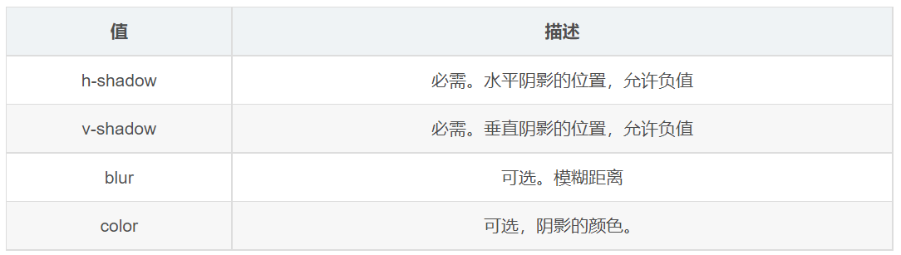

# 文字陰影

> 返回章節首頁：[README.md](./README.md)
>
> `text-shadow` 屬性可以為文字添加陰影效果。



## 導讀
- `text-shadow` 主要用來為文字加陰影。
- 常見寫法會包含位移、模糊半徑與顏色。
- 實作時通常會搭配較大字號與較粗字重，效果更明顯。

## 關鍵字
- text-shadow
- 文字陰影
- blur
- offset

## 30 秒複習入口
- `text-shadow` 用來加文字陰影
- 常見格式是水平位移、垂直位移、模糊半徑、顏色
- `rgba()` 常用來設定半透明陰影

## 速查區

| 寫法 | 說明 |
| --- | --- |
| `text-shadow: 5px 5px 6px rgba(0, 0, 0, .3);` | 水平 5px、垂直 5px、模糊 6px、黑色半透明陰影 |

## 正文
在 CSS3 中，可以使用 `text-shadow` 屬性將陰影應用於文本。

```css
div {
  font-size: 50px;
  color: orangered;
  font-weight: 700;
  text-shadow: 5px 5px 6px rgba(0, 0, 0, .3);
}
```

```html
<div>你是阴影,我是火影</div>
```

`text-shadow` 的效果會受到字體大小、字重與陰影顏色影響。
通常字體越大，陰影越容易看出層次。

## 一句話總結
`text-shadow` 用來替文字加陰影，常見搭配是位移、模糊和半透明顏色。
