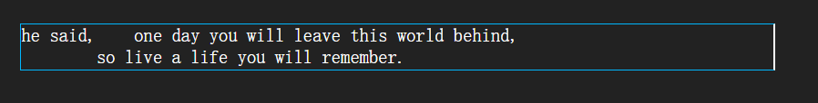
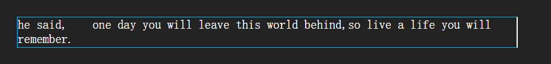
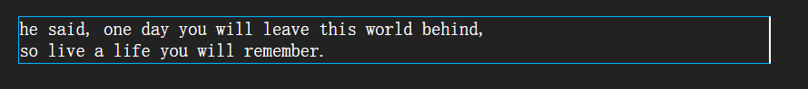

# 文本換行

> 返回章節首頁：[README.md](./README.md)
>
> `white-space` 用於設定文本的空白與換行方式。

## 導讀
- `white-space` 主要控制文本中的空格、換行，以及是否自動換行。
- 它常用來處理需要保留原始排版的內容，或限制文本不換行的情況。
- 常見值有 `normal`、`pre`、`pre-wrap`、`pre-line`、`nowrap`。

## 關鍵字
- white-space
- 文本換行
- 空白
- 換行
- 不換行

## 30 秒複習入口
- `normal`：超出邊界時自動換行，換行會被當成空格
- `pre`：保留原樣，不會自動換行
- `pre-wrap`：保留原樣，超出邊界時自動換行
- `pre-line`：保留換行，但會合併空格，並超出邊界自動換行
- `nowrap`：強制不換行

## 速查區

| 值 | 行為 |
| --- | --- |
| `normal` | 自動換行，換行視為空格 |
| `pre` | 保留空白與換行，不自動換行 |
| `pre-wrap` | 保留空白與換行，並自動換行 |
| `pre-line` | 保留換行，空格會合併，並自動換行 |
| `nowrap` | 不換行 |

## 正文
在 CSS 中，可以使用 `white-space` 屬性設定文本的換行方式。

這個屬性除了控制是否換行，也會影響空格和換行字元是否被保留。

### 常用值

#### `normal`
文本超出邊界時會自動換行，文本中的換行會被瀏覽器視為一個空格。

#### `pre`
原樣輸出，效果與 `pre` 標籤相同。

#### `pre-wrap`
在 `pre` 的基礎上，超出元素邊界時會自動換行。

#### `pre-line`
在 `pre` 的基礎上，超出元素邊界時會自動換行，並保留文字中的換行，但空格會被忽略。

#### `nowrap`
強制不換行。

## 一句話總結
`white-space` 用來控制文本的空白、換行與是否自動換行。
