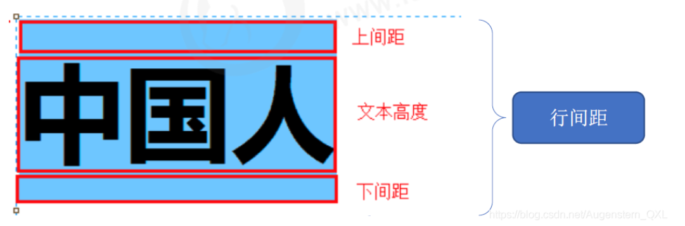

# 行間距

> 返回章節首頁：[README.md](./README.md)
>
> `line-height` 用於設定文字行盒的高度，進而影響行與行之間的距離，也會影響單行文字在盒子中的垂直位置。



## 導讀

- `line-height` 主要用來控制文字的行高與行距。
- 它決定的是一行文字在版面中佔據的垂直空間，也就是 line box 的高度。
- `line-height` 不是單純在文字下方加空白，而是會影響文字上下方的留白分配。
- 當單行文字的 `line-height` 和盒子高度相等時，可以做出視覺上的垂直居中效果。
- 單行文字垂直居中技巧只適合單行，不適合多行文本。
- `line-height` 常見寫法有 `normal`、無單位數字、固定長度、百分比。
- 實務上最推薦使用無單位數字，例如 `line-height: 1.5;`，因為它在繼承時最穩定。
- 固定長度與百分比在繼承時容易變成固定計算值，可能造成子元素行高不符合預期。
- 行距會直接影響文章可讀性、UI 密度、按鈕高度與排版穩定性。

## 關鍵字

- line-height
- 行高
- 行間距
- line box
- inline box
- normal
- unitless
- percentage
- inherit
- font-size
- 單行文字垂直居中
- 可讀性
- 排版穩定性

## 30 秒複習入口

- `line-height` 控制的是一行文字的行盒高度。
- 行距不是只加在文字下方，而是和文字上下方的留白都有關。
- `line-height: normal;` 是預設值，不等於 `1`。
- `normal` 由瀏覽器與字型決定，通常接近字級的 `1.2` 倍，但不是固定值。
- `line-height: 1.5;` 是無單位倍數寫法，會乘上元素自己的 `font-size`。
- `line-height: 24px;` 是固定行高，不會跟著子元素字級自動調整。
- `line-height: 150%;` 會依元素自己的 `font-size` 計算，但在繼承時容易出現固定值問題。
- 最推薦整站使用無單位數字，例如 `body { line-height: 1.5; }`。
- 單行文字要做視覺垂直居中，可以讓 `line-height` 等於盒子的 `height`。
- 多行文字垂直居中不要靠 `line-height`，應該使用 Flex 或 Grid。
- `line-height: 1;` 不是預設值，只是字級的 1 倍，文字可能會顯得擁擠。
- `line-height: 0;` 會讓行盒高度趨近於 0，通常會造成排版異常。

## 屬性特性

| 項目 | 說明 |
| --- | --- |
| 屬性名稱 | `line-height` |
| 作用 | 設定行盒高度，影響文字行距與垂直空間 |
| 初始值 | `normal` |
| 是否繼承 | 是 |
| 常見值 | `normal`、數字、長度、百分比 |
| 推薦寫法 | 無單位數字，例如 `1.5`、`1.6`、`1.8` |
| 常見用途 | 文章行距、按鈕文字垂直居中、表單文字排版、整站文字節奏 |
| 常見誤解 | 以為它只是控制行與行之間的空白 |
| 注意事項 | 固定長度與百分比在繼承時可能造成排版不穩定 |

## 速查區

| 寫法 | 說明 | 適合場景 |
| --- | --- | --- |
| `line-height: normal;` | 瀏覽器與字型決定的預設行高 | 預設狀態 |
| `line-height: 1;` | 行高等於字級 1 倍 | 高密度 UI，但要小心文字擁擠 |
| `line-height: 1.5;` | 行高為目前字級的 1.5 倍 | 一般 UI、整站基礎設定 |
| `line-height: 1.8;` | 行高為目前字級的 1.8 倍 | 中文文章、長段落閱讀 |
| `line-height: 24px;` | 固定行高 `24px` | 特定元件高度控制 |
| `line-height: 40px;` | 固定行高 `40px` | 單行文字垂直居中 |
| `line-height: 150%;` | 依目前元素字級計算 150% | 可用，但繼承時要小心 |
| `line-height: inherit;` | 繼承父元素的已計算值 | 需要跟隨父層設定時 |

## 正文

`line-height` 用於設定一行文字所佔據的垂直空間。

```css
p {
  line-height: 1.6;
}
```

```html
<p>
  這是一段文字。設定 line-height 後，行與行之間的距離會變得更容易閱讀。
</p>
```

在多行文字中，`line-height` 會影響行與行之間的距離。

在單行文字中，`line-height` 也會影響文字在盒子中的垂直位置。

## `line-height` 控制的是行盒高度

`line-height` 最重要的觀念是：

> `line-height` 控制的是 line box 的高度，也就是一行文字在版面中佔據的垂直空間。

它不是：

> 文字本身高度加上下面一段固定空白。

而是：

> 文字所在的行盒高度，以及文字上下方留白如何被分配。

例如：

```css
p {
  font-size: 20px;
  line-height: 30px;
}
```

這代表一行文字的行盒高度是 `30px`。

如果文字字級是 `20px`，那麼多出來的 `10px` 會分配到文字上下方。

大致可以理解為：

```text
行盒高度 30px
文字大小 20px
多出空間 10px
上下各分配約 5px
```

這也是為什麼 `line-height` 會影響文字看起來的垂直位置。

## 行距不是只加在下方

常見錯誤理解：

```text
line-height = 文字下面多一段空白
```

這是不精準的。

比較正確的理解是：

```text
line-height = 一行文字所佔的總高度
```

當 `line-height` 大於 `font-size` 時，多出來的空間會和文字上下方都有關。

例如：

```css
.text {
  font-size: 16px;
  line-height: 24px;
}
```

這裡的 `24px` 是整個行盒高度，不是「文字下面再加 24px」。

## 常見寫法

### `normal`

`normal` 是 `line-height` 的預設值。

```css
p {
  line-height: normal;
}
```

`normal` 由瀏覽器、字型和使用者代理決定。

很多情況下，它大約接近字級的 `1.2` 倍，但不是固定保證。

也就是說：

```css
line-height: normal;
```

不等於：

```css
line-height: 1;
```

也不一定完全等於：

```css
line-height: 1.2;
```

不同字型、不同瀏覽器、不同平台都可能讓 `normal` 的實際效果略有差異。

## 無單位數字

無單位數字是實務上最推薦的寫法。

```css
p {
  line-height: 1.6;
}
```

這表示：

```text
實際行高 = 目前元素 font-size * 1.6
```

例如：

```css
p {
  font-size: 16px;
  line-height: 1.6;
}
```

實際行高是：

```text
16px * 1.6 = 25.6px
```

如果字級變成 `20px`：

```css
p {
  font-size: 20px;
  line-height: 1.6;
}
```

實際行高會變成：

```text
20px * 1.6 = 32px
```

所以無單位數字的好處是：

- 會跟著元素自己的字級變動
- 適合響應式排版
- 適合整站設定
- 繼承時比較安全
- 不容易造成子元素行高失衡

## 固定長度

固定長度是直接指定明確行高。

```css
p {
  line-height: 24px;
}
```

這表示每一行的行盒高度固定是 `24px`。

固定長度適合用在特定元件，例如按鈕、標籤、單行文字容器。

```css
.button {
  height: 40px;
  line-height: 40px;
}
```

但如果用在整站文字排版，要小心繼承問題。

例如：

```css
body {
  font-size: 16px;
  line-height: 24px;
}

.title {
  font-size: 32px;
}
```

`.title` 可能會繼承到固定的 `24px` 行高。

這時標題字級是 `32px`，但行高只有 `24px`，文字可能會顯得擁擠，甚至出現裁切或重疊風險。

所以固定長度不適合直接作為整站預設行高。

## 百分比

`line-height` 也可以使用百分比。

```css
p {
  line-height: 150%;
}
```

這通常表示依照元素自己的 `font-size` 計算。

例如：

```css
p {
  font-size: 16px;
  line-height: 150%;
}
```

實際行高大約是：

```text
16px * 150% = 24px
```

百分比看起來和無單位數字很像，但在繼承時比較容易造成混淆。

如果父元素使用百分比，子元素可能繼承到已經計算好的固定值，而不是重新按照自己的字級計算。

因此實務上更推薦：

```css
line-height: 1.5;
```

而不是：

```css
line-height: 150%;
```

## 為什麼推薦無單位數字

假設：

```css
body {
  font-size: 16px;
  line-height: 1.5;
}

.title {
  font-size: 32px;
}
```

`.title` 繼承到的是 `1.5` 這個比例。

所以 `.title` 的實際行高會是：

```text
32px * 1.5 = 48px
```

這樣行高會跟著標題自己的字級變大。

反過來，如果寫成：

```css
body {
  font-size: 16px;
  line-height: 24px;
}

.title {
  font-size: 32px;
}
```

`.title` 可能會繼承固定的 `24px`。

這時就會變成：

```text
font-size: 32px
line-height: 24px
```

行高比字級還小，排版很容易出問題。

所以整站基礎設定通常建議寫：

```css
body {
  line-height: 1.5;
}
```

或中文文章常見：

```css
.article {
  line-height: 1.8;
}
```

## `line-height` 的繼承

`line-height` 是可繼承屬性。

父元素設定後，子元素通常會繼承。

但是不同值的繼承效果不同。

### 無單位數字的繼承

```css
.parent {
  font-size: 20px;
  line-height: 1.5;
}

.child {
  font-size: 30px;
}
```

`.child` 繼承到的是 `1.5` 這個比例。

所以 `.child` 的實際行高是：

```text
30px * 1.5 = 45px
```

這是比較理想的繼承結果。

### 固定長度的繼承

```css
.parent {
  font-size: 20px;
  line-height: 30px;
}

.child {
  font-size: 30px;
}
```

`.child` 可能會繼承到固定的 `30px`。

所以 `.child` 的結果是：

```text
font-size: 30px
line-height: 30px
```

雖然還能顯示，但行距可能偏緊。

如果 `.child` 字級更大，就可能造成擁擠或裁切。

### 百分比的繼承

```css
.parent {
  font-size: 20px;
  line-height: 150%;
}

.child {
  font-size: 30px;
}
```

`150%` 可能先根據 `.parent` 的 `font-size` 算出固定值：

```text
20px * 150% = 30px
```

然後子元素繼承的是這個已計算結果。

所以 `.child` 可能得到：

```text
font-size: 30px
line-height: 30px
```

這就是百分比行高在繼承時容易讓人誤解的地方。

## 單行文字垂直居中

早期 CSS 常用 `line-height` 做單行文字垂直居中。

做法是：

```css
.box {
  height: 40px;
  line-height: 40px;
}
```

```html
<div class="box">我要垂直居中</div>
```

完整範例：

```css
.box {
  width: 200px;
  height: 40px;
  background-color: pink;
  line-height: 40px;
  text-align: center;
}
```

```html
<div class="box">我要居中</div>
```

這裡：

```css
line-height: 40px;
```

負責讓單行文字在垂直方向看起來置中。

```css
text-align: center;
```

負責讓文字在水平方向置中。

## 單行垂直居中的限制

`line-height = height` 的技巧只適合單行文字。

適合場景：

- 單行按鈕
- 單行標籤
- 單行導航項目
- 單行提示文字

不適合場景：

- 多行文字
- 高度不固定的內容
- 文字可能換行的按鈕
- 複雜內容區塊
- 圖片加文字混排

例如下面這種情況就不適合：

```html
<div class="box">
  這是一段很長的文字，可能會換成兩行或三行。
</div>
```

如果文字換行，`line-height` 就不再是「整個區塊垂直居中」的解法，而是變成每一行文字的行高。

多行內容要做垂直居中，應該使用 Flex：

```css
.box {
  display: flex;
  align-items: center;
  justify-content: center;
}
```

或 Grid：

```css
.box {
  display: grid;
  place-items: center;
}
```

## `line-height` 和 `height` 的差異

`height` 控制元素盒子的高度。

`line-height` 控制文字行盒的高度。

例如：

```css
.box {
  height: 40px;
  line-height: 40px;
}
```

這裡：

| 屬性 | 控制對象 |
| --- | --- |
| `height` | `.box` 這個元素盒子的高度 |
| `line-height` | `.box` 裡面文字一行的行盒高度 |

兩者剛好設成一樣時，單行文字看起來會垂直居中。

但它們不是同一個屬性，也不是互相替代。

## `line-height` 和 `font-size` 的關係

`font-size` 決定文字大小。

`line-height` 決定一行文字佔據的高度。

例如：

```css
.text {
  font-size: 16px;
  line-height: 24px;
}
```

意思是：

```text
文字大小：16px
行盒高度：24px
```

如果寫成無單位數字：

```css
.text {
  font-size: 16px;
  line-height: 1.5;
}
```

意思是：

```text
行盒高度 = 16px * 1.5 = 24px
```

所以行高通常會大於字級，這樣文字上下才有足夠空間。

如果行高太接近字級，例如：

```css
.text {
  font-size: 16px;
  line-height: 1;
}
```

文字會顯得緊密，長段落閱讀體驗通常不好。

## `line-height: 1` 的使用時機

`line-height: 1` 表示行高等於字級 1 倍。

```css
.icon-text {
  line-height: 1;
}
```

它不是預設值。

`line-height: 1` 常見於：

- icon 容器
- 很短的標籤
- 高密度 UI
- 需要精準控制高度的元件

但在長段文字中通常不建議使用。

不建議：

```css
.article {
  line-height: 1;
}
```

這會讓文章很擁擠。

比較適合：

```css
.article {
  line-height: 1.8;
}
```

## `line-height: 0` 的問題

`line-height: 0` 會讓行盒高度趨近於 `0`。

```css
.text {
  line-height: 0;
}
```

這通常會造成排版異常，例如：

- 文字重疊
- 文字被裁切
- 行內元素位置異常
- 圖片或 icon 對齊怪異

只有在非常特殊的排版技巧中才可能使用，不適合一般文本排版。

## 中文、英文與行距

不同語言對行距的需求不完全一樣。

### 中文長文

中文長段落通常需要較大的行距。

```css
.article {
  line-height: 1.8;
}
```

常見範圍：

```css
line-height: 1.6;
line-height: 1.7;
line-height: 1.8;
line-height: 2;
```

中文文章如果行距太小，字與字之間會顯得密集，閱讀壓力比較大。

### 英文段落

英文段落常見行距可以略小一些。

```css
.article-en {
  line-height: 1.5;
}
```

常見範圍：

```css
line-height: 1.4;
line-height: 1.5;
line-height: 1.6;
```

### UI 介面文字

UI 介面文字通常不會像文章一樣放很大的行距，否則畫面會太鬆散。

```css
.form-label {
  line-height: 1.4;
}

.form-tip {
  line-height: 1.5;
}

.card-desc {
  line-height: 1.6;
}
```

## 實務常見行高建議

| 場景 | 常見行高 |
| --- | --- |
| 一般 UI 文字 | `1.4` ~ `1.6` |
| 表單提示文字 | `1.4` ~ `1.6` |
| 卡片描述文字 | `1.5` ~ `1.7` |
| 中文文章 | `1.7` ~ `2` |
| 英文文章 | `1.4` ~ `1.7` |
| 單行按鈕 | 可用固定 `px` 或 Flex |
| 高密度表格 | `1.2` ~ `1.5` |
| icon 容器 | 有時使用 `1` 或固定值 |

這些不是絕對規則，而是常見經驗值。

實際要根據：

- 字體大小
- 字體種類
- 內容長短
- 容器寬度
- UI 密度
- 是否為長文閱讀場景

一起判斷。

## `line-height` 與段落間距

`line-height` 控制的是行內的行距。

段落與段落之間的距離，應該使用 `margin` 控制。

例如：

```css
.article p {
  line-height: 1.8;
  margin-bottom: 1em;
}
```

不要用過大的 `line-height` 來硬撐段落間距。

不建議：

```css
.article p {
  line-height: 3;
}
```

這會讓每一行都很鬆，影響閱讀節奏。

比較好的方式是：

```css
.article p {
  line-height: 1.8;
  margin-bottom: 1em;
}
```

這樣可以清楚分開：

```text
line-height：控制同一段內部的行距
margin-bottom：控制段落之間的距離
```

## `line-height` 與 `font` 簡寫

`line-height` 可以出現在 `font` shorthand 裡。

```css
p {
  font: 16px/1.6 Arial, sans-serif;
}
```

這裡：

```css
16px
```

是 `font-size`。

```css
1.6
```

是 `line-height`。

等同於：

```css
p {
  font-size: 16px;
  line-height: 1.6;
  font-family: Arial, sans-serif;
}
```

這種寫法常見於舊專案或簡潔 CSS，但初學時建議先分開寫，比較清楚。

## `line-height` 與圖片底部空白

圖片預設是 inline-level 元素，會參與文字基線對齊。

有時圖片底部會出現一點空白，這和行盒、基線、`line-height` 有關。

例如：

```html
<div class="image-box">
  
</div>
```

圖片底部可能會有縫隙。

常見解法不是改 `line-height`，而是：

```css
img {
  display: block;
}
```

或：

```css
img {
  vertical-align: middle;
}
```

這個問題更適合放在 `vertical-align` 筆記裡理解，但知道它和 inline formatting、line box 有關會更完整。

## 常見實務場景

### 文章段落行距

```css
.article {
  max-width: 720px;
  margin: 0 auto;
  color: #333;
}

.article p {
  line-height: 1.8;
  margin-bottom: 1em;
}
```

```html
<article class="article">
  <p>
    CSS 的 line-height 屬性可以控制行盒高度，進而影響文字行與行之間的距離。
  </p>
  <p>
    在長篇文章中，適當的行距可以提升閱讀舒適度。
  </p>
</article>
```

### 單行按鈕垂直居中

```css
.button {
  display: inline-block;
  width: 120px;
  height: 36px;
  line-height: 36px;
  text-align: center;
}
```

```html
<a class="button" href="#">查看詳情</a>
```

這是傳統單行按鈕的寫法。

現代也可以使用 Flex：

```css
.button {
  display: inline-flex;
  width: 120px;
  height: 36px;
  align-items: center;
  justify-content: center;
}
```

### 表單提示文字

```css
.form-tip {
  font-size: 14px;
  line-height: 1.5;
  color: #999;
}
```

```html
<p class="form-tip">
  密碼至少需要 8 個字元，並包含英文與數字。
</p>
```

表單提示文字通常不需要太大行距，但也不能太擠。

### 卡片描述文字

```css
.card-desc {
  font-size: 14px;
  line-height: 1.6;
  color: #666;
}
```

```html
<p class="card-desc">
  這是一段卡片描述文字，用來補充說明主要內容。
</p>
```

卡片描述通常比標題小，需要適當行距避免擁擠。

### 表格內容

```css
.table-cell {
  font-size: 14px;
  line-height: 1.4;
}
```

表格通常資訊密度較高，所以行距不會設得太大。

如果表格中有多行描述，可以針對描述欄位加大行距：

```css
.table-cell.description {
  line-height: 1.6;
}
```

## 常見錯誤

### 錯誤一：以為 `line-height` 只控制行與行之間的空白

錯誤理解：

```text
line-height = 兩行文字之間的空白
```

正確理解：

```text
line-height = 一行文字的行盒高度
```

它會影響整行文字的垂直空間，不只是兩行中間的縫隙。

## 錯誤二：把 `normal` 當成 `1`

不正確：

```text
line-height: normal 等於 line-height: 1
```

正確理解：

```text
normal 是瀏覽器和字型決定的預設值，通常接近 1.2，但不是固定值。
```

`line-height: 1` 是明確指定行高為字級 1 倍，通常會比 `normal` 更緊。

## 錯誤三：整站使用固定 px 行高

不建議：

```css
body {
  line-height: 24px;
}
```

這可能導致不同字級的元素都繼承固定行高。

比較推薦：

```css
body {
  line-height: 1.5;
}
```

讓不同字級元素可以依自己的 `font-size` 計算行高。

## 錯誤四：用 `line-height` 做多行垂直居中

不建議：

```css
.box {
  height: 120px;
  line-height: 120px;
}
```

如果文字換行，排版會出問題。

多行垂直居中應該用 Flex：

```css
.box {
  display: flex;
  align-items: center;
  justify-content: center;
}
```

## 錯誤五：用過大的 `line-height` 代替段落間距

不建議：

```css
.article p {
  line-height: 3;
}
```

這會讓每一行都很鬆散。

比較好的做法：

```css
.article p {
  line-height: 1.8;
  margin-bottom: 1em;
}
```

## 錯誤六：行高小於字級導致文字擁擠

```css
.title {
  font-size: 32px;
  line-height: 24px;
}
```

這種寫法可能讓文字上下空間不足。

比較安全：

```css
.title {
  font-size: 32px;
  line-height: 1.3;
}
```

## 錯誤七：以為 `line-height` 可以控制元素高度

`line-height` 可以影響文字所在行盒高度，但它不是專門控制元素盒子高度的屬性。

控制元素高度應該用：

```css
height: 40px;
```

控制文字行高才用：

```css
line-height: 1.5;
```

單行垂直居中時兩者會搭配，但不要混淆它們的責任。

## 實務範例：整站基礎行高

```css
body {
  font-family: Arial, "Noto Sans TC", sans-serif;
  font-size: 16px;
  line-height: 1.5;
  color: #333;
}
```

這樣整站文字會有一個穩定的基礎行高。

不同元素可以再依需求覆蓋：

```css
.article {
  line-height: 1.8;
}

.table {
  line-height: 1.4;
}

.button {
  line-height: 1;
}
```

## 實務範例：中文文章排版

```css
.article {
  max-width: 720px;
  margin: 0 auto;
  color: #333;
}

.article h1 {
  font-size: 32px;
  line-height: 1.3;
  text-align: center;
}

.article p {
  font-size: 16px;
  line-height: 1.8;
  margin-bottom: 1em;
  text-indent: 2em;
}
```

```html
<article class="article">
  <h1>CSS 行間距</h1>

  <p>
    line-height 是 CSS 文本排版中非常重要的屬性，它會影響文字行盒高度與閱讀節奏。
  </p>

  <p>
    在中文長文中，適當加大行距可以降低閱讀壓力，讓內容更容易閱讀。
  </p>
</article>
```

這裡：

- 標題使用較緊的 `line-height: 1.3`
- 段落使用較舒適的 `line-height: 1.8`
- 段落間距用 `margin-bottom`
- 中文段落首行縮排用 `text-indent: 2em`

## 實務範例：按鈕

### 傳統寫法

```css
.button {
  display: inline-block;
  width: 120px;
  height: 36px;
  line-height: 36px;
  text-align: center;
  background-color: #1677ff;
  color: #fff;
}
```

```html
<a href="#" class="button">提交</a>
```

這種方式適合單行文字。

### 現代 Flex 寫法

```css
.button {
  display: inline-flex;
  width: 120px;
  height: 36px;
  align-items: center;
  justify-content: center;
  background-color: #1677ff;
  color: #fff;
}
```

Flex 寫法對圖示、文字、多內容組合更穩定。

## 實務範例：圖示與文字

```css
.icon-text {
  display: inline-flex;
  align-items: center;
  gap: 4px;
  line-height: 1.4;
}
```

```html
<span class="icon-text">
  <span>✓</span>
  <span>操作成功</span>
</span>
```

有圖示和文字時，通常用 Flex 對齊，不建議單靠 `line-height`。

## 面試可能問法

### 問題一：`line-height` 是做什麼的？

`line-height` 用來設定一行文字的行盒高度。

它會影響文字行與行之間的距離，也會影響單行文字在盒子中的垂直位置。

```css
p {
  line-height: 1.6;
}
```

## 問題二：`line-height: normal` 等於 `line-height: 1` 嗎？

不等於。

`normal` 是瀏覽器和字型決定的預設值，通常接近字級的 `1.2` 倍，但不是固定保證。

`line-height: 1` 是明確指定行高為字級的 1 倍。

## 問題三：為什麼推薦使用無單位的 `line-height`？

因為無單位數字在繼承時比較穩定。

```css
body {
  line-height: 1.5;
}
```

子元素會繼承 `1.5` 這個比例，再根據自己的 `font-size` 計算實際行高。

這比固定 `px` 或百分比更適合作為整站基礎設定。

## 問題四：`line-height: 24px` 和 `line-height: 1.5` 有什麼差別？

假設字級是 `16px`：

```css
line-height: 24px;
```

是固定行高，永遠是 `24px`。

```css
line-height: 1.5;
```

是倍數行高，會根據目前元素的 `font-size` 計算：

```text
16px * 1.5 = 24px
```

如果字級變成 `20px`：

```text
20px * 1.5 = 30px
```

所以無單位數字更有彈性。

## 問題五：如何用 `line-height` 做單行文字垂直居中？

讓元素高度和行高相同。

```css
.box {
  height: 40px;
  line-height: 40px;
}
```

這只適合單行文字。

多行文字垂直居中應該使用 Flex 或 Grid。

## 問題六：`line-height` 會繼承嗎？

會。

`line-height` 是可繼承屬性。

但要注意不同值的繼承效果：

- 無單位數字：繼承比例，最推薦。
- 固定長度：可能繼承固定值。
- 百分比：可能繼承已計算後的固定值。
- `inherit`：直接繼承父元素的已計算值。

## 問題七：`line-height` 和 `height` 差在哪？

`height` 控制元素盒子的高度。

`line-height` 控制文字一行的行盒高度。

單行垂直居中時可以讓兩者相等，但它們控制的對象不同。

## 一句話總結

`line-height` 控制的是一行文字的行盒高度，不只是行與行之間的空白；實務上最推薦使用無單位數字作為基礎行高，單行文字可以用 `line-height = height` 做視覺垂直居中，但多行內容應改用 Flex 或 Grid。

---