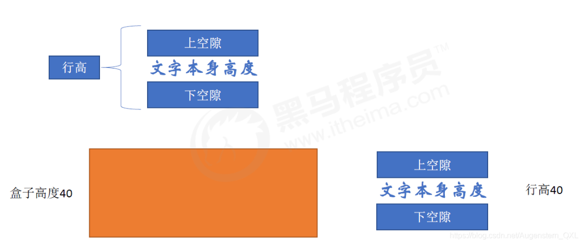

# 行間距

> 返回章節首頁：[README.md](./README.md)
>
> `line-height` 用於設定行與行之間的距離，也會影響單行文字在盒子中的垂直位置。


## 導讀
- `line-height` 主要控制文字的行距。
- 當單行文字的 `line-height` 設成和盒子的高度相等時，可以做出垂直居中的視覺效果。
- 這個技巧適合單行文字，不是多行文本的通用垂直居中方案。
- `line-height` 的數值也有不同寫法，像是 `normal`、固定 `px` 值和倍數寫法。
- 這篇把「怎麼用」和「到底代表什麼」放在一起說明，避免學完只會背寫法。

## 關鍵字
- line-height
- 行高
- 行間距
- 單行文字垂直居中
- 垂直居中

## 30 秒複習入口
- `line-height` 控制文字行與行之間的距離
- `line-height` 會影響單行文字在盒子中的垂直位置
- 單行文字要垂直居中，可以讓 `line-height` 等於盒子的高度
- `line-height` 大於或小於盒子高度時，文字看起來會偏下或偏上
- `line-height: normal` 是預設值，不等於 `1`
- `line-height: 30px` 表示行盒高度是 `30px`
- `line-height: 1.2` 是倍數寫法，會跟著字級計算

## 速查區

| 寫法 | 用途 |
| --- | --- |
| `line-height: 26px;` | 設定段落行距 |
| `line-height: 40px;` | 單行文字垂直居中的常見寫法 |
| `line-height: normal;` | 由瀏覽器決定，通常約略是字級的 1.2 倍 |
| `line-height: 1.2;` | 行高是字級的 1.2 倍 |

## 正文
`line-height` 屬性用於設置行間的距離，可以控制文字行與行之間的距離。

行間距不只影響段落閱讀，也會影響文字在盒子中的垂直位置。

```css
p {
  line-height: 26px;
}
```

## 單行文字垂直居中
CSS 沒有直接提供文字垂直居中的獨立寫法時，可以用 `line-height` 做單行文字垂直居中。

做法是讓文字的行高等於盒子的高度，文字就會在單行情況下看起來位於盒子中間。



- 行高的上空隙和下空隙會把文字擠到中間。
- 如果行高小於盒子高度，文字會偏上。
- 如果行高大於盒子高度，文字會偏下。

```css
div {
  width: 200px;
  height: 40px;
  background-color: pink;
  line-height: 40px;
}
```

```html
<div>我要居中</div>
```

## `line-height` 的行距觀念
`line-height` 決定的是行盒的高度，也就是一行文字佔據的垂直空間。

它不是「文字本身的高度加上下面一段固定空白」，而是會把文字上下方的留白一起納入計算。

### `normal` 不是 `1`
如果沒有設定 `line-height`，實際使用的是 `normal`，不是 `1`。

`normal` 由瀏覽器決定，通常會接近字級的 `1.2` 倍，但不保證永遠一樣。

這也是為什麼不同字型、不同瀏覽器，預設行距看起來可能不完全相同。

### `line-height: 30px` 到底代表什麼
假設字級是 `20px`，而 `line-height` 設成 `30px`，意思不是「文字大小 20px，再往下多出 30px」。

正確的理解是：

- 一行文字的行盒高度變成 `30px`
- 文字本身仍然是 `20px`
- 多出來的 `10px` 會分散到文字上下

也就是說，額外空間會平均分配在上下兩側，而不是只堆在下方。

### `line-height: 1.2` 的計算方式
`line-height` 也可以寫成不帶單位的倍數。

如果字級是 `20px`，而 `line-height: 1.2;`，那麼實際行高就是：

```css
20px * 1.2 = 24px
```

這種寫法的優點，是它會跟著字級一起變動，更適合做整體排版控制。

### 常見誤解
- `line-height` 不是只控制下方空白，而是控制整個行盒高度。
- `line-height: 0;` 不代表文字只消失一部分，它會讓行盒高度趨近於 0，排版通常會變得非常不正常。
- `line-height: 1` 不是預設值；它只是「字級的 1 倍」這個寫法。

## 一句話總結
`line-height` 控制的是行盒高度，除了能做行距與單行垂直居中，也要分清楚 `normal`、固定值與倍數值的差別。
