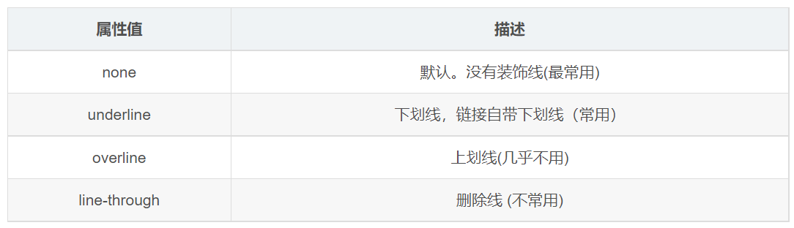

# 裝飾文本

> 返回章節首頁：[README.md](./README.md)
>
> `text-decoration` 屬性用於設定文本裝飾，例如下劃線、刪除線、上劃線。



## 導讀
- `text-decoration` 可以控制文字的裝飾效果。
- 常見值有 `underline`、`line-through`、`overline`。
- `a` 標籤常會搭配 `text-decoration: none;` 取消預設底線。

## 關鍵字
- text-decoration
- 下劃線
- 刪除線
- 上劃線
- none

## 30 秒複習入口
- `underline` 是下劃線
- `line-through` 是刪除線
- `overline` 是上劃線
- `none` 可以取消文字裝飾

## 速查區

| 寫法 | 說明 |
| --- | --- |
| `text-decoration: underline;` | 添加下劃線 |
| `text-decoration: line-through;` | 添加刪除線 |
| `text-decoration: overline;` | 添加上劃線 |
| `text-decoration: none;` | 取消裝飾 |

## 正文
`text-decoration` 屬性規定文字要添加哪些裝飾效果。
它可以用來設定下劃線、刪除線、上劃線等效果。

```css
div {
  /* 下劃線 */
  /* text-decoration: underline; */

  /* 刪除線 */
  /* text-decoration: line-through; */

  /* 上劃線 */
  text-decoration: overline;
}

a {
  /* 取消 a 預設的下劃線 */
  text-decoration: none;
  color: #333;
}
```

```html
<div>粉红色的回忆</div>
<a href="#">粉红色的回忆</a>
```

`a` 標籤在瀏覽器中通常會有預設下劃線。
實際開發時，常用 `text-decoration: none;` 先把這個預設效果去掉，再依設計需求自行控制。

## 一句話總結
`text-decoration` 用來控制文字裝飾，最常見的是下劃線，`a` 標籤常會先取消預設底線。
