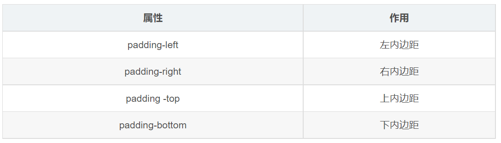
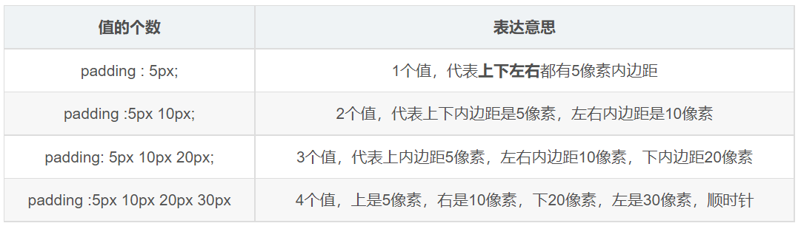
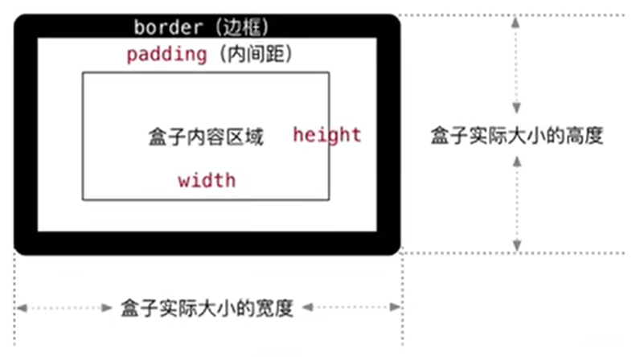
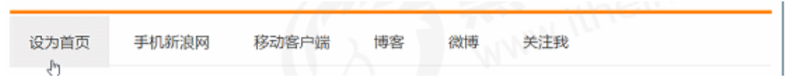

# 內邊距 padding

> 所屬章節：[第十四章 盒子模型](./README.md)  
> 關鍵字：padding、padding-top、padding-right、padding-bottom、padding-left、盒子尺寸  
> 建議回查情境：想讓內容不要貼著邊框時；忘記 `padding` 四值順序時；盒子尺寸因內邊距變大時；做導航項目留白時

## 本節導讀

這一節說明盒子模型中的 `padding`。`padding` 是內容區域與邊框之間的距離，用來控制內容和盒子邊界之間的留白。

第一次閱讀時，先理解 `padding` 在盒子模型中的位置，再看四值簡寫規則。最後要特別注意：在預設盒模型中，`padding` 會影響盒子實際佔用尺寸，但 `width: auto` 的區塊元素在水平方向上會有不同表現。

## 你會在這篇學到什麼

- `padding` 是什麼。
- `padding` 的單方向寫法。
- `padding` 一到四個值的簡寫規則。
- 為什麼 `padding` 會讓盒子實際大小變大。
- 什麼情況下 `padding` 不會讓區塊元素超出父盒子寬度。
- 為什麼導航項目常用 `padding` 撐開空間。

## 先講結論

`padding` 用來設定盒子的內邊距，也就是內容與邊框之間的距離。



在預設盒模型 `content-box` 中：

- `width` / `height` 設定的是內容區域大小。
- `padding` 會加在內容區域外面、邊框裡面。
- 如果盒子已經設定固定 `width` / `height`，再加 `padding`，盒子的實際佔用尺寸會變大。

## 單方向 padding

可以分別設定四個方向的內邊距：

```css
div {
  padding-top: 10px;
  padding-right: 20px;
  padding-bottom: 10px;
  padding-left: 20px;
}
```

四個方向分別是：

- `padding-top`：上內邊距。
- `padding-right`：右內邊距。
- `padding-bottom`：下內邊距。
- `padding-left`：左內邊距。

## `padding` 簡寫規則

`padding` 是簡寫屬性，可以寫一到四個值。



```css
/* 四個值：上 右 下 左 */
padding: 10px 20px 30px 40px;

/* 三個值：上 左右 下 */
padding: 10px 20px 30px;

/* 兩個值：上下 左右 */
padding: 10px 20px;

/* 一個值：上下左右都一樣 */
padding: 10px;
```

記憶方式：四值從上方開始，順時針讀，順序是「上、右、下、左」。

## padding 會影響盒子實際大小

當我們給盒子加上 `padding`，會發生兩件事：

- 內容和邊框之間產生距離。
- 在預設盒模型中，盒子實際佔用尺寸會增加。



例如：

```css
div {
  width: 160px;
  height: 160px;
  background-color: pink;
  padding: 20px;
}
```

```html
<div>
  padding 會影響盒子實際大小
</div>
```

在預設盒模型中，這個盒子的實際寬度會變成：

```text
內容寬度 160px
+ 左右 padding 40px
= 實際佔用寬度 200px
```

實際高度也會變成：

```text
內容高度 160px
+ 上下 padding 40px
= 實際佔用高度 200px
```

如果設計稿要求盒子最終尺寸固定為 `160px × 160px`，但仍要保留 `20px` 內邊距，可以有兩種做法：

```css
/* 做法 1：手動扣掉 padding */
div {
  width: 120px;
  height: 120px;
  padding: 20px;
}
```

```css
/* 做法 2：改用 border-box */
div {
  width: 160px;
  height: 160px;
  padding: 20px;
  box-sizing: border-box;
}
```

第二種做法會在 [box-sizing](./box-sizing.md) 中繼續說明。

## 什麼情況下 padding 不會把盒子撐寬

原文提到「如果盒子本身沒有指定 `width / height`，`padding` 不會撐開盒子大小」。這句需要更精確地理解。

對一般區塊元素來說，如果 `width` 是預設的 `auto`，瀏覽器會讓元素的外部寬度填滿父元素可用空間；此時加上左右 `padding`，通常不會讓整個盒子再額外超出父盒子寬度，而是內容區域會自動變窄。

例如：

```css
div {
  width: 300px;
  height: 100px;
  background-color: purple;
}

div p {
  padding: 30px;
  background-color: skyblue;
}
```

```html
<div>
  <p></p>
</div>
```

這裡 `p` 沒有設定 `width`，它的 `width` 預設是 `auto`。加上左右 `padding` 後，`p` 的外部寬度通常仍會配合父元素寬度，不會因為 `padding` 再額外撐出父元素。

但要注意：

- `padding` 仍然存在，內容區域會被壓縮。
- 上下 `padding` 仍會增加可見高度。
- 如果你手動設定 `width: 100%;`，再加左右 `padding`，在預設盒模型中仍可能造成寬度超出。

所以更穩定的說法是：

> 當區塊元素的 `width` 是 `auto` 時，左右 `padding` 通常不會讓元素外部寬度超出父容器；但 `padding` 仍會影響內容區域與可見高度。

## padding 的實用場景：導航留白

有時候 `padding` 讓盒子變大反而是好事。常見例子是導航列。

導航項目的文字長度可能不同，如果每個項目都固定寬度，短文字可能太空，長文字可能太擠。這時可以讓內容決定寬度，再用左右 `padding` 補出舒適的點擊範圍。



```css
.nav a {
  display: inline-block;
  padding: 0 16px;
  height: 40px;
  line-height: 40px;
}
```

這樣每個導航項目的寬度會跟著文字內容變化，但左右都會保留 `16px` 空間。

## 常見混淆點

### `padding` 是盒子內部的距離

`padding` 控制內容和邊框之間的距離，不是盒子和其他盒子之間的距離。盒子外部距離應該使用 `margin`。

### `padding` 會影響背景顯示範圍

預設情況下，背景會繪製到 `padding` 區域，所以加上 `padding` 後，背景色通常也會一起變大。

### 固定寬高時，padding 會增加實際尺寸

在預設盒模型中，如果元素已經有固定 `width` / `height`，再加 `padding`，外部尺寸會變大。

### `width: auto` 時要分方向理解

區塊元素 `width: auto` 時，左右 `padding` 通常不會讓外部寬度超出父容器；但上下 `padding` 仍會增加高度。

## 延伸閱讀

- [盒子模型的組成](./盒子模型的組成.md)
- [內容 content](./內容content.md)
- [邊框 border](./邊框border.md)
- [外邊距 margin](./外邊距margin.md)
- [box-sizing](./box-sizing.md)

## 一句話抓核心

`padding` 是內容和邊框之間的內部距離；在預設盒模型中，固定寬高的盒子加上 `padding` 會讓實際佔用尺寸變大。
