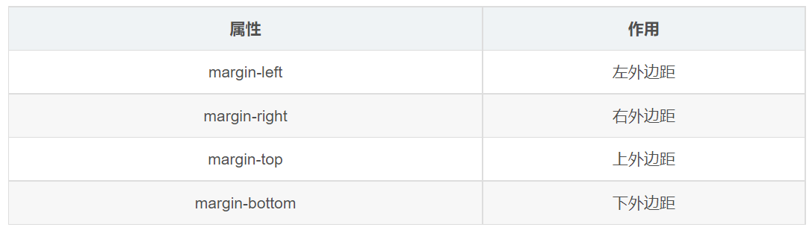
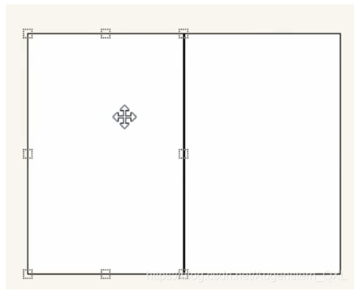

# 外邊距 margin

> 所屬章節：[第十四章 盒子模型](./README.md)  
> 關鍵字：margin、外邊距、垂直外邊距合併、margin 塌陷、負 margin  
> 建議回查情境：想調整盒子和盒子之間距離時；遇到上下 margin 沒有相加時；子元素 `margin-top` 把父元素一起帶下來時；需要用負 margin 壓住邊框時

## 本節導讀

這一節整理 CSS 的 `margin`。`margin` 是盒子模型最外層的距離，用來控制盒子與其他盒子之間的空間。

第一次閱讀時，先理解 `margin` 的基本用途與簡寫規則，再看垂直外邊距合併、父子外邊距塌陷，最後再看負 margin 的常見應用。

## 你會在這篇學到什麼

- `margin` 是什麼。
- `margin` 一到四個值的簡寫規則。
- 相鄰塊元素的垂直外邊距為什麼會合併。
- 嵌套塊元素的 `margin-top` 為什麼可能作用到父元素上。
- 常見外邊距合併解法。
- 負 margin 如何用來壓住相鄰邊框。

## 先講結論

`margin` 用來設定外邊距，也就是盒子和盒子之間的距離。



和 `padding` 不同：

- `padding` 是盒子內部距離，控制內容和邊框之間的空間。
- `margin` 是盒子外部距離，控制這個盒子和其他盒子之間的空間。

## 單方向 margin

可以分別設定四個方向的外邊距：

```css
div {
  margin-top: 10px;
  margin-right: 20px;
  margin-bottom: 10px;
  margin-left: 20px;
}
```

四個方向分別是：

- `margin-top`：上外邊距。
- `margin-right`：右外邊距。
- `margin-bottom`：下外邊距。
- `margin-left`：左外邊距。

## `margin` 簡寫規則

`margin` 是簡寫屬性，可以寫一到四個值。規則和 `padding` 一樣。

```css
/* 四個值：上 右 下 左 */
margin: 10px 20px 30px 40px;

/* 三個值：上 左右 下 */
margin: 10px 20px 30px;

/* 兩個值：上下 左右 */
margin: 10px 20px;

/* 一個值：上下左右都一樣 */
margin: 10px;
```

記憶方式：四值從上方開始，順時針讀，順序是「上、右、下、左」。

## 外邊距合併問題

使用 `margin` 定義塊級元素的垂直外邊距時，可能出現外邊距合併。常見有兩種：

- 相鄰塊元素垂直外邊距合併。
- 嵌套塊元素垂直外邊距塌陷。

這兩種問題都主要發生在垂直方向。左右方向的 `margin-left`、`margin-right` 通常不會用同樣方式合併。

## 相鄰塊元素垂直外邊距合併

當上下相鄰的兩個塊級元素是兄弟關係，且上方元素有 `margin-bottom`、下方元素有 `margin-top` 時，它們之間的垂直距離可能不會相加，而是合併成一個外邊距。

如果兩個值都是正數，合併後的距離通常取較大的那個值。


例如：

```css
.damao,
.ermao {
  width: 200px;
  height: 200px;
  background-color: pink;
}

.damao {
  margin-bottom: 100px;
}

.ermao {
  margin-top: 200px;
}
```

```html
<div class="damao">大毛</div>
<div class="ermao">二毛</div>
```

這裡兩個盒子之間的垂直距離通常是 `200px`，不是 `100px + 200px = 300px`。

簡單解法：只給其中一個盒子設定垂直 `margin`。例如只保留下方盒子的 `margin-top`，或只保留上方盒子的 `margin-bottom`。

## 嵌套塊元素垂直外邊距塌陷

嵌套塊元素也可能發生外邊距塌陷。常見情況是：父元素內部沒有 `border-top`、`padding-top` 或其他內容把父子元素隔開時，第一個子元素的 `margin-top` 可能會和父元素發生合併，看起來像是子元素的 `margin-top` 作用到了父元素上。

例如：

```css
.box-father {
  width: 200px;
  height: 200px;
  background-color: #b2b6b6;
}

.box-child {
  width: 100px;
  height: 100px;
  background-color: #7f9faf;
  margin-top: 100px;
}
```

```html
<!-- 子元素的 margin-top 可能看起來作用到了父元素上 -->
<div class="box-father">
  <div class="box-child"></div>
</div>
```

這種情況不是子元素真的把父元素「推開」那麼簡單，而是父子元素的垂直外邊距發生了合併。

## 嵌套外邊距塌陷的解法

常見解法是讓父元素和子元素的外邊距不再直接相鄰：

1. 給父元素設定 `border-top`。
2. 給父元素設定 `padding-top`。
3. 給父元素設定 `overflow: hidden;`。
4. 把父元素轉成行內塊、浮動元素或其他會建立新格式化環境的布局方式。

原文範例使用 `overflow: hidden;` 解決：

```css
.resolve {
  overflow: hidden;
  margin-top: 20px;
}
```

```html
<!-- 使用 overflow: hidden; 阻止父子 margin-top 合併 -->
<div class="box-father resolve">
  <div class="box-child"></div>
</div>
```

實務上不要只背某一個解法，要先判斷你是否真的希望父元素建立新的格式化環境。若只是想留出父元素內部上方空間，`padding-top` 往往更直觀。

## 負 margin 的運用

`margin` 可以是負值。負 margin 常用來讓元素往某個方向靠近，甚至壓住相鄰元素。



常見場景：多個盒子並排，每個盒子都有 `1px` 邊框。如果盒子緊貼在一起，相鄰邊框會疊成 `1px + 1px = 2px`，看起來比較粗。

可以給後面的盒子加上 `margin-left: -1px;`，讓它往左移動 `1px`，壓住前一個盒子的右邊框：

```css
ul li {
  float: left;
  list-style: none;
  width: 150px;
  height: 200px;
  border: 1px solid red;
  margin-left: -1px;
}
```

這裡要注意：原文「正數向右邊走，負數向左邊走」指的是 `margin-left` 這個方向屬性在這個浮動並排場景中的效果，不代表所有方向的負 margin 都一樣。

更精確地說：

- `margin-left: -1px;` 會讓元素向左靠近。
- `margin-top: -1px;` 會讓元素向上靠近。
- 負 margin 會影響元素和周圍元素的相對位置，使用時要確認是否會造成重疊或布局難維護。

## hover 時提高當前盒子層級

使用負 margin 壓住邊框後，滑鼠經過某個盒子時，通常希望目前盒子的藍色邊框顯示在最上層。

如果元素原本沒有定位，可以在 hover 時加上相對定位：

```css
ul li:hover {
  position: relative;
  border: 1px solid blue;
}
```

如果元素本來就有定位，可以在 hover 時提高 `z-index`：

```css
ul li {
  position: relative;
  float: left;
  list-style: none;
  width: 150px;
  height: 200px;
  border: 1px solid red;
  margin-left: -1px;
}

ul li:hover {
  z-index: 1;
  border: 1px solid blue;
}
```

```html
<ul>
  <li>1</li>
  <li>2</li>
  <li>3</li>
  <li>4</li>
  <li>5</li>
</ul>
```

## 常見混淆點

### `margin` 是盒子外部的距離

`margin` 控制盒子和盒子之間的距離，不會讓內容和邊框之間產生空隙。內容和邊框之間的空隙應使用 `padding`。

### 垂直 margin 可能合併

上下相鄰的塊級元素，垂直 `margin` 可能合併，所以實際距離不一定是兩個 margin 的總和。

### 父子 margin 塌陷需要看條件

不是所有父子元素都會發生塌陷。通常是在父元素和第一個子元素之間沒有邊框、內邊距或其他內容隔開時才容易出現。

### 負 margin 可以用，但不要濫用

負 margin 適合解決特定視覺壓線問題，但它會讓元素位置互相重疊，過度使用會增加布局維護成本。

## 延伸閱讀

- [盒子模型的組成](./盒子模型的組成.md)
- [內邊距 padding](./內邊距padding.md)
- [邊框 border](./邊框border.md)
- [box-sizing](./box-sizing.md)
- [清除默認內外邊距](./清除默認內外邊距.md)

## 一句話抓核心

`margin` 是盒子外部距離，用來控制盒子之間的空間；學習時要特別注意垂直外邊距合併、父子外邊距塌陷與負 margin 的方向效果。
