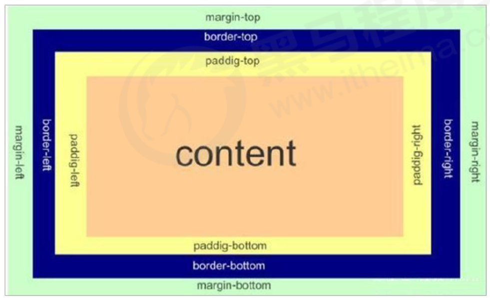

# 盒子模型的組成

> 所屬章節：[第十四章 盒子模型](./README.md)  
> 關鍵字：盒子模型、content、padding、border、margin、矩形區域  
> 建議回查情境：忘記盒子模型由哪些部分構成時；分不清內容、內邊距、邊框與外邊距時；後續學 `box-sizing` 前

## 本節導讀

這一節說明 CSS 盒子模型的基本組成。學盒子模型時，要先把 HTML 元素想成頁面上的矩形盒子，再理解這個盒子由哪些區域構成。

第一次閱讀時，建議先看「盒子是什麼」，再看「盒子模型的四個部分」。後續學 `width`、`height`、`padding`、`border`、`margin` 與 `box-sizing` 時，都會用到這個基礎。

## 你會在這篇學到什麼

- 為什麼 HTML 元素可以被看成盒子。
- CSS 盒子模型由哪四個部分組成。
- `content`、`padding`、`border`、`margin` 各自負責什麼。
- 為什麼盒子模型是理解網頁布局的基礎。

## 先講結論

所謂盒子模型，就是把 HTML 頁面中的布局元素看作一個矩形盒子。這個盒子像一個盛裝內容的容器，瀏覽器會根據盒子的尺寸、內外距與邊框來計算頁面布局。

CSS 中一個盒子主要由四個部分構成：

- `content`：內容區域
- `padding`：內邊距
- `border`：邊框
- `margin`：外邊距



## 為什麼要用盒子的角度看元素

頁面中的每一個標籤，都可以先看作一個盒子。透過盒子的視角，布局問題會變得更容易分析。

例如：

- 想控制元素有多寬、多高，要先看盒子的尺寸。
- 想讓內容不要貼著邊框，要調整盒子的內邊距。
- 想讓兩個元素之間留空，要調整盒子的外邊距。
- 想讓盒子有可見邊界，要設定盒子的邊框。

瀏覽器在渲染網頁時，會把元素計算成一個個矩形區域。CSS 負責控制這些矩形區域的大小、距離、邊界與外觀。

## 盒子模型的四個部分

| 組成部分 | 英文名稱 | 作用 |
| --- | --- | --- |
| 內容 | `content` | 放文字、圖片或子元素的區域，也是 `width`、`height` 默認設定的區域。 |
| 內邊距 | `padding` | 內容與邊框之間的距離。 |
| 邊框 | `border` | 包住內容與內邊距的邊界線。 |
| 外邊距 | `margin` | 盒子與其他盒子之間的距離。 |

可以把它想成由內到外的四層：

1. 最裡面是 `content`。
2. `content` 外面是 `padding`。
3. `padding` 外面是 `border`。
4. `border` 外面是 `margin`。

## 一個簡單例子

```css
.box {
  width: 200px;
  height: 100px;
  padding: 20px;
  border: 2px solid #333;
  margin: 30px;
}
```

這段 CSS 可以這樣理解：

- `width: 200px;` 和 `height: 100px;` 設定內容區域大小。
- `padding: 20px;` 讓內容和邊框之間保留 20px 距離。
- `border: 2px solid #333;` 給盒子加上 2px 實線邊框。
- `margin: 30px;` 讓這個盒子和外部其他元素保持 30px 距離。

## 常見混淆點

### 盒子不一定看得到

沒有設定背景色或邊框時，盒子仍然存在，只是畫面上不一定能直接看出它的範圍。

### `content` 不等於整個盒子

`content` 只是盒子最裡面的內容區域。完整盒子還包含 `padding`、`border` 和 `margin`。

### `margin` 在盒子外面

`margin` 用來控制盒子和其他盒子之間的距離，不屬於盒子可見背景的一部分。

## 延伸閱讀

- [看透網頁布局的本質](./看透網頁布局的本質.md)
- [內容 content](./內容content.md)
- [內邊距 padding](./內邊距padding.md)
- [邊框 border](./邊框border.md)
- [外邊距 margin](./外邊距margin.md)
- [box-sizing](./box-sizing.md)

## 一句話抓核心

盒子模型就是把元素看成矩形盒子，並用 `content`、`padding`、`border`、`margin` 四層來理解盒子的內容、邊界與外部距離。
