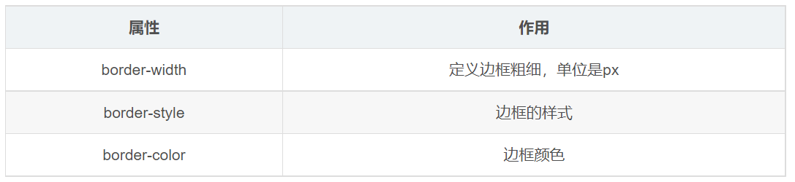
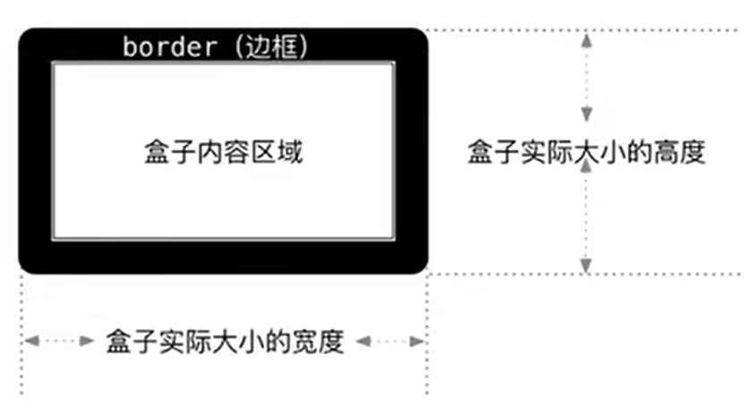
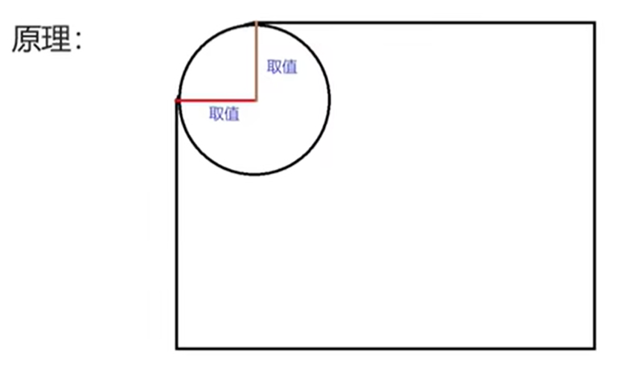

# 邊框 border

> 所屬章節：[第十四章 盒子模型](./README.md)  
> 關鍵字：border、border-width、border-style、border-color、border-radius、單邊邊框  
> 建議回查情境：想設定元素邊線時；分不清 `border` 三個組成部分時；盒子尺寸因邊框變大時；想做圓角或圓形效果時

## 本節導讀

這一節整理 CSS 的邊框相關屬性。`border` 是盒子模型中的邊界層，位於 `padding` 外面、`margin` 裡面，用來讓盒子的邊界變得可見，也會參與盒子尺寸計算。

第一次閱讀時，先理解 `border` 的三個組成部分：寬度、樣式、顏色。接著再看複合寫法、單方向邊框、邊框對盒子尺寸的影響，最後再學 `border-radius` 做圓角。

## 你會在這篇學到什麼

- `border` 的三個基本組成。
- `border` 複合寫法與拆分寫法。
- 常見 `border-style` 取值。
- 如何只設定某一個方向的邊框。
- 為什麼邊框會影響盒子實際大小。
- `border-radius` 如何設定圓角、圓形與膠囊形。

## 先講結論

`border` 用來設定元素的邊框。完整邊框通常由三個部分組成：

- `border-width`：邊框寬度。
- `border-style`：邊框樣式。
- `border-color`：邊框顏色。



最常見的寫法是：

```css
div {
  border: 10px solid red;
}
```

這行代表：

- 邊框寬度是 `10px`。
- 邊框樣式是 `solid`。
- 邊框顏色是 `red`。

## `border` 的拆分寫法

`border` 可以拆成三個屬性分別設定：

```css
div {
  width: 200px;
  height: 200px;
  border-width: 10px;
  border-style: solid;
  border-color: red;
}
```

```html
<div>文字</div>
```

這種寫法適合初學時理解每個部分的作用。

| 屬性 | 作用 | 範例 |
| --- | --- | --- |
| `border-width` | 邊框粗細 | `10px` |
| `border-style` | 邊框樣式 | `solid` |
| `border-color` | 邊框顏色 | `red` |

## `border` 的複合寫法

實務上更常使用複合寫法：

```css
div {
  width: 300px;
  height: 200px;
  border: 5px solid pink;
}
```

```html
<div>文字</div>
```

`border` 複合寫法通常依照「寬度、樣式、顏色」來讀：

```css
border: 5px solid pink;
```

這三個值的書寫順序通常可以調整，但建議固定使用 `寬度 樣式 顏色`，閱讀成本最低。

## `border-style` 常見取值

`border-style` 控制邊框線條長什麼樣子。

| 取值 | 說明 |
| --- | --- |
| `none` | 沒有邊框，這也是預設值。 |
| `solid` | 單實線，最常用。 |
| `dashed` | 虛線。 |
| `dotted` | 點線。 |

要注意：如果只設定 `border-width` 和 `border-color`，但沒有設定 `border-style`，邊框通常不會顯示，因為 `border-style` 的預設值是 `none`。

## 單方向邊框

如果只想設定某一邊，可以使用單方向屬性：

```css
div {
  border-top: 5px solid pink;
  border-bottom: 10px dashed purple;
}
```

常見方向：

- `border-top`：上邊框。
- `border-right`：右邊框。
- `border-bottom`：下邊框。
- `border-left`：左邊框。

這些屬性也可以繼續拆成更細的寫法，例如：

```css
div {
  border-top-width: 5px;
  border-top-style: solid;
  border-top-color: pink;
}
```

## 邊框會影響盒子實際大小



在預設盒模型 `content-box` 中，`width` 和 `height` 設定的是內容區域大小，不包含 `border`。所以加上邊框後，盒子實際佔用空間會變大。

例如，我們想做一個實際佔用尺寸為 `400px × 400px` 的盒子，並且它有 `10px` 紅色邊框：

```css
div {
  width: 380px;
  height: 380px;
  background-color: pink;
  border: 10px solid red;
}
```

```html
<div></div>
```

計算方式：

```text
實際寬度 = 內容寬度 380px + 左右邊框 20px = 400px
實際高度 = 內容高度 380px + 上下邊框 20px = 400px
```

因此，如果量設計稿時包含邊框，有兩種常見處理方式：

- 測量內容區域時，不把邊框算進去。
- 如果測量結果包含邊框，就從 `width` / `height` 中扣掉邊框寬度。

也可以改用 `box-sizing: border-box;`，讓 `width` 和 `height` 包含 `content`、`padding` 與 `border`。這部分可以在 [box-sizing](./box-sizing.md) 繼續學。

## 圓角邊框 `border-radius`

`border-radius` 用來設定元素外邊框的圓角，讓盒子四個角變得圓潤。

它的值可以是長度，也可以是百分比：

```css
div {
  border-radius: 10px;
}
```

```css
div {
  border-radius: 50%;
}
```

圓角效果可以理解成：邊框角落被一個圓或橢圓裁切後，形成圓潤的邊角。



## `border-radius` 的方向寫法

四個角可以分別設定：

```css
div {
  border-top-left-radius: 20px;
  border-top-right-radius: 20px;
  border-bottom-right-radius: 20px;
  border-bottom-left-radius: 20px;
}
```

也可以使用簡寫：

```css
/* 四個角都一樣 */
border-radius: 10px;

/* 從左上角開始，順時針設定 */
border-radius: 10px 20px 30px 40px;
```

四值順序是：

1. 左上角。
2. 右上角。
3. 右下角。
4. 左下角。

如果只寫兩個值，第二個值會對應到另一組對角：

```css
border-radius: 10px 40px;
```

可以理解成：

- 左上角、右下角是 `10px`。
- 右上角、左下角是 `40px`。

## 圓角範例

### 一般圓角

```css
div {
  width: 300px;
  height: 150px;
  background-color: pink;
  border-radius: 10px;
}
```

```html
<div></div>
```

### 正方形變圓形

如果盒子是正方形，想要變成圓形，可以把 `border-radius` 設成寬高的一半，或直接寫 `50%`。

```css
.circle {
  width: 200px;
  height: 200px;
  background-color: pink;
  border-radius: 50%;
}
```

```html
<div class="circle"></div>
```

### 矩形變膠囊形

如果盒子是橫向矩形，想要做成膠囊形，通常把 `border-radius` 設成高度的一半。

```css
.pill {
  width: 300px;
  height: 100px;
  background-color: pink;
  border-radius: 50px;
}
```

```html
<div class="pill"></div>
```

### 不同角設定不同圓角

```css
.radius {
  width: 200px;
  height: 200px;
  background-color: pink;
  border-top-left-radius: 20px;
}
```

```html
<div class="radius"></div>
```

## 常見混淆點

### 邊框不只是一條線，還會參與尺寸計算

在預設盒模型中，邊框會增加盒子的實際佔用空間。這是很多初學者設定寬高後發現盒子變大的原因。

### `border-style` 不設定時，邊框可能看不到

`border-style` 的預設值是 `none`。如果只設定邊框寬度和顏色，畫面上通常仍然看不到邊框。

### `border-radius` 不是只對有邊框的元素有效

即使沒有設定 `border`，只要元素有背景色、背景圖或內容可見，`border-radius` 仍然可以讓元素邊角變圓。

### 圓形需要正方形

`border-radius: 50%;` 不一定會得到正圓。元素本身必須是正方形，才會形成正圓；如果是矩形，通常會形成橢圓或膠囊形。

## 延伸閱讀

- [盒子模型的組成](./盒子模型的組成.md)
- [內容 content](./內容content.md)
- [內邊距 padding](./內邊距padding.md)
- [外邊距 margin](./外邊距margin.md)
- [box-sizing](./box-sizing.md)
- [邊框外輪廓 outline](./邊框外輪廓outline.md)

## 一句話抓核心

`border` 用來設定盒子的邊界，通常由寬度、樣式與顏色組成；在預設盒模型中，邊框會增加盒子的實際佔用尺寸。
