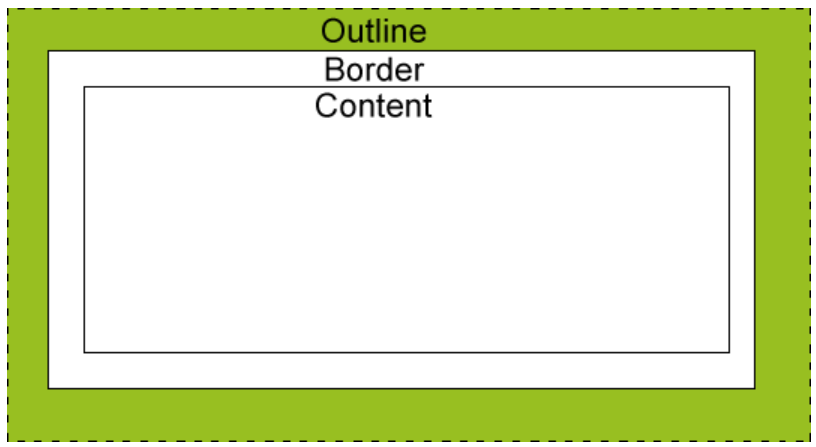

# 邊框外輪廓 outline

> 所屬章節：[第十四章 盒子模型](./README.md)  
> 關鍵字：outline、outline-width、outline-style、outline-color、focus、border  
> 建議回查情境：分不清 `outline` 和 `border` 時；想設定焦點外框時；想移除表單預設外框但又怕影響鍵盤操作時

## 本節導讀

這一節說明 CSS 的 `outline`。`outline` 是畫在元素邊框外側的輪廓線，常用於顯示焦點狀態，例如鍵盤操作時瀏覽器會替可聚焦元素顯示外框。

第一次閱讀時，先理解 `outline` 的三個組成部分，再比較它和 `border` 的差異。最後要特別注意：不要只用 `outline: none;` 移除焦點外框，卻沒有提供新的可見焦點樣式。

## 你會在這篇學到什麼

- `outline` 是什麼。
- `outline` 的拆分屬性與簡寫方式。
- `outline` 和 `border` 的差異。
- 為什麼 `outline` 不會影響盒子尺寸。
- 移除表單預設 outline 時要注意什麼。

## 先講結論

`outline` 是畫在元素邊框外側的輪廓線，可以設定寬度、樣式與顏色。



常見簡寫：

```css
outline: 2px solid #3498db;
```

這行代表：

- `outline-width` 是 `2px`。
- `outline-style` 是 `solid`。
- `outline-color` 是 `#3498db`。

## `outline` 的屬性組成

`outline` 可以拆成三個屬性：

| 屬性 | 作用 | 範例 |
| --- | --- | --- |
| `outline-width` | 設定輪廓寬度 | `2px` |
| `outline-style` | 設定輪廓樣式 | `solid` |
| `outline-color` | 設定輪廓顏色 | `#3498db` |

拆分寫法：

```css
.outlined-element {
  outline-width: 2px;
  outline-style: solid;
  outline-color: #3498db;
}
```

複合寫法：

```css
.outlined-element {
  outline: 2px solid #3498db;
}
```

實務上建議固定按照「寬度、樣式、顏色」閱讀和書寫，雖然 CSS 解析時通常不要求完全照這個順序。

## 基本範例

```css
.outlined-element {
  width: 200px;
  height: 100px;
  background-color: #f0f0f0;
  margin: 20px;
  outline: 2px solid #3498db;
}
```

```html
<div class="outlined-element">This is an outlined element</div>
```

這段程式碼會在元素外側畫出一條藍色輪廓線。這條輪廓線不會改變元素原本的 `width`、`height`，也不會像 `border` 一樣增加盒子在版面中佔用的空間。

## `outline` 和 `border` 的差異

| 比較項目 | `border` | `outline` |
| --- | --- | --- |
| 位置 | 盒子模型的一部分，位於 `padding` 外側 | 畫在邊框外側，不屬於盒子模型尺寸 |
| 是否佔空間 | 會影響盒子實際大小 | 不會影響盒子實際大小 |
| 是否能分方向設定 | 可分別設定上、右、下、左 | 通常是一整圈輪廓，不能像 `border-top` 那樣單獨控制一邊 |
| 常見用途 | 顯示元素邊界、分隔視覺區塊 | 顯示焦點狀態、提示目前操作位置 |

重點是：`outline` 不會影響元素尺寸與周圍元素位置。它可能覆蓋到附近內容，但不會把其他元素推開。

## `outline` 與 focus 狀態

瀏覽器常會在連結、按鈕、輸入框等可聚焦元素取得焦點時，顯示預設的 focus outline。這讓鍵盤使用者知道目前焦點在哪裡。

例如，當使用者按 `Tab` 鍵移動焦點到輸入框時，瀏覽器可能會顯示一圈預設外框。這個預設外框通常會在元素失去焦點時消失。

要注意：這是瀏覽器的預設 focus 樣式，不代表你手動寫下的 `outline: 2px solid blue;` 也會自動只在 focus 時出現。若希望 outline 只在 focus 時出現，應該搭配偽類：

```css
input:focus {
  outline: 2px solid #3498db;
}
```

## 移除預設 outline 的注意事項

原文提到可以用 `outline: none;` 或 `outline: 0;` 移除表單預設外框。這確實可以讓預設 focus 輪廓消失：

```css
input {
  outline: none;
}
```

```html
<input type="text">
```

但實務上不建議只移除外框而不補替代樣式。因為鍵盤使用者會失去「目前焦點在哪裡」的提示。

較好的做法是改成自訂焦點樣式：

```css
input:focus {
  outline: 2px solid #3498db;
  outline-offset: 2px;
}
```

如果設計上真的不想使用外輪廓，也應提供其他清楚的 focus 樣式，例如改變邊框顏色或背景色：

```css
input:focus {
  outline: none;
  border-color: #3498db;
  box-shadow: 0 0 0 3px rgba(52, 152, 219, 0.25);
}
```

## `outline-offset`

`outline-offset` 可以控制輪廓線和元素邊緣之間的距離。

```css
button:focus {
  outline: 2px solid #3498db;
  outline-offset: 4px;
}
```

這樣 focus 輪廓會和元素本身保持一點距離，視覺上更清楚。

## 常見混淆點

### `outline` 不是 `border`

`border` 是盒子模型的一部分，會影響盒子尺寸。`outline` 是額外畫在外側的輪廓線，不會改變元素尺寸。

### `outline` 可以套用在一般元素上

`outline` 不是只能用在連結或表單控件。一般元素也可以設定 `outline`。只是它最常見的用途，是替可聚焦元素提供 focus 提示。

### 手動設定的 outline 不會自動跟著 focus 出現或消失

如果直接在元素上寫 `outline: 2px solid blue;`，輪廓會一直存在。若希望只在取得焦點時顯示，應寫在 `:focus` 上。

### 不要無替代地移除 focus outline

`outline: none;` 會移除焦點提示。若需要移除預設樣式，應補上新的可見 focus 樣式。

## 延伸閱讀

- [邊框 border](./邊框border.md)
- [盒子模型的組成](./盒子模型的組成.md)
- [box-sizing](./box-sizing.md)
- [盒子陰影 box-shadow](./盒子陰影box-shadow.md)

## 一句話抓核心

`outline` 是畫在元素邊框外側的輪廓線，不佔盒子尺寸，最常用來顯示焦點狀態；移除預設 outline 時要提供替代的可見焦點樣式。
