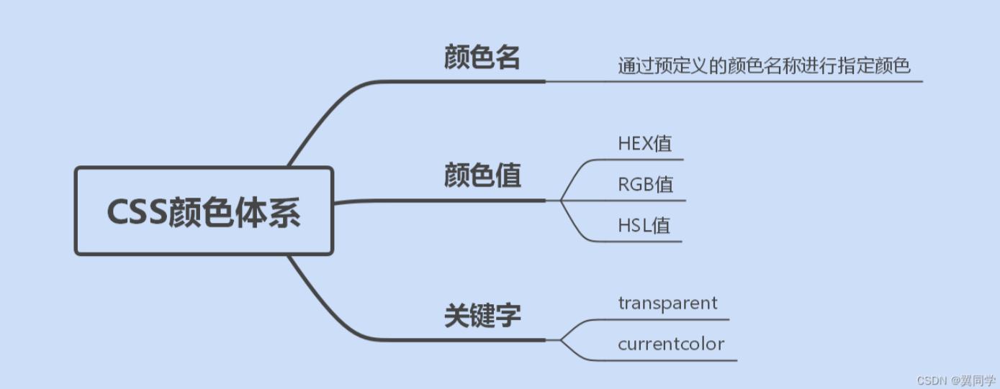
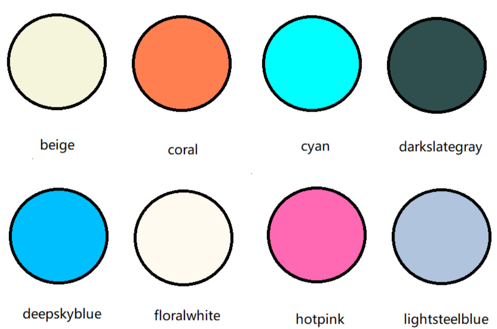
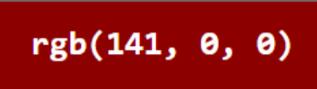
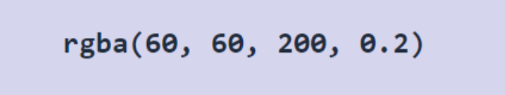
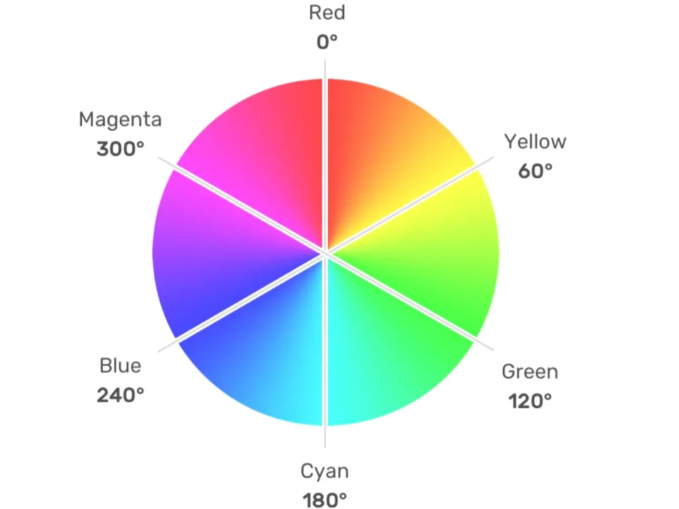
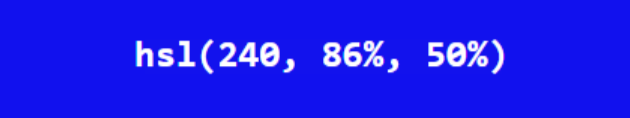
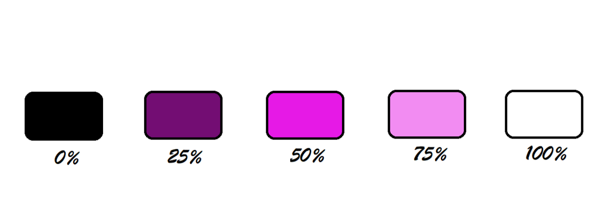

# 第10章 顏色

> 返回章節首頁：[README.md](./README.md)
>
> 本章整理 CSS 常用顏色表示法：命名色、HEX、RGB/RGBA、HSL/HSLA，並補充現代 CSS 顏色語法、透明度寫法與實戰選型。

## 導讀
CSS 顏色不只是「把文字變紅」這麼簡單。實務開發中，顏色常用在文字、背景、邊框、陰影、漸層、遮罩、hover 狀態、disabled 狀態與設計系統 token。

常見顏色表示法有：

- 命名色：例如 `red`、`blue`
- HEX：例如 `#ff0000`
- RGB / RGBA：例如 `rgb(255, 0, 0)`、`rgba(255, 0, 0, 0.5)`
- HSL / HSLA：例如 `hsl(0, 100%, 50%)`、`hsla(0, 100%, 50%, 0.5)`

其中，`RGBA` 是在 `RGB` 的基礎上加入 `alpha`，`HSLA` 是在 `HSL` 的基礎上加入 `alpha`。`alpha` 用來控制顏色的不透明程度：`0` 是完全透明，`1` 是完全不透明。

如果只是使用設計稿給的色碼，通常會看到 HEX；如果要調整顏色的深淺、明暗與鮮豔程度，HSL 通常比 RGB 更直觀。

## 學習目標
讀完本章後，你應該能夠：

- 看懂 CSS 常見顏色表示法。
- 判斷命名色、HEX、RGB、HSL 的差異。
- 理解 `alpha` 和透明度的關係。
- 知道 `RGBA`、`HSLA`、現代 `rgb(... / alpha)`、`hsl(... / alpha)` 的寫法。
- 知道實務上什麼情境適合用哪一種顏色表示法。

## 關鍵字
- 顏色
- 命名色
- HEX
- RGB
- RGBA
- HSL
- HSLA
- alpha
- 透明度
- 不透明度
- hue
- saturation
- lightness
- CSS color
- design token

## 30 秒複習入口
- 要記顏色表示法：`命名色 / HEX / RGB / HSL`
- 要記透明度：`alpha` 越小越透明，越大越不透明
- 要記傳統透明度寫法：`rgba(255, 0, 0, 0.5)`、`hsla(0, 100%, 50%, 0.5)`
- 要記現代透明度寫法：`rgb(255 0 0 / 50%)`、`hsl(0 100% 50% / 50%)`
- 要記 HEX 縮寫：`#aabbcc` 可以寫成 `#abc`，前提是每一組數值都由相同字元組成
- 要記 HEX alpha：`#RRGGBBAA` 的最後兩位 `AA` 是透明度，例如 `#ff000080` 約等於 50% 不透明
- 要記 HSL 三個值：`hue` 是色相，`saturation` 是飽和度，`lightness` 是亮度

## 核心心法

> RGB 適合描述「紅、綠、藍三個通道各是多少」；HSL 適合描述「這是什麼色相、飽和度多高、亮度多亮」。

所以：

- 設計稿給色碼：常用 HEX。
- 要做半透明背景、邊框、遮罩：常用 RGB/RGBA 或 HSL/HSLA。
- 要調整同一顏色的 hover、active、disabled 深淺：HSL 通常更直觀。
- 要建立設計系統：常搭配 CSS 變數，把顏色抽成 token。

## 速查區

| 表示法 | 範例 | 重點 | 適合情境 |
| --- | --- | --- | --- |
| 命名色 | `red` | 直接用英文名稱指定顏色 | 快速測試、教學範例 |
| HEX | `#ff0000` | 以十六進位表示 RGB | 設計稿色碼、UI token |
| HEX 縮寫 | `#f00` | `#ff0000` 的縮寫 | 簡短色碼，但實務可讀性普通 |
| HEX alpha | `#ff000080` | `#RRGGBBAA`，最後兩位代表 alpha | 已有 HEX，又需要透明度 |
| RGB | `rgb(255, 0, 0)` | 用紅、綠、藍三個通道表示 | 需要明確控制 RGB 通道 |
| RGBA | `rgba(255, 0, 0, 0.5)` | RGB 加上 alpha | 傳統透明色寫法 |
| 現代 RGB alpha | `rgb(255 0 0 / 50%)` | 在 `rgb()` 內用 `/` 加 alpha | 現代 CSS 寫法 |
| HSL | `hsl(0, 100%, 50%)` | 用色相、飽和度、亮度表示 | 調整明暗、飽和度 |
| HSLA | `hsla(0, 100%, 50%, 0.5)` | HSL 加上 alpha | 傳統 HSL 透明色寫法 |
| 現代 HSL alpha | `hsl(0 100% 50% / 50%)` | 在 `hsl()` 內用 `/` 加 alpha | 現代 CSS 寫法 |

## 正文

### 1. CSS 顏色簡介
CSS 的 `<color>` 值可以用在很多屬性上，例如：

```css
.title {
  color: #333;
}

.card {
  background-color: #fff;
  border: 1px solid rgb(0 0 0 / 10%);
  box-shadow: 0 8px 24px rgb(0 0 0 / 12%);
}
```

常見會用到顏色的屬性包含：

- `color`
- `background-color`
- `border-color`
- `box-shadow`
- `text-decoration-color`
- `outline-color`
- `accent-color`
- `background-image: linear-gradient(...)`

常見顏色表示法有 `命名色`、`HEX`、`RGB` 和 `HSL`。如果需要透明度，可以使用 `RGBA`、`HSLA`、HEX alpha，或現代 CSS 的 slash alpha 語法。



### 2. 命名色
命名色是直接使用顏色英文名稱，例如：

```css
.error {
  color: red;
}

.info {
  color: blue;
}
```

這種寫法最直觀，適合快速測試或教學範例。但在正式專案中，通常不會大量依賴命名色，原因是：

- 可調整性較低。
- 不容易對應設計稿上的精準色碼。
- 不適合建立完整的設計系統。

所以命名色可以拿來理解概念，但正式 UI 開發通常更常使用 HEX、RGB、HSL 或 CSS 變數。



### 3. HEX
HEX 是前端開發最常見的色碼格式之一，通常長這樣：

```css
#ff0000
```

格式是：

```txt
#RRGGBB
```

其中：

- `RR` 代表紅色通道。
- `GG` 代表綠色通道。
- `BB` 代表藍色通道。
- 每個通道的範圍是 `00` 到 `ff`。

例如：

```css
.color-red {
  color: #ff0000;
}
```

`#ff0000` 代表：

```txt
紅色：ff
綠色：00
藍色：00
```

也就是純紅色。

#### 3.1 HEX 縮寫
如果每一組數值都由重複字元組成，可以縮寫成 3 位形式。

```css
/* 完整寫法 */
#ff0000

/* 縮寫 */
#f00
```

再例如：

```css
#aabbcc 可以縮寫成 #abc
#112233 可以縮寫成 #123
```

但下面這種不能縮寫：

```css
#12ab34
```

因為 `12`、`ab`、`34` 都不是同一個字元重複組成。

#### 3.2 HEX alpha
HEX 也可以帶透明度，格式是：

```txt
#RRGGBBAA
```

最後兩位 `AA` 代表 alpha。

例如：

```css
.overlay {
  background-color: #00000080;
}
```

這裡的 `#00000080` 大約代表「50% 不透明的黑色」。

原因是：

```txt
80 是十六進位
0x80 = 128
128 / 255 ≈ 0.5
```

所以：

```css
#00000080
```

大約等同於：

```css
rgb(0 0 0 / 50%)
```

> 實務提醒：HEX alpha 雖然簡短，但 `80` 這種透明度不如 `50%` 直覺。團隊合作時，如果透明度需要經常閱讀和調整，`rgb(... / 50%)` 或 `hsl(... / 50%)` 通常更好懂。


### 4. RGB 與 RGBA
`rgb()` 用紅、綠、藍三個數值表示顏色。

傳統寫法：

```css
rgb(255, 0, 0)
```

每個通道的範圍通常是：

```txt
0 ~ 255
```

例如：

```css
.box {
  background-color: rgb(141, 0, 0);
}
```

代表：

```txt
紅色：141
綠色：0
藍色：0
```

所以它會是一個偏深的紅色。

#### 4.1 RGBA
`rgba()` 是在 RGB 後面加上 `alpha`：

```css
rgba(255, 0, 0, 0.5)
```

`alpha` 的範圍是：

```txt
0 ~ 1
```

其中：

- `0` 代表完全透明。
- `0.5` 代表 50% 不透明。
- `1` 代表完全不透明。

例如：

```css
.alert {
  background-color: rgba(255, 0, 0, 0.1);
}
```

這代表「很淡的紅色背景」。

#### 4.2 現代 RGB 透明度寫法
現代 CSS 也可以直接在 `rgb()` 裡面用 `/` 加上 alpha：

```css
.alert {
  background-color: rgb(255 0 0 / 10%);
}
```

這和下面的意思接近：

```css
.alert {
  background-color: rgba(255, 0, 0, 0.1);
}
```

差別主要是語法風格：

```css
/* 傳統寫法 */
rgb(255, 0, 0)
rgba(255, 0, 0, 0.5)

/* 現代寫法 */
rgb(255 0 0)
rgb(255 0 0 / 50%)
```




### 5. HSL 與 HSLA
`hsl()` 用三個概念描述顏色：

```txt
hsl(hue, saturation, lightness)
```

也就是：

- `hue`：色相。
- `saturation`：飽和度。
- `lightness`：亮度。

例如：

```css
hsl(0, 100%, 50%)
```

可以拆成：

```txt
hue: 0
saturation: 100%
lightness: 50%
```

#### 5.1 hue 色相
`hue` 可以理解成色環上的角度，常見對應如下：

| hue | 大致顏色 |
| --- | --- |
| `0` 或 `360` | 紅色 |
| `60` | 黃色 |
| `120` | 綠色 |
| `180` | 青色 |
| `240` | 藍色 |
| `300` | 紫色 / 洋紅 |

例如：

```css
.red {
  color: hsl(0, 100%, 50%);
}

.green {
  color: hsl(120, 100%, 50%);
}

.blue {
  color: hsl(240, 100%, 50%);
}
```




#### 5.2 saturation 飽和度
`saturation` 表示顏色有多鮮豔。

- `0%`：沒有彩度，會接近灰階。
- `100%`：彩度最高，顏色最鮮豔。

例如：

```css
.gray-red {
  color: hsl(0, 0%, 50%);
}

.vivid-red {
  color: hsl(0, 100%, 50%);
}
```



#### 5.3 lightness 亮度
`lightness` 表示顏色偏暗或偏亮。

- `0%`：黑色。
- `50%`：正常亮度附近。
- `100%`：白色。

例如：

```css
.dark-red {
  color: hsl(0, 100%, 30%);
}

.normal-red {
  color: hsl(0, 100%, 50%);
}

.light-red {
  color: hsl(0, 100%, 70%);
}
```

HSL 的優點是：你可以固定 `hue`，只調整 `saturation` 或 `lightness`，快速產生同一色系的不同狀態。

```css
.button {
  background-color: hsl(220, 90%, 56%);
}

.button:hover {
  background-color: hsl(220, 90%, 48%);
}

.button:disabled {
  background-color: hsl(220, 20%, 75%);
}
```




#### 5.4 HSLA
`hsla()` 是在 HSL 後面加上 `alpha`：

```css
hsla(0, 100%, 50%, 0.5)
```

例如：

```css
.notice {
  background-color: hsla(210, 100%, 50%, 0.1);
}
```

這代表「淡淡的藍色背景」。

#### 5.5 現代 HSL 透明度寫法
現代 CSS 也可以在 `hsl()` 裡面用 `/` 加上 alpha：

```css
.notice {
  background-color: hsl(210 100% 50% / 10%);
}
```

這和下面的意思接近：

```css
.notice {
  background-color: hsla(210, 100%, 50%, 0.1);
}
```


### 6. 實戰選型建議
如果你不知道該用哪一種顏色寫法，可以先照下面判斷。

| 情境 | 建議用法 | 原因 |
| --- | --- | --- |
| 設計稿直接給色碼 | HEX | 最常見，和設計工具容易對應 |
| 快速測試顏色 | 命名色 | 寫法最短，適合 demo |
| 半透明背景 | `rgb(... / alpha)` 或 `rgba()` | alpha 語意明確 |
| 半透明邊框 | `rgb(... / alpha)` 或 `rgba()` | 常用於卡片、分隔線、陰影 |
| 調整 hover 深淺 | HSL | 調整 `lightness` 很直觀 |
| 調整顏色鮮豔程度 | HSL | 調整 `saturation` 很直觀 |
| 建立設計系統 | CSS 變數 + HEX/HSL | 可維護性較高 |
| 已有 HEX 又要透明度 | HEX alpha 或轉成 RGB/HSL alpha | HEX alpha 短，但不一定好讀 |

### 7. 實戰範例：按鈕顏色設計
假設你要設計一顆主要按鈕，可以這樣寫：

```css
:root {
  --color-primary: hsl(220 90% 56%);
  --color-primary-hover: hsl(220 90% 48%);
  --color-primary-disabled: hsl(220 20% 75%);
  --color-primary-soft-bg: hsl(220 90% 56% / 10%);
  --color-border-subtle: rgb(0 0 0 / 10%);
}

.button {
  color: #fff;
  background-color: var(--color-primary);
  border: 1px solid var(--color-primary);
}

.button:hover {
  background-color: var(--color-primary-hover);
}

.button:disabled {
  background-color: var(--color-primary-disabled);
  border-color: var(--color-primary-disabled);
  cursor: not-allowed;
}

.card {
  background-color: #fff;
  border: 1px solid var(--color-border-subtle);
  box-shadow: 0 8px 24px rgb(0 0 0 / 12%);
}

.primary-alert {
  color: var(--color-primary);
  background-color: var(--color-primary-soft-bg);
}
```

這個例子裡：

- `--color-primary` 是主色。
- `--color-primary-hover` 固定同一個 hue，只降低 lightness，讓 hover 顏色變深。
- `--color-primary-soft-bg` 使用 alpha 做淡色背景。
- `--color-border-subtle` 使用透明黑色做淡邊框。
- `box-shadow` 使用透明黑色做陰影。

這就是 HSL 和 alpha 在實務 UI 中很常見的搭配方式。

### 8. 常見混淆點

#### 8.1 HEX 本質上也是 RGB
`#ff0000` 本質上就是 RGB 的另一種表示方式。

```css
#ff0000
rgb(255, 0, 0)
hsl(0, 100%, 50%)
```

上面三種寫法都可以表示紅色，只是描述角度不同。

#### 8.2 `RGBA` 和 `HSLA` 的差別不在透明度
`RGBA` 和 `HSLA` 都可以加透明度，差別在於前面的顏色描述方式不同。

```css
rgba(255, 0, 0, 0.5)
hsla(0, 100%, 50%, 0.5)
```

兩者都可以表示半透明紅色。

#### 8.3 `alpha` 越小越透明
`alpha` 不是「顏色越淡」的意思，而是「不透明程度」。

```css
rgba(255, 0, 0, 1)   /* 完全不透明 */
rgba(255, 0, 0, 0.5) /* 半透明 */
rgba(255, 0, 0, 0)   /* 完全透明 */
```

#### 8.4 `opacity` 和 alpha 不一樣
這是實務中很容易搞混的地方。

```css
.card {
  opacity: 0.5;
}
```

`opacity` 會讓整個元素都變透明，包含文字、背景、邊框、子元素。

但下面這種寫法只會讓背景色透明：

```css
.card {
  background-color: rgb(0 0 0 / 50%);
}
```

所以如果你只想讓背景半透明，不要直接用 `opacity`，應該使用帶 alpha 的顏色。

#### 8.5 HSL 的 `L` 不是「真實視覺亮度」
HSL 的 `lightness` 很適合做初步的深淺調整，但它不完全等於人眼感受到的真實亮度。對一般 UI 練習來說，先掌握 HSL 已經很夠用；如果未來要做更精準的色彩系統，可以再研究 OKLCH、Lab 等色彩空間。

#### 8.6 現代語法和傳統語法可以並存
你可能會同時看到：

```css
rgba(0, 0, 0, 0.5)
rgb(0 0 0 / 50%)

hsla(220, 90%, 56%, 0.5)
hsl(220 90% 56% / 50%)
```

它們都是在表達帶透明度的顏色。讀舊專案時常看到 `rgba()`、`hsla()`；讀新寫法或現代 CSS 教材時，可能會看到 slash alpha 語法。

## 一句話總結
CSS 顏色可以用命名色、HEX、RGB 或 HSL 表示；如果需要透明度，可以使用 `RGBA`、`HSLA`、HEX alpha，或現代 CSS 的 `rgb(... / alpha)`、`hsl(... / alpha)` 寫法。實務上，HEX 常用來承接設計稿色碼，HSL 常用來調整同一色系的深淺與狀態，alpha 則常用於半透明背景、邊框與陰影。

## 回查清單
- 只想查寫法：看「速查區」。
- 想查透明度：看「RGB/RGBA」、「HSL/HSLA」、「HEX alpha」。
- 想知道用哪一種：看「實戰選型建議」。
- 想寫元件色彩狀態：看「實戰範例：按鈕顏色設計」。
- 想釐清觀念錯誤：看「常見混淆點」。

## 參考資料
- [MDN：CSS `<color>` value](https://developer.mozilla.org/en-US/docs/Web/CSS/Reference/Values/color_value)
- [MDN：CSS color values](https://developer.mozilla.org/en-US/docs/Web/CSS/Guides/Colors/Color_values)
- [MDN：rgb()](https://developer.mozilla.org/en-US/docs/Web/CSS/Reference/Values/color_value/rgb)
- [MDN：hsl()](https://developer.mozilla.org/en-US/docs/Web/CSS/Reference/Values/color_value/hsl)

## 修正說明
- 將原本「`RGBA`、`HSLA` 是在前兩種表示法上再加入透明度」修正為更精準的說法：`RGBA` 是 RGB 加 alpha，`HSLA` 是 HSL 加 alpha。
- 補上現代 CSS 的 slash alpha 語法，例如 `rgb(255 0 0 / 50%)`、`hsl(0 100% 50% / 50%)`。
- 補上 HEX alpha：`#RRGGBBAA`。
- 補上「什麼情境用哪一種表示法」的實戰選型表。
- 補上 CSS 變數與 UI 狀態色範例。
- 補上 `opacity` 與 alpha 的差異，避免實務開發中誤用。
- 保留原本圖片路徑，方便直接覆蓋原筆記後沿用既有圖片。
